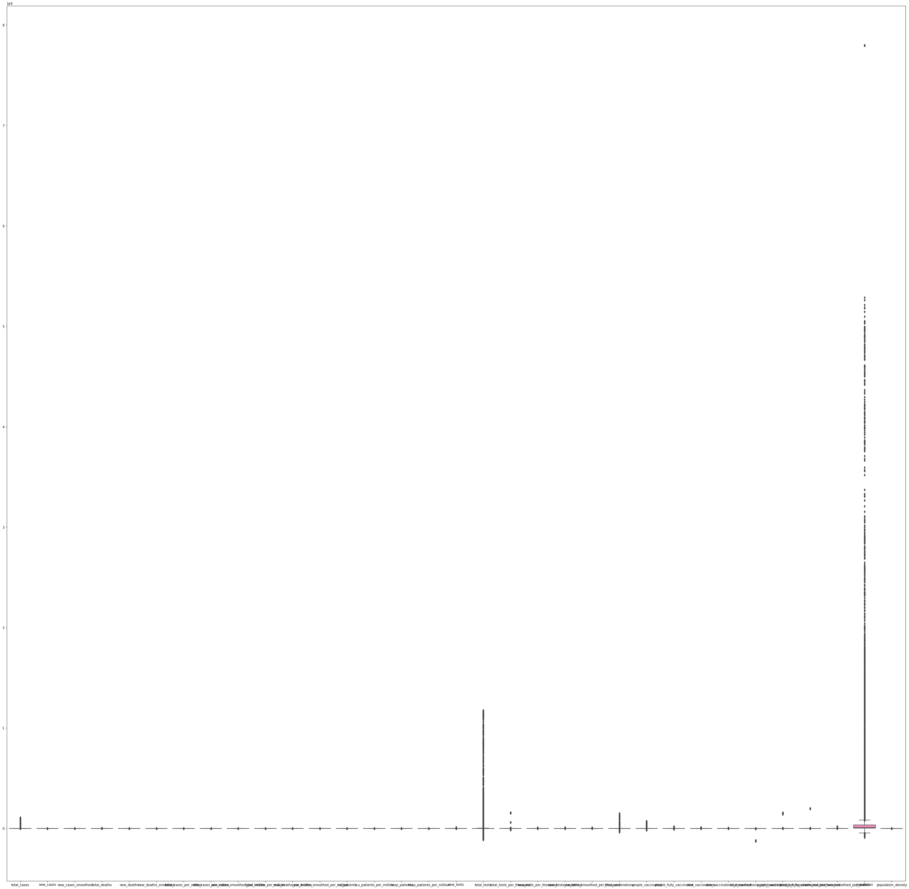
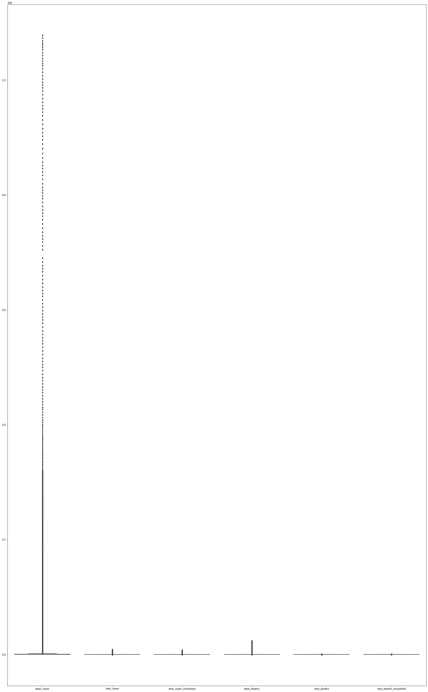
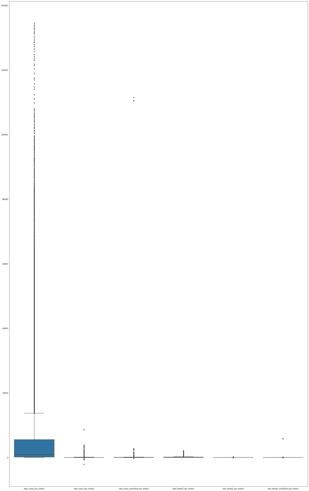
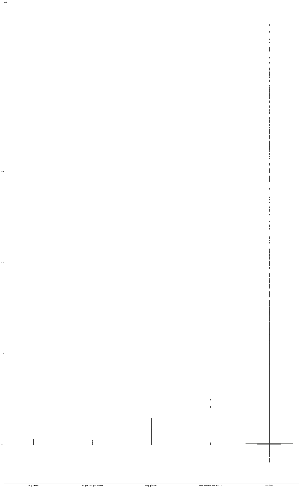
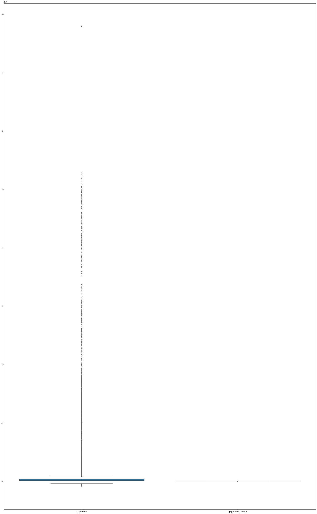
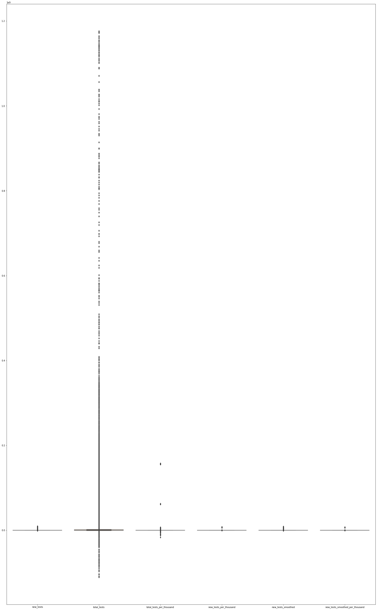
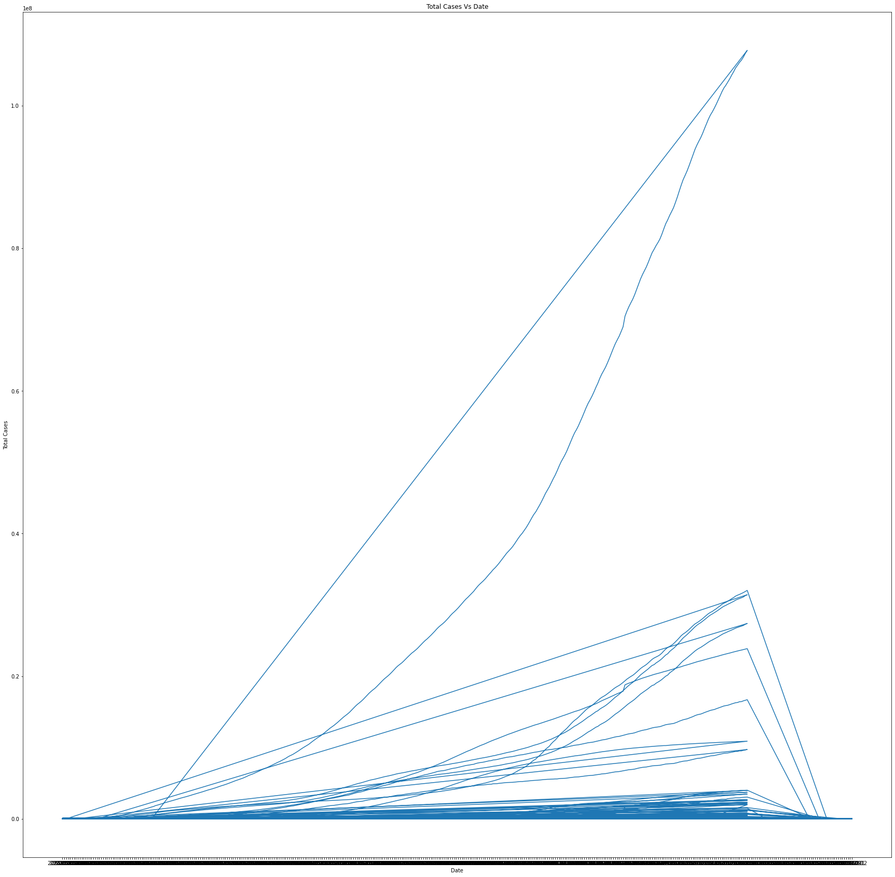
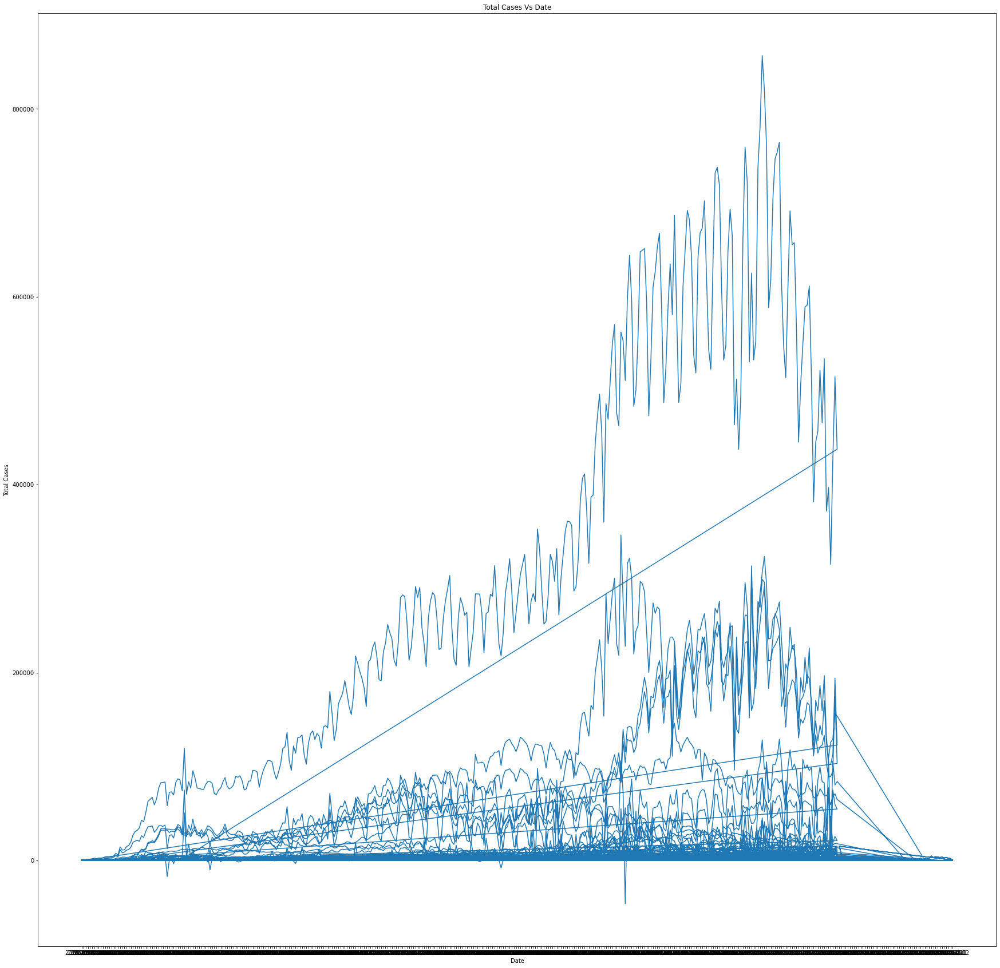

```python
import pandas as pd
df = pd.read_csv("D:\Final_project\data\Owid-covid-data-filled.csv")
```


```python
df.isnull().sum()
```


    iso_code                                   387
    continent                                    0
    location                                     0
    date                                         0
    total_cases                                  0
    new_cases                                    0
    new_cases_smoothed                           0
    total_deaths                                 0
    new_deaths                                   0
    new_deaths_smoothed                          0
    total_cases_per_million                      0
    new_cases_per_million                        0
    new_cases_smoothed_per_million               0
    total_deaths_per_million                     0
    new_deaths_per_million                       0
    new_deaths_smoothed_per_million              0
    reproduction_rate                        16776
    icu_patients                                 0
    icu_patients_per_million                     0
    hosp_patients                                0
    hosp_patients_per_million                    0
    weekly_icu_admissions                    67399
    weekly_icu_admissions_per_million        67399
    weekly_hosp_admissions                   66959
    weekly_hosp_admissions_per_million       66959
    new_tests                                    0
    total_tests                                  0
    total_tests_per_thousand                     0
    new_tests_per_thousand                       0
    new_tests_smoothed                           0
    new_tests_smoothed_per_thousand              0
    positive_rate                            34753
    tests_per_case                           35257
    tests_units                              31896
    total_vaccinations                           0
    people_vaccinated                            0
    people_fully_vaccinated                      0
    new_vaccinations                             0
    new_vaccinations_smoothed                    0
    total_vaccinations_per_hundred               0
    people_vaccinated_per_hundred                0
    people_fully_vaccinated_per_hundred          0
    new_vaccinations_smoothed_per_million        0
    stringency_index                          9552
    population                                   0
    population_density                           0
    median_age                                5850
    aged_65_older                             6570
    aged_70_older                             6202
    gdp_per_capita                            5796
    extreme_poverty                          25398
    cardiovasc_death_rate                     5069
    diabetes_prevalence                       4420
    female_smokers                           18407
    male_smokers                             19088
    handwashing_facilities                   36474
    hospital_beds_per_thousand               10260
    life_expectancy                           3357
    human_development_index                   5126
    dtype: int64


```python
df[df.iso_code.isnull()].location.value_counts()
```


    North America    387
    Name: location, dtype: int64


```python
 df.loc[ df['location'] =='North America','iso_code'] = '-'
```


```python
df[df.iso_code=='-'].location.value_counts()
```


    North America    387
    Name: location, dtype: int64


```python
df.isnull().sum()
```


    iso_code                                     0
    continent                                    0
    location                                     0
    date                                         0
    total_cases                                  0
    new_cases                                    0
    new_cases_smoothed                           0
    total_deaths                                 0
    new_deaths                                   0
    new_deaths_smoothed                          0
    total_cases_per_million                      0
    new_cases_per_million                        0
    new_cases_smoothed_per_million               0
    total_deaths_per_million                     0
    new_deaths_per_million                       0
    new_deaths_smoothed_per_million              0
    reproduction_rate                        16776
    icu_patients                                 0
    icu_patients_per_million                     0
    hosp_patients                                0
    hosp_patients_per_million                    0
    weekly_icu_admissions                    67399
    weekly_icu_admissions_per_million        67399
    weekly_hosp_admissions                   66959
    weekly_hosp_admissions_per_million       66959
    new_tests                                    0
    total_tests                                  0
    total_tests_per_thousand                     0
    new_tests_per_thousand                       0
    new_tests_smoothed                           0
    new_tests_smoothed_per_thousand              0
    positive_rate                            34753
    tests_per_case                           35257
    tests_units                              31896
    total_vaccinations                           0
    people_vaccinated                            0
    people_fully_vaccinated                      0
    new_vaccinations                             0
    new_vaccinations_smoothed                    0
    total_vaccinations_per_hundred               0
    people_vaccinated_per_hundred                0
    people_fully_vaccinated_per_hundred          0
    new_vaccinations_smoothed_per_million        0
    stringency_index                          9552
    population                                   0
    population_density                           0
    median_age                                5850
    aged_65_older                             6570
    aged_70_older                             6202
    gdp_per_capita                            5796
    extreme_poverty                          25398
    cardiovasc_death_rate                     5069
    diabetes_prevalence                       4420
    female_smokers                           18407
    male_smokers                             19088
    handwashing_facilities                   36474
    hospital_beds_per_thousand               10260
    life_expectancy                           3357
    human_development_index                   5126
    dtype: int64


```python
# df.to_csv(r'D:\Final_project\Owid-covid-data-final.csv', index = False)
```


```python
# df = pd.read_csv("Owid-covid-data-final.csv")
```


```python
df.tail()
```


<div>
<style scoped>
    .dataframe tbody tr th:only-of-type {
        vertical-align: middle;
    }

    .dataframe tbody tr th {
        vertical-align: top;
    }

    .dataframe thead th {
        text-align: right;
    }
</style>
<table border="1" class="dataframe">
  <thead>
    <tr style="text-align: right;">
      <th></th>
      <th>iso_code</th>
      <th>continent</th>
      <th>location</th>
      <th>date</th>
      <th>total_cases</th>
      <th>new_cases</th>
      <th>new_cases_smoothed</th>
      <th>total_deaths</th>
      <th>new_deaths</th>
      <th>new_deaths_smoothed</th>
      <th>...</th>
      <th>gdp_per_capita</th>
      <th>extreme_poverty</th>
      <th>cardiovasc_death_rate</th>
      <th>diabetes_prevalence</th>
      <th>female_smokers</th>
      <th>male_smokers</th>
      <th>handwashing_facilities</th>
      <th>hospital_beds_per_thousand</th>
      <th>life_expectancy</th>
      <th>human_development_index</th>
    </tr>
  </thead>
  <tbody>
    <tr>
      <th>68066</th>
      <td>ZWE</td>
      <td>Africa</td>
      <td>Zimbabwe</td>
      <td>2021-02-07</td>
      <td>34552.0</td>
      <td>65.0</td>
      <td>166.286</td>
      <td>1326.0</td>
      <td>10.0</td>
      <td>15.571</td>
      <td>...</td>
      <td>1899.775</td>
      <td>21.4</td>
      <td>307.846</td>
      <td>1.82</td>
      <td>1.6</td>
      <td>30.7</td>
      <td>36.791</td>
      <td>1.7</td>
      <td>61.49</td>
      <td>0.571</td>
    </tr>
    <tr>
      <th>68067</th>
      <td>ZWE</td>
      <td>Africa</td>
      <td>Zimbabwe</td>
      <td>2021-02-08</td>
      <td>34658.0</td>
      <td>106.0</td>
      <td>158.571</td>
      <td>1339.0</td>
      <td>13.0</td>
      <td>15.000</td>
      <td>...</td>
      <td>1899.775</td>
      <td>21.4</td>
      <td>307.846</td>
      <td>1.82</td>
      <td>1.6</td>
      <td>30.7</td>
      <td>36.791</td>
      <td>1.7</td>
      <td>61.49</td>
      <td>0.571</td>
    </tr>
    <tr>
      <th>68068</th>
      <td>ZWE</td>
      <td>Africa</td>
      <td>Zimbabwe</td>
      <td>2021-02-09</td>
      <td>34781.0</td>
      <td>123.0</td>
      <td>138.143</td>
      <td>1353.0</td>
      <td>14.0</td>
      <td>14.143</td>
      <td>...</td>
      <td>1899.775</td>
      <td>21.4</td>
      <td>307.846</td>
      <td>1.82</td>
      <td>1.6</td>
      <td>30.7</td>
      <td>36.791</td>
      <td>1.7</td>
      <td>61.49</td>
      <td>0.571</td>
    </tr>
    <tr>
      <th>68069</th>
      <td>ZWE</td>
      <td>Africa</td>
      <td>Zimbabwe</td>
      <td>2021-02-10</td>
      <td>34864.0</td>
      <td>83.0</td>
      <td>128.571</td>
      <td>1364.0</td>
      <td>11.0</td>
      <td>13.571</td>
      <td>...</td>
      <td>1899.775</td>
      <td>21.4</td>
      <td>307.846</td>
      <td>1.82</td>
      <td>1.6</td>
      <td>30.7</td>
      <td>36.791</td>
      <td>1.7</td>
      <td>61.49</td>
      <td>0.571</td>
    </tr>
    <tr>
      <th>68070</th>
      <td>ZWE</td>
      <td>Africa</td>
      <td>Zimbabwe</td>
      <td>2021-02-11</td>
      <td>34864.0</td>
      <td>0.0</td>
      <td>99.000</td>
      <td>1364.0</td>
      <td>0.0</td>
      <td>10.857</td>
      <td>...</td>
      <td>1899.775</td>
      <td>21.4</td>
      <td>307.846</td>
      <td>1.82</td>
      <td>1.6</td>
      <td>30.7</td>
      <td>36.791</td>
      <td>1.7</td>
      <td>61.49</td>
      <td>0.571</td>
    </tr>
  </tbody>
</table>
<p>5 rows × 59 columns</p>
</div>


```python
df[df.iso_code.isnull()].location.value_counts()
```


    Series([], Name: location, dtype: int64)


```python
df.isnull().sum()
```


    iso_code                                     0
    continent                                    0
    location                                     0
    date                                         0
    total_cases                                  0
    new_cases                                    0
    new_cases_smoothed                           0
    total_deaths                                 0
    new_deaths                                   0
    new_deaths_smoothed                          0
    total_cases_per_million                      0
    new_cases_per_million                        0
    new_cases_smoothed_per_million               0
    total_deaths_per_million                     0
    new_deaths_per_million                       0
    new_deaths_smoothed_per_million              0
    reproduction_rate                        16776
    icu_patients                                 0
    icu_patients_per_million                     0
    hosp_patients                                0
    hosp_patients_per_million                    0
    weekly_icu_admissions                    67399
    weekly_icu_admissions_per_million        67399
    weekly_hosp_admissions                   66959
    weekly_hosp_admissions_per_million       66959
    new_tests                                    0
    total_tests                                  0
    total_tests_per_thousand                     0
    new_tests_per_thousand                       0
    new_tests_smoothed                           0
    new_tests_smoothed_per_thousand              0
    positive_rate                            34753
    tests_per_case                           35257
    tests_units                              31896
    total_vaccinations                           0
    people_vaccinated                            0
    people_fully_vaccinated                      0
    new_vaccinations                             0
    new_vaccinations_smoothed                    0
    total_vaccinations_per_hundred               0
    people_vaccinated_per_hundred                0
    people_fully_vaccinated_per_hundred          0
    new_vaccinations_smoothed_per_million        0
    stringency_index                          9552
    population                                   0
    population_density                           0
    median_age                                5850
    aged_65_older                             6570
    aged_70_older                             6202
    gdp_per_capita                            5796
    extreme_poverty                          25398
    cardiovasc_death_rate                     5069
    diabetes_prevalence                       4420
    female_smokers                           18407
    male_smokers                             19088
    handwashing_facilities                   36474
    hospital_beds_per_thousand               10260
    life_expectancy                           3357
    human_development_index                   5126
    dtype: int64


```python
df.drop(['median_age', 'aged_65_older' , 'aged_70_older' ,'gdp_per_capita',
'extreme_poverty', 'cardiovasc_death_rate', 'diabetes_prevalence',                       
'female_smokers', 'male_smokers', 'handwashing_facilities',                   
'hospital_beds_per_thousand', 'life_expectancy', 'human_development_index',
'stringency_index', 'positive_rate', 'tests_per_case', 'tests_units',
'weekly_icu_admissions', 'weekly_icu_admissions_per_million',        
'weekly_hosp_admissions', 'weekly_hosp_admissions_per_million','reproduction_rate'],axis=1,inplace=True)
```


```python
df[df['location']=='Europe'].location.value_counts()
```


    Europe    386
    Name: location, dtype: int64


```python
df[df['location']=='European Union'].location.value_counts()
```


    European Union    386
    Name: location, dtype: int64


```python
df.drop(df[df['location']=='European Union'].index, inplace = True)
```


```python
df.isnull().sum()
```


    iso_code                                 0
    continent                                0
    location                                 0
    date                                     0
    total_cases                              0
    new_cases                                0
    new_cases_smoothed                       0
    total_deaths                             0
    new_deaths                               0
    new_deaths_smoothed                      0
    total_cases_per_million                  0
    new_cases_per_million                    0
    new_cases_smoothed_per_million           0
    total_deaths_per_million                 0
    new_deaths_per_million                   0
    new_deaths_smoothed_per_million          0
    icu_patients                             0
    icu_patients_per_million                 0
    hosp_patients                            0
    hosp_patients_per_million                0
    new_tests                                0
    total_tests                              0
    total_tests_per_thousand                 0
    new_tests_per_thousand                   0
    new_tests_smoothed                       0
    new_tests_smoothed_per_thousand          0
    total_vaccinations                       0
    people_vaccinated                        0
    people_fully_vaccinated                  0
    new_vaccinations                         0
    new_vaccinations_smoothed                0
    total_vaccinations_per_hundred           0
    people_vaccinated_per_hundred            0
    people_fully_vaccinated_per_hundred      0
    new_vaccinations_smoothed_per_million    0
    population                               0
    population_density                       0
    dtype: int64


```python
df.describe()
```


<div>
<style scoped>
    .dataframe tbody tr th:only-of-type {
        vertical-align: middle;
    }

    .dataframe tbody tr th {
        vertical-align: top;
    }

    .dataframe thead th {
        text-align: right;
    }
</style>
<table border="1" class="dataframe">
  <thead>
    <tr style="text-align: right;">
      <th></th>
      <th>total_cases</th>
      <th>new_cases</th>
      <th>new_cases_smoothed</th>
      <th>total_deaths</th>
      <th>new_deaths</th>
      <th>new_deaths_smoothed</th>
      <th>total_cases_per_million</th>
      <th>new_cases_per_million</th>
      <th>new_cases_smoothed_per_million</th>
      <th>total_deaths_per_million</th>
      <th>...</th>
      <th>people_vaccinated</th>
      <th>people_fully_vaccinated</th>
      <th>new_vaccinations</th>
      <th>new_vaccinations_smoothed</th>
      <th>total_vaccinations_per_hundred</th>
      <th>people_vaccinated_per_hundred</th>
      <th>people_fully_vaccinated_per_hundred</th>
      <th>new_vaccinations_smoothed_per_million</th>
      <th>population</th>
      <th>population_density</th>
    </tr>
  </thead>
  <tbody>
    <tr>
      <th>count</th>
      <td>6.768500e+04</td>
      <td>67685.000000</td>
      <td>67685.000000</td>
      <td>6.768500e+04</td>
      <td>67685.000000</td>
      <td>67685.000000</td>
      <td>67685.000000</td>
      <td>67685.000000</td>
      <td>67685.000000</td>
      <td>67685.000000</td>
      <td>...</td>
      <td>6.768500e+04</td>
      <td>6.768500e+04</td>
      <td>6.768500e+04</td>
      <td>6.768500e+04</td>
      <td>6.768500e+04</td>
      <td>6.768500e+04</td>
      <td>6.768500e+04</td>
      <td>6.768500e+04</td>
      <td>6.768500e+04</td>
      <td>67685.000000</td>
    </tr>
    <tr>
      <th>mean</th>
      <td>5.188787e+05</td>
      <td>4740.537224</td>
      <td>4685.482836</td>
      <td>1.380527e+04</td>
      <td>104.979168</td>
      <td>103.413231</td>
      <td>6269.765436</td>
      <td>61.743019</td>
      <td>70.972782</td>
      <td>132.285572</td>
      <td>...</td>
      <td>3.286945e+05</td>
      <td>1.810588e+05</td>
      <td>3.564937e+03</td>
      <td>3.248057e+04</td>
      <td>-7.546713e+05</td>
      <td>8.681133e+05</td>
      <td>1.207089e+06</td>
      <td>1.076262e+05</td>
      <td>1.181865e+08</td>
      <td>306.482930</td>
    </tr>
    <tr>
      <th>std</th>
      <td>3.836257e+06</td>
      <td>31627.173421</td>
      <td>31153.039680</td>
      <td>9.031974e+04</td>
      <td>651.833423</td>
      <td>626.110193</td>
      <td>12684.398713</td>
      <td>164.803422</td>
      <td>961.918802</td>
      <td>264.962205</td>
      <td>...</td>
      <td>1.741964e+06</td>
      <td>4.037207e+05</td>
      <td>1.613404e+05</td>
      <td>1.320416e+05</td>
      <td>8.888401e+06</td>
      <td>1.022249e+07</td>
      <td>1.421657e+07</td>
      <td>1.268981e+06</td>
      <td>6.606875e+08</td>
      <td>1511.585643</td>
    </tr>
    <tr>
      <th>min</th>
      <td>0.000000e+00</td>
      <td>-46076.000000</td>
      <td>-1121.714000</td>
      <td>0.000000e+00</td>
      <td>-1918.000000</td>
      <td>-232.143000</td>
      <td>0.000000</td>
      <td>-2153.437000</td>
      <td>-276.825000</td>
      <td>0.000000</td>
      <td>...</td>
      <td>-1.626592e+07</td>
      <td>-6.053738e+06</td>
      <td>-1.151069e+06</td>
      <td>-8.823788e+05</td>
      <td>-1.258920e+08</td>
      <td>-4.691574e+05</td>
      <td>-3.052317e+05</td>
      <td>-3.975774e+04</td>
      <td>-8.935061e+07</td>
      <td>1.980000</td>
    </tr>
    <tr>
      <th>25%</th>
      <td>5.760000e+02</td>
      <td>1.000000</td>
      <td>5.571000</td>
      <td>9.000000e+00</td>
      <td>0.000000</td>
      <td>0.000000</td>
      <td>107.613000</td>
      <td>0.067000</td>
      <td>0.908000</td>
      <td>1.290000</td>
      <td>...</td>
      <td>1.141060e+05</td>
      <td>1.586384e+05</td>
      <td>-1.769145e+04</td>
      <td>1.434273e+04</td>
      <td>-4.515736e+04</td>
      <td>3.655967e+03</td>
      <td>4.924128e+03</td>
      <td>4.988890e+02</td>
      <td>2.877800e+06</td>
      <td>35.608000</td>
    </tr>
    <tr>
      <th>50%</th>
      <td>6.323000e+03</td>
      <td>51.000000</td>
      <td>70.857000</td>
      <td>1.120000e+02</td>
      <td>1.000000</td>
      <td>1.000000</td>
      <td>893.302000</td>
      <td>5.276000</td>
      <td>7.457000</td>
      <td>16.458000</td>
      <td>...</td>
      <td>1.164604e+05</td>
      <td>1.619744e+05</td>
      <td>-1.757826e+04</td>
      <td>1.447155e+04</td>
      <td>-8.894151e+03</td>
      <td>1.241056e+04</td>
      <td>1.495961e+04</td>
      <td>1.480104e+03</td>
      <td>1.019671e+07</td>
      <td>82.805000</td>
    </tr>
    <tr>
      <th>75%</th>
      <td>7.023100e+04</td>
      <td>597.000000</td>
      <td>604.714000</td>
      <td>1.356000e+03</td>
      <td>10.000000</td>
      <td>10.429000</td>
      <td>5566.382000</td>
      <td>48.936000</td>
      <td>55.007000</td>
      <td>105.487000</td>
      <td>...</td>
      <td>1.288621e+05</td>
      <td>1.630406e+05</td>
      <td>-1.602021e+04</td>
      <td>1.545249e+04</td>
      <td>-1.757107e+03</td>
      <td>4.285380e+04</td>
      <td>5.523133e+04</td>
      <td>5.074695e+03</td>
      <td>3.481387e+07</td>
      <td>207.566000</td>
    </tr>
    <tr>
      <th>max</th>
      <td>1.077784e+08</td>
      <td>856853.000000</td>
      <td>737758.143000</td>
      <td>2.368527e+06</td>
      <td>17885.000000</td>
      <td>14406.143000</td>
      <td>134485.213000</td>
      <td>8652.658000</td>
      <td>111523.390000</td>
      <td>2121.516000</td>
      <td>...</td>
      <td>7.319694e+07</td>
      <td>2.019557e+07</td>
      <td>1.258528e+07</td>
      <td>6.146844e+06</td>
      <td>7.110359e+05</td>
      <td>1.579923e+08</td>
      <td>2.002581e+08</td>
      <td>1.875808e+07</td>
      <td>7.794799e+09</td>
      <td>19347.500000</td>
    </tr>
  </tbody>
</table>
<p>8 rows × 33 columns</p>
</div>


```python
corr=df.corr()
corr.style.background_gradient(cmap='coolwarm')
```


<style  type="text/css" >
#T_7b247_row0_col0,#T_7b247_row1_col1,#T_7b247_row2_col2,#T_7b247_row3_col3,#T_7b247_row4_col4,#T_7b247_row5_col5,#T_7b247_row6_col6,#T_7b247_row7_col7,#T_7b247_row8_col8,#T_7b247_row9_col9,#T_7b247_row10_col10,#T_7b247_row11_col11,#T_7b247_row12_col12,#T_7b247_row12_col14,#T_7b247_row13_col13,#T_7b247_row13_col15,#T_7b247_row13_col19,#T_7b247_row13_col21,#T_7b247_row13_col28,#T_7b247_row13_col29,#T_7b247_row13_col30,#T_7b247_row14_col12,#T_7b247_row14_col14,#T_7b247_row15_col13,#T_7b247_row15_col15,#T_7b247_row15_col18,#T_7b247_row15_col19,#T_7b247_row15_col21,#T_7b247_row15_col28,#T_7b247_row15_col29,#T_7b247_row15_col30,#T_7b247_row16_col16,#T_7b247_row17_col17,#T_7b247_row18_col15,#T_7b247_row18_col18,#T_7b247_row18_col19,#T_7b247_row18_col21,#T_7b247_row18_col28,#T_7b247_row18_col29,#T_7b247_row18_col30,#T_7b247_row19_col13,#T_7b247_row19_col15,#T_7b247_row19_col18,#T_7b247_row19_col19,#T_7b247_row19_col21,#T_7b247_row19_col28,#T_7b247_row19_col29,#T_7b247_row19_col30,#T_7b247_row20_col20,#T_7b247_row21_col13,#T_7b247_row21_col15,#T_7b247_row21_col18,#T_7b247_row21_col19,#T_7b247_row21_col21,#T_7b247_row21_col28,#T_7b247_row21_col29,#T_7b247_row21_col30,#T_7b247_row22_col22,#T_7b247_row23_col23,#T_7b247_row24_col24,#T_7b247_row25_col25,#T_7b247_row26_col26,#T_7b247_row27_col27,#T_7b247_row28_col13,#T_7b247_row28_col15,#T_7b247_row28_col18,#T_7b247_row28_col19,#T_7b247_row28_col21,#T_7b247_row28_col28,#T_7b247_row28_col29,#T_7b247_row28_col30,#T_7b247_row29_col13,#T_7b247_row29_col15,#T_7b247_row29_col18,#T_7b247_row29_col19,#T_7b247_row29_col21,#T_7b247_row29_col28,#T_7b247_row29_col29,#T_7b247_row29_col30,#T_7b247_row30_col13,#T_7b247_row30_col15,#T_7b247_row30_col18,#T_7b247_row30_col19,#T_7b247_row30_col21,#T_7b247_row30_col28,#T_7b247_row30_col29,#T_7b247_row30_col30,#T_7b247_row31_col31,#T_7b247_row32_col32{
            background-color:  #b40426;
            color:  #f1f1f1;
        }#T_7b247_row0_col1,#T_7b247_row1_col0,#T_7b247_row1_col5,#T_7b247_row5_col1{
            background-color:  #cf453c;
            color:  #f1f1f1;
        }#T_7b247_row0_col2,#T_7b247_row0_col14,#T_7b247_row1_col3,#T_7b247_row2_col0,#T_7b247_row2_col5,#T_7b247_row3_col1,#T_7b247_row3_col5,#T_7b247_row5_col2,#T_7b247_row5_col3,#T_7b247_row14_col0,#T_7b247_row14_col17,#T_7b247_row17_col14{
            background-color:  #ca3b37;
            color:  #f1f1f1;
        }#T_7b247_row0_col3,#T_7b247_row0_col17,#T_7b247_row2_col20,#T_7b247_row3_col0,#T_7b247_row3_col20,#T_7b247_row17_col0,#T_7b247_row20_col2,#T_7b247_row20_col3{
            background-color:  #bb1b2c;
            color:  #f1f1f1;
        }#T_7b247_row0_col4,#T_7b247_row4_col0{
            background-color:  #dc5d4a;
            color:  #000000;
        }#T_7b247_row0_col5,#T_7b247_row4_col16,#T_7b247_row5_col0,#T_7b247_row16_col4{
            background-color:  #d55042;
            color:  #000000;
        }#T_7b247_row0_col6,#T_7b247_row3_col9,#T_7b247_row19_col8,#T_7b247_row31_col24{
            background-color:  #7a9df8;
            color:  #000000;
        }#T_7b247_row0_col7,#T_7b247_row1_col8,#T_7b247_row2_col8,#T_7b247_row10_col14,#T_7b247_row10_col25,#T_7b247_row17_col7,#T_7b247_row25_col10{
            background-color:  #5f7fe8;
            color:  #000000;
        }#T_7b247_row0_col8,#T_7b247_row3_col7,#T_7b247_row4_col8,#T_7b247_row5_col8,#T_7b247_row7_col2,#T_7b247_row10_col12,#T_7b247_row12_col8,#T_7b247_row14_col8,#T_7b247_row14_col10,#T_7b247_row16_col8,#T_7b247_row17_col8,#T_7b247_row20_col8{
            background-color:  #5e7de7;
            color:  #000000;
        }#T_7b247_row0_col9,#T_7b247_row9_col14,#T_7b247_row12_col6,#T_7b247_row17_col9{
            background-color:  #7396f5;
            color:  #000000;
        }#T_7b247_row0_col10,#T_7b247_row10_col0,#T_7b247_row10_col16,#T_7b247_row16_col10{
            background-color:  #5470de;
            color:  #000000;
        }#T_7b247_row0_col11,#T_7b247_row1_col10,#T_7b247_row1_col11,#T_7b247_row2_col11,#T_7b247_row3_col11,#T_7b247_row7_col4,#T_7b247_row7_col14,#T_7b247_row8_col9,#T_7b247_row10_col1,#T_7b247_row10_col23,#T_7b247_row11_col6,#T_7b247_row12_col11,#T_7b247_row14_col11,#T_7b247_row16_col11,#T_7b247_row17_col11,#T_7b247_row20_col11,#T_7b247_row22_col11,#T_7b247_row23_col8,#T_7b247_row23_col10,#T_7b247_row23_col11,#T_7b247_row25_col8,#T_7b247_row25_col11,#T_7b247_row26_col8,#T_7b247_row26_col11,#T_7b247_row31_col8,#T_7b247_row32_col11{
            background-color:  #5a78e4;
            color:  #000000;
        }#T_7b247_row0_col12,#T_7b247_row12_col0{
            background-color:  #cc403a;
            color:  #f1f1f1;
        }#T_7b247_row0_col13,#T_7b247_row0_col15,#T_7b247_row0_col18,#T_7b247_row0_col19,#T_7b247_row0_col21,#T_7b247_row0_col28,#T_7b247_row0_col29,#T_7b247_row0_col30,#T_7b247_row1_col13,#T_7b247_row1_col15,#T_7b247_row1_col18,#T_7b247_row1_col19,#T_7b247_row1_col21,#T_7b247_row1_col28,#T_7b247_row1_col29,#T_7b247_row1_col30,#T_7b247_row2_col13,#T_7b247_row2_col15,#T_7b247_row2_col18,#T_7b247_row2_col19,#T_7b247_row2_col21,#T_7b247_row2_col28,#T_7b247_row2_col29,#T_7b247_row2_col30,#T_7b247_row3_col13,#T_7b247_row3_col15,#T_7b247_row3_col18,#T_7b247_row3_col19,#T_7b247_row3_col21,#T_7b247_row3_col28,#T_7b247_row3_col29,#T_7b247_row3_col30,#T_7b247_row4_col13,#T_7b247_row4_col15,#T_7b247_row4_col18,#T_7b247_row4_col19,#T_7b247_row4_col21,#T_7b247_row4_col28,#T_7b247_row4_col29,#T_7b247_row4_col30,#T_7b247_row5_col15,#T_7b247_row5_col18,#T_7b247_row5_col19,#T_7b247_row5_col21,#T_7b247_row5_col28,#T_7b247_row5_col29,#T_7b247_row5_col30,#T_7b247_row9_col7,#T_7b247_row12_col13,#T_7b247_row12_col15,#T_7b247_row12_col18,#T_7b247_row12_col19,#T_7b247_row12_col21,#T_7b247_row12_col28,#T_7b247_row12_col29,#T_7b247_row12_col30,#T_7b247_row14_col13,#T_7b247_row14_col15,#T_7b247_row14_col18,#T_7b247_row14_col19,#T_7b247_row14_col21,#T_7b247_row14_col28,#T_7b247_row14_col29,#T_7b247_row14_col30,#T_7b247_row16_col13,#T_7b247_row16_col15,#T_7b247_row16_col18,#T_7b247_row16_col19,#T_7b247_row16_col21,#T_7b247_row16_col28,#T_7b247_row16_col29,#T_7b247_row16_col30,#T_7b247_row17_col13,#T_7b247_row17_col15,#T_7b247_row17_col18,#T_7b247_row17_col19,#T_7b247_row17_col21,#T_7b247_row17_col28,#T_7b247_row17_col29,#T_7b247_row17_col30,#T_7b247_row20_col13,#T_7b247_row20_col15,#T_7b247_row20_col18,#T_7b247_row20_col19,#T_7b247_row20_col21,#T_7b247_row20_col28,#T_7b247_row20_col29,#T_7b247_row20_col30,#T_7b247_row22_col13,#T_7b247_row22_col15,#T_7b247_row22_col18,#T_7b247_row22_col19,#T_7b247_row22_col21,#T_7b247_row22_col28,#T_7b247_row22_col29,#T_7b247_row22_col30,#T_7b247_row23_col13,#T_7b247_row23_col15,#T_7b247_row23_col18,#T_7b247_row23_col19,#T_7b247_row23_col21,#T_7b247_row23_col28,#T_7b247_row23_col29,#T_7b247_row23_col30,#T_7b247_row25_col13,#T_7b247_row25_col15,#T_7b247_row25_col18,#T_7b247_row25_col19,#T_7b247_row25_col21,#T_7b247_row25_col28,#T_7b247_row25_col29,#T_7b247_row25_col30,#T_7b247_row26_col13,#T_7b247_row26_col15,#T_7b247_row26_col18,#T_7b247_row26_col19,#T_7b247_row26_col21,#T_7b247_row26_col28,#T_7b247_row26_col29,#T_7b247_row26_col30,#T_7b247_row31_col15,#T_7b247_row31_col19,#T_7b247_row31_col21,#T_7b247_row31_col28,#T_7b247_row31_col29,#T_7b247_row31_col30{
            background-color:  #dbdcde;
            color:  #000000;
        }#T_7b247_row0_col16,#T_7b247_row16_col0{
            background-color:  #c12b30;
            color:  #f1f1f1;
        }#T_7b247_row0_col20,#T_7b247_row1_col20,#T_7b247_row3_col14,#T_7b247_row4_col12,#T_7b247_row4_col14,#T_7b247_row12_col4,#T_7b247_row14_col3,#T_7b247_row14_col4,#T_7b247_row20_col0,#T_7b247_row20_col1,#T_7b247_row22_col23,#T_7b247_row23_col22{
            background-color:  #c0282f;
            color:  #f1f1f1;
        }#T_7b247_row0_col22,#T_7b247_row22_col0,#T_7b247_row23_col31,#T_7b247_row31_col23{
            background-color:  #f0cdbb;
            color:  #000000;
        }#T_7b247_row0_col23,#T_7b247_row14_col22,#T_7b247_row23_col0{
            background-color:  #efcfbf;
            color:  #000000;
        }#T_7b247_row0_col24{
            background-color:  #cad8ef;
            color:  #000000;
        }#T_7b247_row0_col25,#T_7b247_row25_col0{
            background-color:  #f7b79b;
            color:  #000000;
        }#T_7b247_row0_col26,#T_7b247_row26_col0{
            background-color:  #f7a98b;
            color:  #000000;
        }#T_7b247_row0_col27,#T_7b247_row1_col27,#T_7b247_row2_col27,#T_7b247_row3_col27,#T_7b247_row4_col27,#T_7b247_row5_col27,#T_7b247_row12_col27,#T_7b247_row14_col27,#T_7b247_row16_col27,#T_7b247_row17_col27,#T_7b247_row20_col27,#T_7b247_row22_col27,#T_7b247_row23_col27,#T_7b247_row25_col27,#T_7b247_row26_col27,#T_7b247_row31_col27{
            background-color:  #dedcdb;
            color:  #000000;
        }#T_7b247_row0_col31,#T_7b247_row31_col0{
            background-color:  #f7b497;
            color:  #000000;
        }#T_7b247_row0_col32,#T_7b247_row7_col31,#T_7b247_row8_col0,#T_7b247_row8_col17,#T_7b247_row8_col20,#T_7b247_row11_col4,#T_7b247_row11_col5,#T_7b247_row11_col12,#T_7b247_row11_col14,#T_7b247_row22_col32,#T_7b247_row27_col0,#T_7b247_row27_col20,#T_7b247_row27_col22,#T_7b247_row27_col23{
            background-color:  #4358cb;
            color:  #f1f1f1;
        }#T_7b247_row1_col2,#T_7b247_row2_col1,#T_7b247_row5_col14,#T_7b247_row14_col5,#T_7b247_row17_col20,#T_7b247_row20_col17{
            background-color:  #b70d28;
            color:  #f1f1f1;
        }#T_7b247_row1_col4,#T_7b247_row4_col1,#T_7b247_row12_col17,#T_7b247_row17_col12{
            background-color:  #cd423b;
            color:  #f1f1f1;
        }#T_7b247_row1_col6,#T_7b247_row2_col24{
            background-color:  #7699f6;
            color:  #000000;
        }#T_7b247_row1_col7,#T_7b247_row9_col25,#T_7b247_row13_col6,#T_7b247_row15_col6,#T_7b247_row19_col6,#T_7b247_row24_col9,#T_7b247_row29_col6{
            background-color:  #6b8df0;
            color:  #000000;
        }#T_7b247_row1_col9,#T_7b247_row1_col24,#T_7b247_row2_col9,#T_7b247_row4_col9,#T_7b247_row9_col0,#T_7b247_row9_col5,#T_7b247_row9_col12,#T_7b247_row9_col17,#T_7b247_row10_col8,#T_7b247_row16_col9,#T_7b247_row20_col9,#T_7b247_row24_col31{
            background-color:  #7093f3;
            color:  #000000;
        }#T_7b247_row1_col12,#T_7b247_row12_col1,#T_7b247_row23_col26,#T_7b247_row26_col23{
            background-color:  #c43032;
            color:  #f1f1f1;
        }#T_7b247_row1_col14,#T_7b247_row2_col17,#T_7b247_row3_col12,#T_7b247_row12_col3,#T_7b247_row14_col1,#T_7b247_row17_col2{
            background-color:  #c32e31;
            color:  #f1f1f1;
        }#T_7b247_row1_col16,#T_7b247_row2_col12,#T_7b247_row2_col14,#T_7b247_row4_col5,#T_7b247_row5_col4,#T_7b247_row12_col2,#T_7b247_row14_col2,#T_7b247_row16_col1{
            background-color:  #be242e;
            color:  #f1f1f1;
        }#T_7b247_row1_col17,#T_7b247_row17_col1{
            background-color:  #c73635;
            color:  #f1f1f1;
        }#T_7b247_row1_col22,#T_7b247_row22_col1{
            background-color:  #bfd3f6;
            color:  #000000;
        }#T_7b247_row1_col23,#T_7b247_row23_col1{
            background-color:  #cbd8ee;
            color:  #000000;
        }#T_7b247_row1_col25,#T_7b247_row2_col25,#T_7b247_row22_col12,#T_7b247_row25_col1,#T_7b247_row25_col2{
            background-color:  #eed0c0;
            color:  #000000;
        }#T_7b247_row1_col26,#T_7b247_row22_col14,#T_7b247_row26_col1{
            background-color:  #efcebd;
            color:  #000000;
        }#T_7b247_row1_col31,#T_7b247_row3_col26,#T_7b247_row14_col26,#T_7b247_row26_col3,#T_7b247_row26_col14,#T_7b247_row31_col1{
            background-color:  #f4987a;
            color:  #000000;
        }#T_7b247_row1_col32,#T_7b247_row2_col32,#T_7b247_row3_col32,#T_7b247_row11_col1,#T_7b247_row11_col2,#T_7b247_row11_col3,#T_7b247_row11_col23,#T_7b247_row11_col25,#T_7b247_row11_col26,#T_7b247_row16_col32,#T_7b247_row17_col32,#T_7b247_row20_col32,#T_7b247_row23_col32,#T_7b247_row25_col32,#T_7b247_row26_col32,#T_7b247_row31_col32{
            background-color:  #4257c9;
            color:  #f1f1f1;
        }#T_7b247_row2_col3,#T_7b247_row3_col2,#T_7b247_row14_col16,#T_7b247_row14_col20,#T_7b247_row16_col14,#T_7b247_row20_col14{
            background-color:  #c53334;
            color:  #f1f1f1;
        }#T_7b247_row2_col4,#T_7b247_row4_col2{
            background-color:  #d1493f;
            color:  #f1f1f1;
        }#T_7b247_row2_col6,#T_7b247_row3_col6,#T_7b247_row17_col6,#T_7b247_row19_col11{
            background-color:  #779af7;
            color:  #000000;
        }#T_7b247_row2_col7,#T_7b247_row6_col17,#T_7b247_row18_col11,#T_7b247_row24_col1{
            background-color:  #6788ee;
            color:  #000000;
        }#T_7b247_row2_col10,#T_7b247_row6_col25,#T_7b247_row6_col26,#T_7b247_row7_col12,#T_7b247_row10_col2,#T_7b247_row10_col26,#T_7b247_row22_col8,#T_7b247_row24_col11,#T_7b247_row31_col11{
            background-color:  #5977e3;
            color:  #000000;
        }#T_7b247_row2_col16,#T_7b247_row3_col16,#T_7b247_row16_col2,#T_7b247_row16_col3{
            background-color:  #bd1f2d;
            color:  #f1f1f1;
        }#T_7b247_row2_col22,#T_7b247_row24_col0{
            background-color:  #c4d5f3;
            color:  #000000;
        }#T_7b247_row2_col23,#T_7b247_row3_col24,#T_7b247_row23_col2{
            background-color:  #d1dae9;
            color:  #000000;
        }#T_7b247_row2_col26,#T_7b247_row8_col13,#T_7b247_row26_col2{
            background-color:  #f2cab5;
            color:  #000000;
        }#T_7b247_row2_col31,#T_7b247_row5_col25,#T_7b247_row25_col5,#T_7b247_row31_col2{
            background-color:  #f39778;
            color:  #000000;
        }#T_7b247_row3_col4,#T_7b247_row4_col3,#T_7b247_row5_col16,#T_7b247_row16_col5{
            background-color:  #d24b40;
            color:  #f1f1f1;
        }#T_7b247_row3_col8,#T_7b247_row12_col10,#T_7b247_row32_col8{
            background-color:  #5d7ce6;
            color:  #000000;
        }#T_7b247_row3_col10,#T_7b247_row7_col0,#T_7b247_row7_col3,#T_7b247_row11_col7,#T_7b247_row31_col6{
            background-color:  #5572df;
            color:  #000000;
        }#T_7b247_row3_col17,#T_7b247_row17_col3{
            background-color:  #ba162b;
            color:  #f1f1f1;
        }#T_7b247_row3_col22,#T_7b247_row12_col23,#T_7b247_row14_col23,#T_7b247_row20_col26,#T_7b247_row22_col3,#T_7b247_row23_col12,#T_7b247_row26_col20{
            background-color:  #f5c2aa;
            color:  #000000;
        }#T_7b247_row3_col23,#T_7b247_row22_col5,#T_7b247_row23_col3{
            background-color:  #f5c4ac;
            color:  #000000;
        }#T_7b247_row3_col25,#T_7b247_row12_col25,#T_7b247_row25_col3{
            background-color:  #f7a889;
            color:  #000000;
        }#T_7b247_row3_col31,#T_7b247_row31_col3{
            background-color:  #f59c7d;
            color:  #000000;
        }#T_7b247_row4_col6,#T_7b247_row5_col6,#T_7b247_row5_col9,#T_7b247_row8_col7,#T_7b247_row9_col8,#T_7b247_row9_col24,#T_7b247_row12_col9{
            background-color:  #7295f4;
            color:  #000000;
        }#T_7b247_row4_col7,#T_7b247_row6_col5,#T_7b247_row6_col11,#T_7b247_row7_col1,#T_7b247_row9_col11,#T_7b247_row10_col5,#T_7b247_row12_col7,#T_7b247_row14_col7,#T_7b247_row16_col7{
            background-color:  #6282ea;
            color:  #000000;
        }#T_7b247_row4_col10,#T_7b247_row6_col0,#T_7b247_row22_col6,#T_7b247_row23_col6{
            background-color:  #688aef;
            color:  #000000;
        }#T_7b247_row4_col11,#T_7b247_row5_col11,#T_7b247_row6_col24,#T_7b247_row32_col6{
            background-color:  #5b7ae5;
            color:  #000000;
        }#T_7b247_row4_col17,#T_7b247_row17_col4{
            background-color:  #df634e;
            color:  #000000;
        }#T_7b247_row4_col20,#T_7b247_row20_col4{
            background-color:  #da5a49;
            color:  #000000;
        }#T_7b247_row4_col22{
            background-color:  #f1cdba;
            color:  #000000;
        }#T_7b247_row4_col23,#T_7b247_row17_col26,#T_7b247_row26_col17{
            background-color:  #f7ba9f;
            color:  #000000;
        }#T_7b247_row4_col24{
            background-color:  #90b2fe;
            color:  #000000;
        }#T_7b247_row4_col25,#T_7b247_row25_col4{
            background-color:  #f29072;
            color:  #000000;
        }#T_7b247_row4_col26,#T_7b247_row26_col4{
            background-color:  #f39577;
            color:  #000000;
        }#T_7b247_row4_col31,#T_7b247_row14_col31,#T_7b247_row24_col22,#T_7b247_row31_col4,#T_7b247_row31_col14{
            background-color:  #ea7b60;
            color:  #000000;
        }#T_7b247_row4_col32,#T_7b247_row5_col32,#T_7b247_row8_col25,#T_7b247_row8_col26,#T_7b247_row8_col31,#T_7b247_row9_col32,#T_7b247_row11_col0,#T_7b247_row11_col16,#T_7b247_row11_col17,#T_7b247_row11_col20,#T_7b247_row11_col22,#T_7b247_row11_col31,#T_7b247_row12_col32,#T_7b247_row14_col32{
            background-color:  #4055c8;
            color:  #f1f1f1;
        }#T_7b247_row5_col7,#T_7b247_row5_col10,#T_7b247_row6_col4,#T_7b247_row20_col7{
            background-color:  #6180e9;
            color:  #000000;
        }#T_7b247_row5_col12,#T_7b247_row8_col11,#T_7b247_row11_col8,#T_7b247_row12_col5,#T_7b247_row13_col18,#T_7b247_row16_col20,#T_7b247_row18_col13,#T_7b247_row20_col16{
            background-color:  #b50927;
            color:  #f1f1f1;
        }#T_7b247_row5_col13,#T_7b247_row7_col27,#T_7b247_row10_col6,#T_7b247_row10_col13,#T_7b247_row10_col15,#T_7b247_row10_col18,#T_7b247_row10_col19,#T_7b247_row10_col21,#T_7b247_row10_col28,#T_7b247_row10_col29,#T_7b247_row10_col30,#T_7b247_row31_col13,#T_7b247_row31_col18{
            background-color:  #dadce0;
            color:  #000000;
        }#T_7b247_row5_col17,#T_7b247_row17_col5{
            background-color:  #d75445;
            color:  #000000;
        }#T_7b247_row5_col20,#T_7b247_row20_col5,#T_7b247_row25_col26,#T_7b247_row26_col25{
            background-color:  #d44e41;
            color:  #000000;
        }#T_7b247_row5_col22,#T_7b247_row7_col6,#T_7b247_row17_col25,#T_7b247_row25_col17{
            background-color:  #f4c5ad;
            color:  #000000;
        }#T_7b247_row5_col23,#T_7b247_row23_col5,#T_7b247_row24_col23{
            background-color:  #f7af91;
            color:  #000000;
        }#T_7b247_row5_col24{
            background-color:  #9abbff;
            color:  #000000;
        }#T_7b247_row5_col26,#T_7b247_row26_col5{
            background-color:  #ef886b;
            color:  #000000;
        }#T_7b247_row5_col31,#T_7b247_row31_col5{
            background-color:  #e67259;
            color:  #000000;
        }#T_7b247_row6_col1,#T_7b247_row6_col14,#T_7b247_row6_col16,#T_7b247_row7_col11,#T_7b247_row10_col11{
            background-color:  #6485ec;
            color:  #000000;
        }#T_7b247_row6_col2,#T_7b247_row6_col3{
            background-color:  #6687ed;
            color:  #000000;
        }#T_7b247_row6_col7{
            background-color:  #f3c8b2;
            color:  #000000;
        }#T_7b247_row6_col8,#T_7b247_row9_col3{
            background-color:  #799cf8;
            color:  #000000;
        }#T_7b247_row6_col9{
            background-color:  #ed8366;
            color:  #000000;
        }#T_7b247_row6_col10,#T_7b247_row6_col27{
            background-color:  #d2dbe8;
            color:  #000000;
        }#T_7b247_row6_col12,#T_7b247_row6_col20,#T_7b247_row24_col6{
            background-color:  #6384eb;
            color:  #000000;
        }#T_7b247_row6_col13,#T_7b247_row6_col15,#T_7b247_row6_col19,#T_7b247_row6_col21,#T_7b247_row6_col28,#T_7b247_row6_col29,#T_7b247_row6_col30{
            background-color:  #e7d7ce;
            color:  #000000;
        }#T_7b247_row6_col18{
            background-color:  #e8d6cc;
            color:  #000000;
        }#T_7b247_row6_col22,#T_7b247_row7_col17,#T_7b247_row7_col20,#T_7b247_row8_col10,#T_7b247_row10_col3,#T_7b247_row13_col32,#T_7b247_row15_col32,#T_7b247_row18_col32,#T_7b247_row19_col32,#T_7b247_row21_col32,#T_7b247_row28_col32,#T_7b247_row29_col32,#T_7b247_row30_col32{
            background-color:  #5673e0;
            color:  #000000;
        }#T_7b247_row6_col23,#T_7b247_row7_col5,#T_7b247_row7_col16,#T_7b247_row24_col8,#T_7b247_row26_col10{
            background-color:  #5875e1;
            color:  #000000;
        }#T_7b247_row6_col31,#T_7b247_row7_col26,#T_7b247_row8_col3,#T_7b247_row8_col4,#T_7b247_row8_col5,#T_7b247_row8_col12,#T_7b247_row8_col16,#T_7b247_row27_col1,#T_7b247_row27_col2,#T_7b247_row27_col3,#T_7b247_row27_col7,#T_7b247_row27_col16,#T_7b247_row27_col17,#T_7b247_row27_col25,#T_7b247_row27_col26{
            background-color:  #445acc;
            color:  #f1f1f1;
        }#T_7b247_row6_col32,#T_7b247_row20_col10,#T_7b247_row22_col10,#T_7b247_row32_col7{
            background-color:  #536edd;
            color:  #000000;
        }#T_7b247_row7_col8,#T_7b247_row28_col11,#T_7b247_row30_col8{
            background-color:  #81a4fb;
            color:  #000000;
        }#T_7b247_row7_col9,#T_7b247_row10_col9,#T_7b247_row16_col22,#T_7b247_row20_col23,#T_7b247_row22_col16,#T_7b247_row22_col20,#T_7b247_row23_col20{
            background-color:  #d8dce2;
            color:  #000000;
        }#T_7b247_row7_col10,#T_7b247_row17_col23,#T_7b247_row23_col17{
            background-color:  #e1dad6;
            color:  #000000;
        }#T_7b247_row7_col13,#T_7b247_row7_col15,#T_7b247_row7_col18,#T_7b247_row7_col19,#T_7b247_row7_col21,#T_7b247_row7_col28,#T_7b247_row7_col29,#T_7b247_row7_col30,#T_7b247_row10_col27{
            background-color:  #dfdbd9;
            color:  #000000;
        }#T_7b247_row7_col22,#T_7b247_row7_col24,#T_7b247_row13_col9,#T_7b247_row13_col27,#T_7b247_row15_col9,#T_7b247_row15_col10,#T_7b247_row15_col27,#T_7b247_row18_col10,#T_7b247_row18_col27,#T_7b247_row19_col9,#T_7b247_row19_col10,#T_7b247_row19_col27,#T_7b247_row21_col9,#T_7b247_row21_col10,#T_7b247_row21_col27,#T_7b247_row24_col7,#T_7b247_row27_col6,#T_7b247_row27_col8,#T_7b247_row27_col11,#T_7b247_row27_col13,#T_7b247_row27_col15,#T_7b247_row27_col18,#T_7b247_row27_col19,#T_7b247_row27_col21,#T_7b247_row27_col28,#T_7b247_row27_col29,#T_7b247_row27_col30,#T_7b247_row27_col32,#T_7b247_row28_col9,#T_7b247_row28_col10,#T_7b247_row28_col27,#T_7b247_row29_col9,#T_7b247_row29_col10,#T_7b247_row29_col27,#T_7b247_row30_col9,#T_7b247_row30_col10,#T_7b247_row30_col27,#T_7b247_row32_col0,#T_7b247_row32_col1,#T_7b247_row32_col2,#T_7b247_row32_col3,#T_7b247_row32_col4,#T_7b247_row32_col5,#T_7b247_row32_col9,#T_7b247_row32_col12,#T_7b247_row32_col14,#T_7b247_row32_col16,#T_7b247_row32_col17,#T_7b247_row32_col20,#T_7b247_row32_col22,#T_7b247_row32_col23,#T_7b247_row32_col25,#T_7b247_row32_col26,#T_7b247_row32_col31{
            background-color:  #3b4cc0;
            color:  #f1f1f1;
        }#T_7b247_row7_col23,#T_7b247_row8_col23{
            background-color:  #3f53c6;
            color:  #f1f1f1;
        }#T_7b247_row7_col25,#T_7b247_row8_col1,#T_7b247_row8_col2,#T_7b247_row8_col14,#T_7b247_row10_col32,#T_7b247_row22_col7,#T_7b247_row24_col32,#T_7b247_row27_col4,#T_7b247_row27_col5,#T_7b247_row27_col12,#T_7b247_row27_col14,#T_7b247_row27_col31{
            background-color:  #455cce;
            color:  #f1f1f1;
        }#T_7b247_row7_col32,#T_7b247_row13_col7,#T_7b247_row15_col7,#T_7b247_row18_col7,#T_7b247_row19_col7{
            background-color:  #506bda;
            color:  #000000;
        }#T_7b247_row8_col6,#T_7b247_row9_col2,#T_7b247_row9_col4,#T_7b247_row9_col16,#T_7b247_row22_col9,#T_7b247_row23_col9,#T_7b247_row26_col9{
            background-color:  #6f92f3;
            color:  #000000;
        }#T_7b247_row8_col15,#T_7b247_row11_col15,#T_7b247_row12_col22{
            background-color:  #edd1c2;
            color:  #000000;
        }#T_7b247_row8_col18,#T_7b247_row32_col15,#T_7b247_row32_col19,#T_7b247_row32_col21,#T_7b247_row32_col28,#T_7b247_row32_col29{
            background-color:  #e3d9d3;
            color:  #000000;
        }#T_7b247_row8_col19{
            background-color:  #ead5c9;
            color:  #000000;
        }#T_7b247_row8_col21,#T_7b247_row8_col29,#T_7b247_row11_col30{
            background-color:  #ebd3c6;
            color:  #000000;
        }#T_7b247_row8_col22,#T_7b247_row32_col10{
            background-color:  #3e51c5;
            color:  #f1f1f1;
        }#T_7b247_row8_col24,#T_7b247_row10_col24,#T_7b247_row27_col10,#T_7b247_row31_col10,#T_7b247_row32_col24{
            background-color:  #465ecf;
            color:  #f1f1f1;
        }#T_7b247_row8_col27,#T_7b247_row11_col27{
            background-color:  #cdd9ec;
            color:  #000000;
        }#T_7b247_row8_col28{
            background-color:  #edd2c3;
            color:  #000000;
        }#T_7b247_row8_col30,#T_7b247_row11_col28{
            background-color:  #ecd3c5;
            color:  #000000;
        }#T_7b247_row8_col32,#T_7b247_row9_col31,#T_7b247_row11_col9,#T_7b247_row11_col10,#T_7b247_row27_col9,#T_7b247_row27_col24,#T_7b247_row31_col7{
            background-color:  #4b64d5;
            color:  #f1f1f1;
        }#T_7b247_row9_col1,#T_7b247_row9_col20,#T_7b247_row25_col9{
            background-color:  #6e90f2;
            color:  #000000;
        }#T_7b247_row9_col6{
            background-color:  #eb7d62;
            color:  #000000;
        }#T_7b247_row9_col10,#T_7b247_row20_col22{
            background-color:  #d7dce3;
            color:  #000000;
        }#T_7b247_row9_col13,#T_7b247_row9_col15,#T_7b247_row9_col18,#T_7b247_row9_col19,#T_7b247_row9_col21,#T_7b247_row9_col28,#T_7b247_row9_col29,#T_7b247_row9_col30,#T_7b247_row16_col23,#T_7b247_row23_col16{
            background-color:  #d9dce1;
            color:  #000000;
        }#T_7b247_row9_col22,#T_7b247_row9_col23,#T_7b247_row9_col26,#T_7b247_row18_col6,#T_7b247_row24_col2{
            background-color:  #6c8ff1;
            color:  #000000;
        }#T_7b247_row9_col27,#T_7b247_row22_col31,#T_7b247_row31_col22{
            background-color:  #e0dbd8;
            color:  #000000;
        }#T_7b247_row10_col4,#T_7b247_row18_col8,#T_7b247_row21_col6,#T_7b247_row25_col6,#T_7b247_row26_col6,#T_7b247_row28_col6,#T_7b247_row30_col6{
            background-color:  #6a8bef;
            color:  #000000;
        }#T_7b247_row10_col7{
            background-color:  #e5d8d1;
            color:  #000000;
        }#T_7b247_row10_col17,#T_7b247_row10_col20,#T_7b247_row10_col22,#T_7b247_row17_col10{
            background-color:  #516ddb;
            color:  #000000;
        }#T_7b247_row10_col31{
            background-color:  #485fd1;
            color:  #f1f1f1;
        }#T_7b247_row11_col13,#T_7b247_row20_col25,#T_7b247_row25_col20{
            background-color:  #f2cbb7;
            color:  #000000;
        }#T_7b247_row11_col18,#T_7b247_row32_col13,#T_7b247_row32_col18,#T_7b247_row32_col30{
            background-color:  #e2dad5;
            color:  #000000;
        }#T_7b247_row11_col19{
            background-color:  #e9d5cb;
            color:  #000000;
        }#T_7b247_row11_col21,#T_7b247_row11_col29{
            background-color:  #ead4c8;
            color:  #000000;
        }#T_7b247_row11_col24,#T_7b247_row11_col32,#T_7b247_row13_col24,#T_7b247_row15_col24,#T_7b247_row18_col24,#T_7b247_row19_col24,#T_7b247_row21_col24,#T_7b247_row28_col24,#T_7b247_row29_col24,#T_7b247_row30_col24{
            background-color:  #4961d2;
            color:  #f1f1f1;
        }#T_7b247_row12_col16,#T_7b247_row12_col20,#T_7b247_row16_col12,#T_7b247_row20_col12,#T_7b247_row22_col26,#T_7b247_row26_col22{
            background-color:  #c83836;
            color:  #f1f1f1;
        }#T_7b247_row12_col24{
            background-color:  #94b6ff;
            color:  #000000;
        }#T_7b247_row12_col26,#T_7b247_row26_col12{
            background-color:  #f49a7b;
            color:  #000000;
        }#T_7b247_row12_col31,#T_7b247_row22_col24,#T_7b247_row31_col12{
            background-color:  #e97a5f;
            color:  #000000;
        }#T_7b247_row13_col0,#T_7b247_row13_col10,#T_7b247_row13_col20,#T_7b247_row13_col31,#T_7b247_row15_col0,#T_7b247_row15_col20,#T_7b247_row15_col31,#T_7b247_row18_col9,#T_7b247_row18_col20,#T_7b247_row18_col31,#T_7b247_row19_col0,#T_7b247_row19_col20,#T_7b247_row19_col31,#T_7b247_row21_col0,#T_7b247_row21_col20,#T_7b247_row21_col31,#T_7b247_row24_col10,#T_7b247_row28_col0,#T_7b247_row28_col17,#T_7b247_row28_col20,#T_7b247_row28_col31,#T_7b247_row29_col0,#T_7b247_row29_col17,#T_7b247_row29_col20,#T_7b247_row29_col31,#T_7b247_row30_col0,#T_7b247_row30_col17,#T_7b247_row30_col20,#T_7b247_row30_col31{
            background-color:  #3c4ec2;
            color:  #f1f1f1;
        }#T_7b247_row13_col1,#T_7b247_row13_col2,#T_7b247_row13_col3,#T_7b247_row13_col4,#T_7b247_row13_col5,#T_7b247_row13_col12,#T_7b247_row13_col14,#T_7b247_row13_col16,#T_7b247_row13_col17,#T_7b247_row13_col22,#T_7b247_row13_col23,#T_7b247_row13_col25,#T_7b247_row13_col26,#T_7b247_row15_col1,#T_7b247_row15_col2,#T_7b247_row15_col3,#T_7b247_row15_col4,#T_7b247_row15_col5,#T_7b247_row15_col12,#T_7b247_row15_col14,#T_7b247_row15_col16,#T_7b247_row15_col17,#T_7b247_row15_col22,#T_7b247_row15_col23,#T_7b247_row15_col25,#T_7b247_row15_col26,#T_7b247_row18_col0,#T_7b247_row18_col1,#T_7b247_row18_col2,#T_7b247_row18_col3,#T_7b247_row18_col4,#T_7b247_row18_col5,#T_7b247_row18_col12,#T_7b247_row18_col14,#T_7b247_row18_col16,#T_7b247_row18_col17,#T_7b247_row18_col22,#T_7b247_row18_col23,#T_7b247_row18_col25,#T_7b247_row18_col26,#T_7b247_row19_col1,#T_7b247_row19_col2,#T_7b247_row19_col3,#T_7b247_row19_col4,#T_7b247_row19_col5,#T_7b247_row19_col12,#T_7b247_row19_col14,#T_7b247_row19_col16,#T_7b247_row19_col17,#T_7b247_row19_col22,#T_7b247_row19_col23,#T_7b247_row19_col25,#T_7b247_row19_col26,#T_7b247_row21_col1,#T_7b247_row21_col2,#T_7b247_row21_col3,#T_7b247_row21_col4,#T_7b247_row21_col5,#T_7b247_row21_col12,#T_7b247_row21_col14,#T_7b247_row21_col16,#T_7b247_row21_col17,#T_7b247_row21_col22,#T_7b247_row21_col23,#T_7b247_row21_col25,#T_7b247_row21_col26,#T_7b247_row28_col1,#T_7b247_row28_col2,#T_7b247_row28_col3,#T_7b247_row28_col4,#T_7b247_row28_col5,#T_7b247_row28_col12,#T_7b247_row28_col14,#T_7b247_row28_col16,#T_7b247_row28_col22,#T_7b247_row28_col23,#T_7b247_row28_col25,#T_7b247_row28_col26,#T_7b247_row29_col1,#T_7b247_row29_col2,#T_7b247_row29_col3,#T_7b247_row29_col4,#T_7b247_row29_col5,#T_7b247_row29_col12,#T_7b247_row29_col14,#T_7b247_row29_col16,#T_7b247_row29_col22,#T_7b247_row29_col23,#T_7b247_row29_col25,#T_7b247_row29_col26,#T_7b247_row30_col1,#T_7b247_row30_col2,#T_7b247_row30_col3,#T_7b247_row30_col4,#T_7b247_row30_col5,#T_7b247_row30_col12,#T_7b247_row30_col14,#T_7b247_row30_col16,#T_7b247_row30_col22,#T_7b247_row30_col23,#T_7b247_row30_col25,#T_7b247_row30_col26{
            background-color:  #3d50c3;
            color:  #f1f1f1;
        }#T_7b247_row13_col8,#T_7b247_row14_col24{
            background-color:  #9bbcff;
            color:  #000000;
        }#T_7b247_row13_col11{
            background-color:  #98b9ff;
            color:  #000000;
        }#T_7b247_row14_col6,#T_7b247_row14_col9,#T_7b247_row16_col6,#T_7b247_row20_col6{
            background-color:  #7597f6;
            color:  #000000;
        }#T_7b247_row14_col25,#T_7b247_row25_col12{
            background-color:  #f7a688;
            color:  #000000;
        }#T_7b247_row15_col8{
            background-color:  #86a9fc;
            color:  #000000;
        }#T_7b247_row15_col11{
            background-color:  #85a8fc;
            color:  #000000;
        }#T_7b247_row16_col17,#T_7b247_row17_col16{
            background-color:  #b8122a;
            color:  #f1f1f1;
        }#T_7b247_row16_col24{
            background-color:  #a5c3fe;
            color:  #000000;
        }#T_7b247_row16_col25,#T_7b247_row25_col16{
            background-color:  #f3c7b1;
            color:  #000000;
        }#T_7b247_row16_col26,#T_7b247_row23_col14,#T_7b247_row26_col16{
            background-color:  #f5c1a9;
            color:  #000000;
        }#T_7b247_row16_col31,#T_7b247_row31_col16{
            background-color:  #f6a283;
            color:  #000000;
        }#T_7b247_row17_col22,#T_7b247_row22_col17{
            background-color:  #e4d9d2;
            color:  #000000;
        }#T_7b247_row17_col24{
            background-color:  #c0d4f5;
            color:  #000000;
        }#T_7b247_row17_col31,#T_7b247_row23_col24{
            background-color:  #f7aa8c;
            color:  #000000;
        }#T_7b247_row20_col24{
            background-color:  #a6c4fe;
            color:  #000000;
        }#T_7b247_row20_col31,#T_7b247_row31_col20{
            background-color:  #f6a385;
            color:  #000000;
        }#T_7b247_row21_col7,#T_7b247_row25_col7,#T_7b247_row28_col7,#T_7b247_row29_col7,#T_7b247_row30_col7{
            background-color:  #4f69d9;
            color:  #000000;
        }#T_7b247_row21_col8,#T_7b247_row29_col8,#T_7b247_row30_col11{
            background-color:  #80a3fa;
            color:  #000000;
        }#T_7b247_row21_col11,#T_7b247_row29_col11{
            background-color:  #7da0f9;
            color:  #000000;
        }#T_7b247_row22_col2{
            background-color:  #c5d6f2;
            color:  #000000;
        }#T_7b247_row22_col4,#T_7b247_row24_col25{
            background-color:  #f1ccb8;
            color:  #000000;
        }#T_7b247_row22_col25,#T_7b247_row25_col22{
            background-color:  #dd5f4b;
            color:  #000000;
        }#T_7b247_row23_col4,#T_7b247_row26_col24{
            background-color:  #f7b99e;
            color:  #000000;
        }#T_7b247_row23_col7{
            background-color:  #4a63d3;
            color:  #f1f1f1;
        }#T_7b247_row23_col25,#T_7b247_row25_col23{
            background-color:  #d85646;
            color:  #000000;
        }#T_7b247_row24_col3{
            background-color:  #ccd9ed;
            color:  #000000;
        }#T_7b247_row24_col4{
            background-color:  #89acfd;
            color:  #000000;
        }#T_7b247_row24_col5,#T_7b247_row24_col14{
            background-color:  #93b5fe;
            color:  #000000;
        }#T_7b247_row24_col12{
            background-color:  #8caffe;
            color:  #000000;
        }#T_7b247_row24_col13,#T_7b247_row24_col15,#T_7b247_row24_col18,#T_7b247_row24_col19,#T_7b247_row24_col21,#T_7b247_row24_col28,#T_7b247_row24_col29,#T_7b247_row24_col30{
            background-color:  #dcdddd;
            color:  #000000;
        }#T_7b247_row24_col16{
            background-color:  #9dbdff;
            color:  #000000;
        }#T_7b247_row24_col17{
            background-color:  #bad0f8;
            color:  #000000;
        }#T_7b247_row24_col20{
            background-color:  #9ebeff;
            color:  #000000;
        }#T_7b247_row24_col26{
            background-color:  #f7bca1;
            color:  #000000;
        }#T_7b247_row24_col27{
            background-color:  #dddcdc;
            color:  #000000;
        }#T_7b247_row25_col14{
            background-color:  #f6a586;
            color:  #000000;
        }#T_7b247_row25_col24{
            background-color:  #f2c9b4;
            color:  #000000;
        }#T_7b247_row25_col31{
            background-color:  #f6bfa6;
            color:  #000000;
        }#T_7b247_row26_col7,#T_7b247_row31_col9{
            background-color:  #4e68d8;
            color:  #000000;
        }#T_7b247_row26_col31,#T_7b247_row31_col26{
            background-color:  #f7b89c;
            color:  #000000;
        }#T_7b247_row28_col8{
            background-color:  #84a7fc;
            color:  #000000;
        }#T_7b247_row31_col17{
            background-color:  #f7ac8e;
            color:  #000000;
        }#T_7b247_row31_col25{
            background-color:  #f5c0a7;
            color:  #000000;
        }#T_7b247_row32_col27{
            background-color:  #d6dce4;
            color:  #000000;
        }</style><table id="T_7b247_" ><thead>    <tr>        <th class="blank level0" ></th>        <th class="col_heading level0 col0" >total_cases</th>        <th class="col_heading level0 col1" >new_cases</th>        <th class="col_heading level0 col2" >new_cases_smoothed</th>        <th class="col_heading level0 col3" >total_deaths</th>        <th class="col_heading level0 col4" >new_deaths</th>        <th class="col_heading level0 col5" >new_deaths_smoothed</th>        <th class="col_heading level0 col6" >total_cases_per_million</th>        <th class="col_heading level0 col7" >new_cases_per_million</th>        <th class="col_heading level0 col8" >new_cases_smoothed_per_million</th>        <th class="col_heading level0 col9" >total_deaths_per_million</th>        <th class="col_heading level0 col10" >new_deaths_per_million</th>        <th class="col_heading level0 col11" >new_deaths_smoothed_per_million</th>        <th class="col_heading level0 col12" >icu_patients</th>        <th class="col_heading level0 col13" >icu_patients_per_million</th>        <th class="col_heading level0 col14" >hosp_patients</th>        <th class="col_heading level0 col15" >hosp_patients_per_million</th>        <th class="col_heading level0 col16" >new_tests</th>        <th class="col_heading level0 col17" >total_tests</th>        <th class="col_heading level0 col18" >total_tests_per_thousand</th>        <th class="col_heading level0 col19" >new_tests_per_thousand</th>        <th class="col_heading level0 col20" >new_tests_smoothed</th>        <th class="col_heading level0 col21" >new_tests_smoothed_per_thousand</th>        <th class="col_heading level0 col22" >total_vaccinations</th>        <th class="col_heading level0 col23" >people_vaccinated</th>        <th class="col_heading level0 col24" >people_fully_vaccinated</th>        <th class="col_heading level0 col25" >new_vaccinations</th>        <th class="col_heading level0 col26" >new_vaccinations_smoothed</th>        <th class="col_heading level0 col27" >total_vaccinations_per_hundred</th>        <th class="col_heading level0 col28" >people_vaccinated_per_hundred</th>        <th class="col_heading level0 col29" >people_fully_vaccinated_per_hundred</th>        <th class="col_heading level0 col30" >new_vaccinations_smoothed_per_million</th>        <th class="col_heading level0 col31" >population</th>        <th class="col_heading level0 col32" >population_density</th>    </tr></thead><tbody>
                <tr>
                        <th id="T_7b247_level0_row0" class="row_heading level0 row0" >total_cases</th>
                        <td id="T_7b247_row0_col0" class="data row0 col0" >1.000000</td>
                        <td id="T_7b247_row0_col1" class="data row0 col1" >0.922546</td>
                        <td id="T_7b247_row0_col2" class="data row0 col2" >0.938996</td>
                        <td id="T_7b247_row0_col3" class="data row0 col3" >0.977657</td>
                        <td id="T_7b247_row0_col4" class="data row0 col4" >0.876877</td>
                        <td id="T_7b247_row0_col5" class="data row0 col5" >0.903451</td>
                        <td id="T_7b247_row0_col6" class="data row0 col6" >0.129769</td>
                        <td id="T_7b247_row0_col7" class="data row0 col7" >0.071036</td>
                        <td id="T_7b247_row0_col8" class="data row0 col8" >0.010980</td>
                        <td id="T_7b247_row0_col9" class="data row0 col9" >0.153705</td>
                        <td id="T_7b247_row0_col10" class="data row0 col10" >0.066034</td>
                        <td id="T_7b247_row0_col11" class="data row0 col11" >0.003313</td>
                        <td id="T_7b247_row0_col12" class="data row0 col12" >0.928859</td>
                        <td id="T_7b247_row0_col13" class="data row0 col13" >-0.011057</td>
                        <td id="T_7b247_row0_col14" class="data row0 col14" >0.937243</td>
                        <td id="T_7b247_row0_col15" class="data row0 col15" >-0.011310</td>
                        <td id="T_7b247_row0_col16" class="data row0 col16" >0.963445</td>
                        <td id="T_7b247_row0_col17" class="data row0 col17" >0.976906</td>
                        <td id="T_7b247_row0_col18" class="data row0 col18" >-0.010386</td>
                        <td id="T_7b247_row0_col19" class="data row0 col19" >-0.011174</td>
                        <td id="T_7b247_row0_col20" class="data row0 col20" >0.967100</td>
                        <td id="T_7b247_row0_col21" class="data row0 col21" >-0.011160</td>
                        <td id="T_7b247_row0_col22" class="data row0 col22" >0.578966</td>
                        <td id="T_7b247_row0_col23" class="data row0 col23" >0.570637</td>
                        <td id="T_7b247_row0_col24" class="data row0 col24" >0.402412</td>
                        <td id="T_7b247_row0_col25" class="data row0 col25" >0.662195</td>
                        <td id="T_7b247_row0_col26" class="data row0 col26" >0.704077</td>
                        <td id="T_7b247_row0_col27" class="data row0 col27" >0.011504</td>
                        <td id="T_7b247_row0_col28" class="data row0 col28" >-0.011451</td>
                        <td id="T_7b247_row0_col29" class="data row0 col29" >-0.011467</td>
                        <td id="T_7b247_row0_col30" class="data row0 col30" >-0.011418</td>
                        <td id="T_7b247_row0_col31" class="data row0 col31" >0.670248</td>
                        <td id="T_7b247_row0_col32" class="data row0 col32" >-0.018670</td>
            </tr>
            <tr>
                        <th id="T_7b247_level0_row1" class="row_heading level0 row1" >new_cases</th>
                        <td id="T_7b247_row1_col0" class="data row1 col0" >0.922546</td>
                        <td id="T_7b247_row1_col1" class="data row1 col1" >1.000000</td>
                        <td id="T_7b247_row1_col2" class="data row1 col2" >0.989736</td>
                        <td id="T_7b247_row1_col3" class="data row1 col3" >0.937118</td>
                        <td id="T_7b247_row1_col4" class="data row1 col4" >0.924391</td>
                        <td id="T_7b247_row1_col5" class="data row1 col5" >0.923654</td>
                        <td id="T_7b247_row1_col6" class="data row1 col6" >0.117720</td>
                        <td id="T_7b247_row1_col7" class="data row1 col7" >0.108005</td>
                        <td id="T_7b247_row1_col8" class="data row1 col8" >0.015008</td>
                        <td id="T_7b247_row1_col9" class="data row1 col9" >0.144204</td>
                        <td id="T_7b247_row1_col10" class="data row1 col10" >0.084576</td>
                        <td id="T_7b247_row1_col11" class="data row1 col11" >0.003924</td>
                        <td id="T_7b247_row1_col12" class="data row1 col12" >0.955575</td>
                        <td id="T_7b247_row1_col13" class="data row1 col13" >-0.012229</td>
                        <td id="T_7b247_row1_col14" class="data row1 col14" >0.957717</td>
                        <td id="T_7b247_row1_col15" class="data row1 col15" >-0.012525</td>
                        <td id="T_7b247_row1_col16" class="data row1 col16" >0.971722</td>
                        <td id="T_7b247_row1_col17" class="data row1 col17" >0.946203</td>
                        <td id="T_7b247_row1_col18" class="data row1 col18" >-0.011776</td>
                        <td id="T_7b247_row1_col19" class="data row1 col19" >-0.012410</td>
                        <td id="T_7b247_row1_col20" class="data row1 col20" >0.965797</td>
                        <td id="T_7b247_row1_col21" class="data row1 col21" >-0.012406</td>
                        <td id="T_7b247_row1_col22" class="data row1 col22" >0.385279</td>
                        <td id="T_7b247_row1_col23" class="data row1 col23" >0.425250</td>
                        <td id="T_7b247_row1_col24" class="data row1 col24" >0.125364</td>
                        <td id="T_7b247_row1_col25" class="data row1 col25" >0.567328</td>
                        <td id="T_7b247_row1_col26" class="data row1 col26" >0.574198</td>
                        <td id="T_7b247_row1_col27" class="data row1 col27" >0.012672</td>
                        <td id="T_7b247_row1_col28" class="data row1 col28" >-0.012715</td>
                        <td id="T_7b247_row1_col29" class="data row1 col29" >-0.012716</td>
                        <td id="T_7b247_row1_col30" class="data row1 col30" >-0.012670</td>
                        <td id="T_7b247_row1_col31" class="data row1 col31" >0.746766</td>
                        <td id="T_7b247_row1_col32" class="data row1 col32" >-0.021200</td>
            </tr>
            <tr>
                        <th id="T_7b247_level0_row2" class="row_heading level0 row2" >new_cases_smoothed</th>
                        <td id="T_7b247_row2_col0" class="data row2 col0" >0.938996</td>
                        <td id="T_7b247_row2_col1" class="data row2 col1" >0.989736</td>
                        <td id="T_7b247_row2_col2" class="data row2 col2" >1.000000</td>
                        <td id="T_7b247_row2_col3" class="data row2 col3" >0.950496</td>
                        <td id="T_7b247_row2_col4" class="data row2 col4" >0.915908</td>
                        <td id="T_7b247_row2_col5" class="data row2 col5" >0.938014</td>
                        <td id="T_7b247_row2_col6" class="data row2 col6" >0.121391</td>
                        <td id="T_7b247_row2_col7" class="data row2 col7" >0.098114</td>
                        <td id="T_7b247_row2_col8" class="data row2 col8" >0.015280</td>
                        <td id="T_7b247_row2_col9" class="data row2 col9" >0.147328</td>
                        <td id="T_7b247_row2_col10" class="data row2 col10" >0.081305</td>
                        <td id="T_7b247_row2_col11" class="data row2 col11" >0.004147</td>
                        <td id="T_7b247_row2_col12" class="data row2 col12" >0.968258</td>
                        <td id="T_7b247_row2_col13" class="data row2 col13" >-0.012255</td>
                        <td id="T_7b247_row2_col14" class="data row2 col14" >0.969933</td>
                        <td id="T_7b247_row2_col15" class="data row2 col15" >-0.012561</td>
                        <td id="T_7b247_row2_col16" class="data row2 col16" >0.975190</td>
                        <td id="T_7b247_row2_col17" class="data row2 col17" >0.958716</td>
                        <td id="T_7b247_row2_col18" class="data row2 col18" >-0.011797</td>
                        <td id="T_7b247_row2_col19" class="data row2 col19" >-0.012452</td>
                        <td id="T_7b247_row2_col20" class="data row2 col20" >0.977245</td>
                        <td id="T_7b247_row2_col21" class="data row2 col21" >-0.012443</td>
                        <td id="T_7b247_row2_col22" class="data row2 col22" >0.402926</td>
                        <td id="T_7b247_row2_col23" class="data row2 col23" >0.443464</td>
                        <td id="T_7b247_row2_col24" class="data row2 col24" >0.140311</td>
                        <td id="T_7b247_row2_col25" class="data row2 col25" >0.566588</td>
                        <td id="T_7b247_row2_col26" class="data row2 col26" >0.593854</td>
                        <td id="T_7b247_row2_col27" class="data row2 col27" >0.012715</td>
                        <td id="T_7b247_row2_col28" class="data row2 col28" >-0.012752</td>
                        <td id="T_7b247_row2_col29" class="data row2 col29" >-0.012755</td>
                        <td id="T_7b247_row2_col30" class="data row2 col30" >-0.012708</td>
                        <td id="T_7b247_row2_col31" class="data row2 col31" >0.751803</td>
                        <td id="T_7b247_row2_col32" class="data row2 col32" >-0.021250</td>
            </tr>
            <tr>
                        <th id="T_7b247_level0_row3" class="row_heading level0 row3" >total_deaths</th>
                        <td id="T_7b247_row3_col0" class="data row3 col0" >0.977657</td>
                        <td id="T_7b247_row3_col1" class="data row3 col1" >0.937118</td>
                        <td id="T_7b247_row3_col2" class="data row3 col2" >0.950496</td>
                        <td id="T_7b247_row3_col3" class="data row3 col3" >1.000000</td>
                        <td id="T_7b247_row3_col4" class="data row3 col4" >0.908950</td>
                        <td id="T_7b247_row3_col5" class="data row3 col5" >0.936773</td>
                        <td id="T_7b247_row3_col6" class="data row3 col6" >0.120735</td>
                        <td id="T_7b247_row3_col7" class="data row3 col7" >0.066050</td>
                        <td id="T_7b247_row3_col8" class="data row3 col8" >0.009854</td>
                        <td id="T_7b247_row3_col9" class="data row3 col9" >0.174658</td>
                        <td id="T_7b247_row3_col10" class="data row3 col10" >0.070749</td>
                        <td id="T_7b247_row3_col11" class="data row3 col11" >0.003486</td>
                        <td id="T_7b247_row3_col12" class="data row3 col12" >0.956644</td>
                        <td id="T_7b247_row3_col13" class="data row3 col13" >-0.012572</td>
                        <td id="T_7b247_row3_col14" class="data row3 col14" >0.965089</td>
                        <td id="T_7b247_row3_col15" class="data row3 col15" >-0.012805</td>
                        <td id="T_7b247_row3_col16" class="data row3 col16" >0.974143</td>
                        <td id="T_7b247_row3_col17" class="data row3 col17" >0.983337</td>
                        <td id="T_7b247_row3_col18" class="data row3 col18" >-0.012134</td>
                        <td id="T_7b247_row3_col19" class="data row3 col19" >-0.012682</td>
                        <td id="T_7b247_row3_col20" class="data row3 col20" >0.976184</td>
                        <td id="T_7b247_row3_col21" class="data row3 col21" >-0.012672</td>
                        <td id="T_7b247_row3_col22" class="data row3 col22" >0.623524</td>
                        <td id="T_7b247_row3_col23" class="data row3 col23" >0.618241</td>
                        <td id="T_7b247_row3_col24" class="data row3 col24" >0.426866</td>
                        <td id="T_7b247_row3_col25" class="data row3 col25" >0.705776</td>
                        <td id="T_7b247_row3_col26" class="data row3 col26" >0.746693</td>
                        <td id="T_7b247_row3_col27" class="data row3 col27" >0.013029</td>
                        <td id="T_7b247_row3_col28" class="data row3 col28" >-0.012929</td>
                        <td id="T_7b247_row3_col29" class="data row3 col29" >-0.012961</td>
                        <td id="T_7b247_row3_col30" class="data row3 col30" >-0.012907</td>
                        <td id="T_7b247_row3_col31" class="data row3 col31" >0.740311</td>
                        <td id="T_7b247_row3_col32" class="data row3 col32" >-0.022448</td>
            </tr>
            <tr>
                        <th id="T_7b247_level0_row4" class="row_heading level0 row4" >new_deaths</th>
                        <td id="T_7b247_row4_col0" class="data row4 col0" >0.876877</td>
                        <td id="T_7b247_row4_col1" class="data row4 col1" >0.924391</td>
                        <td id="T_7b247_row4_col2" class="data row4 col2" >0.915908</td>
                        <td id="T_7b247_row4_col3" class="data row4 col3" >0.908950</td>
                        <td id="T_7b247_row4_col4" class="data row4 col4" >1.000000</td>
                        <td id="T_7b247_row4_col5" class="data row4 col5" >0.971451</td>
                        <td id="T_7b247_row4_col6" class="data row4 col6" >0.103653</td>
                        <td id="T_7b247_row4_col7" class="data row4 col7" >0.080719</td>
                        <td id="T_7b247_row4_col8" class="data row4 col8" >0.011361</td>
                        <td id="T_7b247_row4_col9" class="data row4 col9" >0.145649</td>
                        <td id="T_7b247_row4_col10" class="data row4 col10" >0.130071</td>
                        <td id="T_7b247_row4_col11" class="data row4 col11" >0.005519</td>
                        <td id="T_7b247_row4_col12" class="data row4 col12" >0.967490</td>
                        <td id="T_7b247_row4_col13" class="data row4 col13" >-0.013110</td>
                        <td id="T_7b247_row4_col14" class="data row4 col14" >0.966589</td>
                        <td id="T_7b247_row4_col15" class="data row4 col15" >-0.013449</td>
                        <td id="T_7b247_row4_col16" class="data row4 col16" >0.902987</td>
                        <td id="T_7b247_row4_col17" class="data row4 col17" >0.866858</td>
                        <td id="T_7b247_row4_col18" class="data row4 col18" >-0.012833</td>
                        <td id="T_7b247_row4_col19" class="data row4 col19" >-0.013357</td>
                        <td id="T_7b247_row4_col20" class="data row4 col20" >0.882851</td>
                        <td id="T_7b247_row4_col21" class="data row4 col21" >-0.013351</td>
                        <td id="T_7b247_row4_col22" class="data row4 col22" >0.584985</td>
                        <td id="T_7b247_row4_col23" class="data row4 col23" >0.653272</td>
                        <td id="T_7b247_row4_col24" class="data row4 col24" >0.220412</td>
                        <td id="T_7b247_row4_col25" class="data row4 col25" >0.768017</td>
                        <td id="T_7b247_row4_col26" class="data row4 col26" >0.752940</td>
                        <td id="T_7b247_row4_col27" class="data row4 col27" >0.013734</td>
                        <td id="T_7b247_row4_col28" class="data row4 col28" >-0.013602</td>
                        <td id="T_7b247_row4_col29" class="data row4 col29" >-0.013660</td>
                        <td id="T_7b247_row4_col30" class="data row4 col30" >-0.013589</td>
                        <td id="T_7b247_row4_col31" class="data row4 col31" >0.814552</td>
                        <td id="T_7b247_row4_col32" class="data row4 col32" >-0.023706</td>
            </tr>
            <tr>
                        <th id="T_7b247_level0_row5" class="row_heading level0 row5" >new_deaths_smoothed</th>
                        <td id="T_7b247_row5_col0" class="data row5 col0" >0.903451</td>
                        <td id="T_7b247_row5_col1" class="data row5 col1" >0.923654</td>
                        <td id="T_7b247_row5_col2" class="data row5 col2" >0.938014</td>
                        <td id="T_7b247_row5_col3" class="data row5 col3" >0.936773</td>
                        <td id="T_7b247_row5_col4" class="data row5 col4" >0.971451</td>
                        <td id="T_7b247_row5_col5" class="data row5 col5" >1.000000</td>
                        <td id="T_7b247_row5_col6" class="data row5 col6" >0.107205</td>
                        <td id="T_7b247_row5_col7" class="data row5 col7" >0.074785</td>
                        <td id="T_7b247_row5_col8" class="data row5 col8" >0.011500</td>
                        <td id="T_7b247_row5_col9" class="data row5 col9" >0.151019</td>
                        <td id="T_7b247_row5_col10" class="data row5 col10" >0.103888</td>
                        <td id="T_7b247_row5_col11" class="data row5 col11" >0.005785</td>
                        <td id="T_7b247_row5_col12" class="data row5 col12" >0.993453</td>
                        <td id="T_7b247_row5_col13" class="data row5 col13" >-0.013432</td>
                        <td id="T_7b247_row5_col14" class="data row5 col14" >0.991353</td>
                        <td id="T_7b247_row5_col15" class="data row5 col15" >-0.013784</td>
                        <td id="T_7b247_row5_col16" class="data row5 col16" >0.909178</td>
                        <td id="T_7b247_row5_col17" class="data row5 col17" >0.893303</td>
                        <td id="T_7b247_row5_col18" class="data row5 col18" >-0.013148</td>
                        <td id="T_7b247_row5_col19" class="data row5 col19" >-0.013698</td>
                        <td id="T_7b247_row5_col20" class="data row5 col20" >0.907845</td>
                        <td id="T_7b247_row5_col21" class="data row5 col21" >-0.013682</td>
                        <td id="T_7b247_row5_col22" class="data row5 col22" >0.615933</td>
                        <td id="T_7b247_row5_col23" class="data row5 col23" >0.685364</td>
                        <td id="T_7b247_row5_col24" class="data row5 col24" >0.249305</td>
                        <td id="T_7b247_row5_col25" class="data row5 col25" >0.751481</td>
                        <td id="T_7b247_row5_col26" class="data row5 col26" >0.786555</td>
                        <td id="T_7b247_row5_col27" class="data row5 col27" >0.014082</td>
                        <td id="T_7b247_row5_col28" class="data row5 col28" >-0.013936</td>
                        <td id="T_7b247_row5_col29" class="data row5 col29" >-0.013998</td>
                        <td id="T_7b247_row5_col30" class="data row5 col30" >-0.013924</td>
                        <td id="T_7b247_row5_col31" class="data row5 col31" >0.834491</td>
                        <td id="T_7b247_row5_col32" class="data row5 col32" >-0.024276</td>
            </tr>
            <tr>
                        <th id="T_7b247_level0_row6" class="row_heading level0 row6" >total_cases_per_million</th>
                        <td id="T_7b247_row6_col0" class="data row6 col0" >0.129769</td>
                        <td id="T_7b247_row6_col1" class="data row6 col1" >0.117720</td>
                        <td id="T_7b247_row6_col2" class="data row6 col2" >0.121391</td>
                        <td id="T_7b247_row6_col3" class="data row6 col3" >0.120735</td>
                        <td id="T_7b247_row6_col4" class="data row6 col4" >0.103653</td>
                        <td id="T_7b247_row6_col5" class="data row6 col5" >0.107205</td>
                        <td id="T_7b247_row6_col6" class="data row6 col6" >1.000000</td>
                        <td id="T_7b247_row6_col7" class="data row6 col7" >0.592047</td>
                        <td id="T_7b247_row6_col8" class="data row6 col8" >0.098855</td>
                        <td id="T_7b247_row6_col9" class="data row6 col9" >0.798561</td>
                        <td id="T_7b247_row6_col10" class="data row6 col10" >0.447325</td>
                        <td id="T_7b247_row6_col11" class="data row6 col11" >0.028183</td>
                        <td id="T_7b247_row6_col12" class="data row6 col12" >0.109755</td>
                        <td id="T_7b247_row6_col13" class="data row6 col13" >0.084416</td>
                        <td id="T_7b247_row6_col14" class="data row6 col14" >0.114380</td>
                        <td id="T_7b247_row6_col15" class="data row6 col15" >0.083139</td>
                        <td id="T_7b247_row6_col16" class="data row6 col16" >0.115567</td>
                        <td id="T_7b247_row6_col17" class="data row6 col17" >0.123518</td>
                        <td id="T_7b247_row6_col18" class="data row6 col18" >0.088716</td>
                        <td id="T_7b247_row6_col19" class="data row6 col19" >0.083191</td>
                        <td id="T_7b247_row6_col20" class="data row6 col20" >0.115663</td>
                        <td id="T_7b247_row6_col21" class="data row6 col21" >0.082319</td>
                        <td id="T_7b247_row6_col22" class="data row6 col22" >0.074000</td>
                        <td id="T_7b247_row6_col23" class="data row6 col23" >0.077272</td>
                        <td id="T_7b247_row6_col24" class="data row6 col24" >0.057138</td>
                        <td id="T_7b247_row6_col25" class="data row6 col25" >0.079975</td>
                        <td id="T_7b247_row6_col26" class="data row6 col26" >0.079780</td>
                        <td id="T_7b247_row6_col27" class="data row6 col27" >-0.082579</td>
                        <td id="T_7b247_row6_col28" class="data row6 col28" >0.082066</td>
                        <td id="T_7b247_row6_col29" class="data row6 col29" >0.082409</td>
                        <td id="T_7b247_row6_col30" class="data row6 col30" >0.081987</td>
                        <td id="T_7b247_row6_col31" class="data row6 col31" >0.012510</td>
                        <td id="T_7b247_row6_col32" class="data row6 col32" >0.034055</td>
            </tr>
            <tr>
                        <th id="T_7b247_level0_row7" class="row_heading level0 row7" >new_cases_per_million</th>
                        <td id="T_7b247_row7_col0" class="data row7 col0" >0.071036</td>
                        <td id="T_7b247_row7_col1" class="data row7 col1" >0.108005</td>
                        <td id="T_7b247_row7_col2" class="data row7 col2" >0.098114</td>
                        <td id="T_7b247_row7_col3" class="data row7 col3" >0.066050</td>
                        <td id="T_7b247_row7_col4" class="data row7 col4" >0.080719</td>
                        <td id="T_7b247_row7_col5" class="data row7 col5" >0.074785</td>
                        <td id="T_7b247_row7_col6" class="data row7 col6" >0.592047</td>
                        <td id="T_7b247_row7_col7" class="data row7 col7" >1.000000</td>
                        <td id="T_7b247_row7_col8" class="data row7 col8" >0.127895</td>
                        <td id="T_7b247_row7_col9" class="data row7 col9" >0.466767</td>
                        <td id="T_7b247_row7_col10" class="data row7 col10" >0.508594</td>
                        <td id="T_7b247_row7_col11" class="data row7 col11" >0.039405</td>
                        <td id="T_7b247_row7_col12" class="data row7 col12" >0.078696</td>
                        <td id="T_7b247_row7_col13" class="data row7 col13" >0.023653</td>
                        <td id="T_7b247_row7_col14" class="data row7 col14" >0.081564</td>
                        <td id="T_7b247_row7_col15" class="data row7 col15" >0.020839</td>
                        <td id="T_7b247_row7_col16" class="data row7 col16" >0.078859</td>
                        <td id="T_7b247_row7_col17" class="data row7 col17" >0.073079</td>
                        <td id="T_7b247_row7_col18" class="data row7 col18" >0.023280</td>
                        <td id="T_7b247_row7_col19" class="data row7 col19" >0.020091</td>
                        <td id="T_7b247_row7_col20" class="data row7 col20" >0.075853</td>
                        <td id="T_7b247_row7_col21" class="data row7 col21" >0.019774</td>
                        <td id="T_7b247_row7_col22" class="data row7 col22" >-0.014585</td>
                        <td id="T_7b247_row7_col23" class="data row7 col23" >-0.000444</td>
                        <td id="T_7b247_row7_col24" class="data row7 col24" >-0.054184</td>
                        <td id="T_7b247_row7_col25" class="data row7 col25" >0.018580</td>
                        <td id="T_7b247_row7_col26" class="data row7 col26" >0.012731</td>
                        <td id="T_7b247_row7_col27" class="data row7 col27" >-0.020678</td>
                        <td id="T_7b247_row7_col28" class="data row7 col28" >0.019209</td>
                        <td id="T_7b247_row7_col29" class="data row7 col29" >0.019499</td>
                        <td id="T_7b247_row7_col30" class="data row7 col30" >0.019218</td>
                        <td id="T_7b247_row7_col31" class="data row7 col31" >0.005950</td>
                        <td id="T_7b247_row7_col32" class="data row7 col32" >0.029087</td>
            </tr>
            <tr>
                        <th id="T_7b247_level0_row8" class="row_heading level0 row8" >new_cases_smoothed_per_million</th>
                        <td id="T_7b247_row8_col0" class="data row8 col0" >0.010980</td>
                        <td id="T_7b247_row8_col1" class="data row8 col1" >0.015008</td>
                        <td id="T_7b247_row8_col2" class="data row8 col2" >0.015280</td>
                        <td id="T_7b247_row8_col3" class="data row8 col3" >0.009854</td>
                        <td id="T_7b247_row8_col4" class="data row8 col4" >0.011361</td>
                        <td id="T_7b247_row8_col5" class="data row8 col5" >0.011500</td>
                        <td id="T_7b247_row8_col6" class="data row8 col6" >0.098855</td>
                        <td id="T_7b247_row8_col7" class="data row8 col7" >0.127895</td>
                        <td id="T_7b247_row8_col8" class="data row8 col8" >1.000000</td>
                        <td id="T_7b247_row8_col9" class="data row8 col9" >0.075943</td>
                        <td id="T_7b247_row8_col10" class="data row8 col10" >0.073173</td>
                        <td id="T_7b247_row8_col11" class="data row8 col11" >0.993668</td>
                        <td id="T_7b247_row8_col12" class="data row8 col12" >0.012009</td>
                        <td id="T_7b247_row8_col13" class="data row8 col13" >0.207855</td>
                        <td id="T_7b247_row8_col14" class="data row8 col14" >0.012457</td>
                        <td id="T_7b247_row8_col15" class="data row8 col15" >0.144566</td>
                        <td id="T_7b247_row8_col16" class="data row8 col16" >0.011562</td>
                        <td id="T_7b247_row8_col17" class="data row8 col17" >0.011096</td>
                        <td id="T_7b247_row8_col18" class="data row8 col18" >0.051090</td>
                        <td id="T_7b247_row8_col19" class="data row8 col19" >0.103346</td>
                        <td id="T_7b247_row8_col20" class="data row8 col20" >0.011490</td>
                        <td id="T_7b247_row8_col21" class="data row8 col21" >0.120450</td>
                        <td id="T_7b247_row8_col22" class="data row8 col22" >-0.003012</td>
                        <td id="T_7b247_row8_col23" class="data row8 col23" >-0.000528</td>
                        <td id="T_7b247_row8_col24" class="data row8 col24" >-0.009305</td>
                        <td id="T_7b247_row8_col25" class="data row8 col25" >0.001530</td>
                        <td id="T_7b247_row8_col26" class="data row8 col26" >0.001489</td>
                        <td id="T_7b247_row8_col27" class="data row8 col27" >-0.115852</td>
                        <td id="T_7b247_row8_col28" class="data row8 col28" >0.133958</td>
                        <td id="T_7b247_row8_col29" class="data row8 col29" >0.119883</td>
                        <td id="T_7b247_row8_col30" class="data row8 col30" >0.128238</td>
                        <td id="T_7b247_row8_col31" class="data row8 col31" >-0.000720</td>
                        <td id="T_7b247_row8_col32" class="data row8 col32" >0.010414</td>
            </tr>
            <tr>
                        <th id="T_7b247_level0_row9" class="row_heading level0 row9" >total_deaths_per_million</th>
                        <td id="T_7b247_row9_col0" class="data row9 col0" >0.153705</td>
                        <td id="T_7b247_row9_col1" class="data row9 col1" >0.144204</td>
                        <td id="T_7b247_row9_col2" class="data row9 col2" >0.147328</td>
                        <td id="T_7b247_row9_col3" class="data row9 col3" >0.174658</td>
                        <td id="T_7b247_row9_col4" class="data row9 col4" >0.145649</td>
                        <td id="T_7b247_row9_col5" class="data row9 col5" >0.151019</td>
                        <td id="T_7b247_row9_col6" class="data row9 col6" >0.798561</td>
                        <td id="T_7b247_row9_col7" class="data row9 col7" >0.466767</td>
                        <td id="T_7b247_row9_col8" class="data row9 col8" >0.075943</td>
                        <td id="T_7b247_row9_col9" class="data row9 col9" >1.000000</td>
                        <td id="T_7b247_row9_col10" class="data row9 col10" >0.467678</td>
                        <td id="T_7b247_row9_col11" class="data row9 col11" >0.029054</td>
                        <td id="T_7b247_row9_col12" class="data row9 col12" >0.149413</td>
                        <td id="T_7b247_row9_col13" class="data row9 col13" >-0.025393</td>
                        <td id="T_7b247_row9_col14" class="data row9 col14" >0.158683</td>
                        <td id="T_7b247_row9_col15" class="data row9 col15" >-0.027737</td>
                        <td id="T_7b247_row9_col16" class="data row9 col16" >0.147491</td>
                        <td id="T_7b247_row9_col17" class="data row9 col17" >0.152685</td>
                        <td id="T_7b247_row9_col18" class="data row9 col18" >-0.022717</td>
                        <td id="T_7b247_row9_col19" class="data row9 col19" >-0.027984</td>
                        <td id="T_7b247_row9_col20" class="data row9 col20" >0.145587</td>
                        <td id="T_7b247_row9_col21" class="data row9 col21" >-0.028379</td>
                        <td id="T_7b247_row9_col22" class="data row9 col22" >0.143437</td>
                        <td id="T_7b247_row9_col23" class="data row9 col23" >0.140149</td>
                        <td id="T_7b247_row9_col24" class="data row9 col24" >0.131093</td>
                        <td id="T_7b247_row9_col25" class="data row9 col25" >0.138722</td>
                        <td id="T_7b247_row9_col26" class="data row9 col26" >0.141081</td>
                        <td id="T_7b247_row9_col27" class="data row9 col27" >0.029557</td>
                        <td id="T_7b247_row9_col28" class="data row9 col28" >-0.028669</td>
                        <td id="T_7b247_row9_col29" class="data row9 col29" >-0.028856</td>
                        <td id="T_7b247_row9_col30" class="data row9 col30" >-0.028786</td>
                        <td id="T_7b247_row9_col31" class="data row9 col31" >0.037029</td>
                        <td id="T_7b247_row9_col32" class="data row9 col32" >-0.026031</td>
            </tr>
            <tr>
                        <th id="T_7b247_level0_row10" class="row_heading level0 row10" >new_deaths_per_million</th>
                        <td id="T_7b247_row10_col0" class="data row10 col0" >0.066034</td>
                        <td id="T_7b247_row10_col1" class="data row10 col1" >0.084576</td>
                        <td id="T_7b247_row10_col2" class="data row10 col2" >0.081305</td>
                        <td id="T_7b247_row10_col3" class="data row10 col3" >0.070749</td>
                        <td id="T_7b247_row10_col4" class="data row10 col4" >0.130071</td>
                        <td id="T_7b247_row10_col5" class="data row10 col5" >0.103888</td>
                        <td id="T_7b247_row10_col6" class="data row10 col6" >0.447325</td>
                        <td id="T_7b247_row10_col7" class="data row10 col7" >0.508594</td>
                        <td id="T_7b247_row10_col8" class="data row10 col8" >0.073173</td>
                        <td id="T_7b247_row10_col9" class="data row10 col9" >0.467678</td>
                        <td id="T_7b247_row10_col10" class="data row10 col10" >1.000000</td>
                        <td id="T_7b247_row10_col11" class="data row10 col11" >0.037786</td>
                        <td id="T_7b247_row10_col12" class="data row10 col12" >0.095018</td>
                        <td id="T_7b247_row10_col13" class="data row10 col13" >-0.015866</td>
                        <td id="T_7b247_row10_col14" class="data row10 col14" >0.098568</td>
                        <td id="T_7b247_row10_col15" class="data row10 col15" >-0.018587</td>
                        <td id="T_7b247_row10_col16" class="data row10 col16" >0.066165</td>
                        <td id="T_7b247_row10_col17" class="data row10 col17" >0.057983</td>
                        <td id="T_7b247_row10_col18" class="data row10 col18" >-0.018300</td>
                        <td id="T_7b247_row10_col19" class="data row10 col19" >-0.019180</td>
                        <td id="T_7b247_row10_col20" class="data row10 col20" >0.060260</td>
                        <td id="T_7b247_row10_col21" class="data row10 col21" >-0.019718</td>
                        <td id="T_7b247_row10_col22" class="data row10 col22" >0.060040</td>
                        <td id="T_7b247_row10_col23" class="data row10 col23" >0.084659</td>
                        <td id="T_7b247_row10_col24" class="data row10 col24" >-0.011996</td>
                        <td id="T_7b247_row10_col25" class="data row10 col25" >0.102428</td>
                        <td id="T_7b247_row10_col26" class="data row10 col26" >0.078143</td>
                        <td id="T_7b247_row10_col27" class="data row10 col27" >0.019987</td>
                        <td id="T_7b247_row10_col28" class="data row10 col28" >-0.019598</td>
                        <td id="T_7b247_row10_col29" class="data row10 col29" >-0.019894</td>
                        <td id="T_7b247_row10_col30" class="data row10 col30" >-0.019799</td>
                        <td id="T_7b247_row10_col31" class="data row10 col31" >0.022771</td>
                        <td id="T_7b247_row10_col32" class="data row10 col32" >-0.007645</td>
            </tr>
            <tr>
                        <th id="T_7b247_level0_row11" class="row_heading level0 row11" >new_deaths_smoothed_per_million</th>
                        <td id="T_7b247_row11_col0" class="data row11 col0" >0.003313</td>
                        <td id="T_7b247_row11_col1" class="data row11 col1" >0.003924</td>
                        <td id="T_7b247_row11_col2" class="data row11 col2" >0.004147</td>
                        <td id="T_7b247_row11_col3" class="data row11 col3" >0.003486</td>
                        <td id="T_7b247_row11_col4" class="data row11 col4" >0.005519</td>
                        <td id="T_7b247_row11_col5" class="data row11 col5" >0.005785</td>
                        <td id="T_7b247_row11_col6" class="data row11 col6" >0.028183</td>
                        <td id="T_7b247_row11_col7" class="data row11 col7" >0.039405</td>
                        <td id="T_7b247_row11_col8" class="data row11 col8" >0.993668</td>
                        <td id="T_7b247_row11_col9" class="data row11 col9" >0.029054</td>
                        <td id="T_7b247_row11_col10" class="data row11 col10" >0.037786</td>
                        <td id="T_7b247_row11_col11" class="data row11 col11" >1.000000</td>
                        <td id="T_7b247_row11_col12" class="data row11 col12" >0.005078</td>
                        <td id="T_7b247_row11_col13" class="data row11 col13" >0.204702</td>
                        <td id="T_7b247_row11_col14" class="data row11 col14" >0.005282</td>
                        <td id="T_7b247_row11_col15" class="data row11 col15" >0.141038</td>
                        <td id="T_7b247_row11_col16" class="data row11 col16" >0.002767</td>
                        <td id="T_7b247_row11_col17" class="data row11 col17" >0.002636</td>
                        <td id="T_7b247_row11_col18" class="data row11 col18" >0.046195</td>
                        <td id="T_7b247_row11_col19" class="data row11 col19" >0.099458</td>
                        <td id="T_7b247_row11_col20" class="data row11 col20" >0.002742</td>
                        <td id="T_7b247_row11_col21" class="data row11 col21" >0.116779</td>
                        <td id="T_7b247_row11_col22" class="data row11 col22" >0.003496</td>
                        <td id="T_7b247_row11_col23" class="data row11 col23" >0.005194</td>
                        <td id="T_7b247_row11_col24" class="data row11 col24" >-0.000840</td>
                        <td id="T_7b247_row11_col25" class="data row11 col25" >0.004557</td>
                        <td id="T_7b247_row11_col26" class="data row11 col26" >0.004510</td>
                        <td id="T_7b247_row11_col27" class="data row11 col27" >-0.111947</td>
                        <td id="T_7b247_row11_col28" class="data row11 col28" >0.130526</td>
                        <td id="T_7b247_row11_col29" class="data row11 col29" >0.116231</td>
                        <td id="T_7b247_row11_col30" class="data row11 col30" >0.124732</td>
                        <td id="T_7b247_row11_col31" class="data row11 col31" >-0.000287</td>
                        <td id="T_7b247_row11_col32" class="data row11 col32" >0.005215</td>
            </tr>
            <tr>
                        <th id="T_7b247_level0_row12" class="row_heading level0 row12" >icu_patients</th>
                        <td id="T_7b247_row12_col0" class="data row12 col0" >0.928859</td>
                        <td id="T_7b247_row12_col1" class="data row12 col1" >0.955575</td>
                        <td id="T_7b247_row12_col2" class="data row12 col2" >0.968258</td>
                        <td id="T_7b247_row12_col3" class="data row12 col3" >0.956644</td>
                        <td id="T_7b247_row12_col4" class="data row12 col4" >0.967490</td>
                        <td id="T_7b247_row12_col5" class="data row12 col5" >0.993453</td>
                        <td id="T_7b247_row12_col6" class="data row12 col6" >0.109755</td>
                        <td id="T_7b247_row12_col7" class="data row12 col7" >0.078696</td>
                        <td id="T_7b247_row12_col8" class="data row12 col8" >0.012009</td>
                        <td id="T_7b247_row12_col9" class="data row12 col9" >0.149413</td>
                        <td id="T_7b247_row12_col10" class="data row12 col10" >0.095018</td>
                        <td id="T_7b247_row12_col11" class="data row12 col11" >0.005078</td>
                        <td id="T_7b247_row12_col12" class="data row12 col12" >1.000000</td>
                        <td id="T_7b247_row12_col13" class="data row12 col13" >-0.013246</td>
                        <td id="T_7b247_row12_col14" class="data row12 col14" >0.998431</td>
                        <td id="T_7b247_row12_col15" class="data row12 col15" >-0.013594</td>
                        <td id="T_7b247_row12_col16" class="data row12 col16" >0.943622</td>
                        <td id="T_7b247_row12_col17" class="data row12 col17" >0.927488</td>
                        <td id="T_7b247_row12_col18" class="data row12 col18" >-0.012904</td>
                        <td id="T_7b247_row12_col19" class="data row12 col19" >-0.013492</td>
                        <td id="T_7b247_row12_col20" class="data row12 col20" >0.942972</td>
                        <td id="T_7b247_row12_col21" class="data row12 col21" >-0.013481</td>
                        <td id="T_7b247_row12_col22" class="data row12 col22" >0.565148</td>
                        <td id="T_7b247_row12_col23" class="data row12 col23" >0.623018</td>
                        <td id="T_7b247_row12_col24" class="data row12 col24" >0.230218</td>
                        <td id="T_7b247_row12_col25" class="data row12 col25" >0.708974</td>
                        <td id="T_7b247_row12_col26" class="data row12 col26" >0.741150</td>
                        <td id="T_7b247_row12_col27" class="data row12 col27" >0.013855</td>
                        <td id="T_7b247_row12_col28" class="data row12 col28" >-0.013755</td>
                        <td id="T_7b247_row12_col29" class="data row12 col29" >-0.013802</td>
                        <td id="T_7b247_row12_col30" class="data row12 col30" >-0.013737</td>
                        <td id="T_7b247_row12_col31" class="data row12 col31" >0.818889</td>
                        <td id="T_7b247_row12_col32" class="data row12 col32" >-0.023815</td>
            </tr>
            <tr>
                        <th id="T_7b247_level0_row13" class="row_heading level0 row13" >icu_patients_per_million</th>
                        <td id="T_7b247_row13_col0" class="data row13 col0" >-0.011057</td>
                        <td id="T_7b247_row13_col1" class="data row13 col1" >-0.012229</td>
                        <td id="T_7b247_row13_col2" class="data row13 col2" >-0.012255</td>
                        <td id="T_7b247_row13_col3" class="data row13 col3" >-0.012572</td>
                        <td id="T_7b247_row13_col4" class="data row13 col4" >-0.013110</td>
                        <td id="T_7b247_row13_col5" class="data row13 col5" >-0.013432</td>
                        <td id="T_7b247_row13_col6" class="data row13 col6" >0.084416</td>
                        <td id="T_7b247_row13_col7" class="data row13 col7" >0.023653</td>
                        <td id="T_7b247_row13_col8" class="data row13 col8" >0.207855</td>
                        <td id="T_7b247_row13_col9" class="data row13 col9" >-0.025393</td>
                        <td id="T_7b247_row13_col10" class="data row13 col10" >-0.015866</td>
                        <td id="T_7b247_row13_col11" class="data row13 col11" >0.204702</td>
                        <td id="T_7b247_row13_col12" class="data row13 col12" >-0.013246</td>
                        <td id="T_7b247_row13_col13" class="data row13 col13" >1.000000</td>
                        <td id="T_7b247_row13_col14" class="data row13 col14" >-0.013211</td>
                        <td id="T_7b247_row13_col15" class="data row13 col15" >0.997909</td>
                        <td id="T_7b247_row13_col16" class="data row13 col16" >-0.012074</td>
                        <td id="T_7b247_row13_col17" class="data row13 col17" >-0.011857</td>
                        <td id="T_7b247_row13_col18" class="data row13 col18" >0.987076</td>
                        <td id="T_7b247_row13_col19" class="data row13 col19" >0.994322</td>
                        <td id="T_7b247_row13_col20" class="data row13 col20" >-0.012024</td>
                        <td id="T_7b247_row13_col21" class="data row13 col21" >0.996019</td>
                        <td id="T_7b247_row13_col22" class="data row13 col22" >-0.009118</td>
                        <td id="T_7b247_row13_col23" class="data row13 col23" >-0.009973</td>
                        <td id="T_7b247_row13_col24" class="data row13 col24" >-0.004188</td>
                        <td id="T_7b247_row13_col25" class="data row13 col25" >-0.010764</td>
                        <td id="T_7b247_row13_col26" class="data row13 col26" >-0.011257</td>
                        <td id="T_7b247_row13_col27" class="data row13 col27" >-0.995573</td>
                        <td id="T_7b247_row13_col28" class="data row13 col28" >0.997160</td>
                        <td id="T_7b247_row13_col29" class="data row13 col29" >0.995976</td>
                        <td id="T_7b247_row13_col30" class="data row13 col30" >0.996691</td>
                        <td id="T_7b247_row13_col31" class="data row13 col31" >-0.015163</td>
                        <td id="T_7b247_row13_col32" class="data row13 col32" >0.047726</td>
            </tr>
            <tr>
                        <th id="T_7b247_level0_row14" class="row_heading level0 row14" >hosp_patients</th>
                        <td id="T_7b247_row14_col0" class="data row14 col0" >0.937243</td>
                        <td id="T_7b247_row14_col1" class="data row14 col1" >0.957717</td>
                        <td id="T_7b247_row14_col2" class="data row14 col2" >0.969933</td>
                        <td id="T_7b247_row14_col3" class="data row14 col3" >0.965089</td>
                        <td id="T_7b247_row14_col4" class="data row14 col4" >0.966589</td>
                        <td id="T_7b247_row14_col5" class="data row14 col5" >0.991353</td>
                        <td id="T_7b247_row14_col6" class="data row14 col6" >0.114380</td>
                        <td id="T_7b247_row14_col7" class="data row14 col7" >0.081564</td>
                        <td id="T_7b247_row14_col8" class="data row14 col8" >0.012457</td>
                        <td id="T_7b247_row14_col9" class="data row14 col9" >0.158683</td>
                        <td id="T_7b247_row14_col10" class="data row14 col10" >0.098568</td>
                        <td id="T_7b247_row14_col11" class="data row14 col11" >0.005282</td>
                        <td id="T_7b247_row14_col12" class="data row14 col12" >0.998431</td>
                        <td id="T_7b247_row14_col13" class="data row14 col13" >-0.013211</td>
                        <td id="T_7b247_row14_col14" class="data row14 col14" >1.000000</td>
                        <td id="T_7b247_row14_col15" class="data row14 col15" >-0.013548</td>
                        <td id="T_7b247_row14_col16" class="data row14 col16" >0.950720</td>
                        <td id="T_7b247_row14_col17" class="data row14 col17" >0.936710</td>
                        <td id="T_7b247_row14_col18" class="data row14 col18" >-0.012852</td>
                        <td id="T_7b247_row14_col19" class="data row14 col19" >-0.013464</td>
                        <td id="T_7b247_row14_col20" class="data row14 col20" >0.949772</td>
                        <td id="T_7b247_row14_col21" class="data row14 col21" >-0.013452</td>
                        <td id="T_7b247_row14_col22" class="data row14 col22" >0.573896</td>
                        <td id="T_7b247_row14_col23" class="data row14 col23" >0.625115</td>
                        <td id="T_7b247_row14_col24" class="data row14 col24" >0.252025</td>
                        <td id="T_7b247_row14_col25" class="data row14 col25" >0.712931</td>
                        <td id="T_7b247_row14_col26" class="data row14 col26" >0.744896</td>
                        <td id="T_7b247_row14_col27" class="data row14 col27" >0.013836</td>
                        <td id="T_7b247_row14_col28" class="data row14 col28" >-0.013731</td>
                        <td id="T_7b247_row14_col29" class="data row14 col29" >-0.013779</td>
                        <td id="T_7b247_row14_col30" class="data row14 col30" >-0.013712</td>
                        <td id="T_7b247_row14_col31" class="data row14 col31" >0.813690</td>
                        <td id="T_7b247_row14_col32" class="data row14 col32" >-0.023700</td>
            </tr>
            <tr>
                        <th id="T_7b247_level0_row15" class="row_heading level0 row15" >hosp_patients_per_million</th>
                        <td id="T_7b247_row15_col0" class="data row15 col0" >-0.011310</td>
                        <td id="T_7b247_row15_col1" class="data row15 col1" >-0.012525</td>
                        <td id="T_7b247_row15_col2" class="data row15 col2" >-0.012561</td>
                        <td id="T_7b247_row15_col3" class="data row15 col3" >-0.012805</td>
                        <td id="T_7b247_row15_col4" class="data row15 col4" >-0.013449</td>
                        <td id="T_7b247_row15_col5" class="data row15 col5" >-0.013784</td>
                        <td id="T_7b247_row15_col6" class="data row15 col6" >0.083139</td>
                        <td id="T_7b247_row15_col7" class="data row15 col7" >0.020839</td>
                        <td id="T_7b247_row15_col8" class="data row15 col8" >0.144566</td>
                        <td id="T_7b247_row15_col9" class="data row15 col9" >-0.027737</td>
                        <td id="T_7b247_row15_col10" class="data row15 col10" >-0.018587</td>
                        <td id="T_7b247_row15_col11" class="data row15 col11" >0.141038</td>
                        <td id="T_7b247_row15_col12" class="data row15 col12" >-0.013594</td>
                        <td id="T_7b247_row15_col13" class="data row15 col13" >0.997909</td>
                        <td id="T_7b247_row15_col14" class="data row15 col14" >-0.013548</td>
                        <td id="T_7b247_row15_col15" class="data row15 col15" >1.000000</td>
                        <td id="T_7b247_row15_col16" class="data row15 col16" >-0.012280</td>
                        <td id="T_7b247_row15_col17" class="data row15 col17" >-0.012055</td>
                        <td id="T_7b247_row15_col18" class="data row15 col18" >0.995286</td>
                        <td id="T_7b247_row15_col19" class="data row15 col19" >0.999115</td>
                        <td id="T_7b247_row15_col20" class="data row15 col20" >-0.012228</td>
                        <td id="T_7b247_row15_col21" class="data row15 col21" >0.999688</td>
                        <td id="T_7b247_row15_col22" class="data row15 col22" >-0.009247</td>
                        <td id="T_7b247_row15_col23" class="data row15 col23" >-0.010198</td>
                        <td id="T_7b247_row15_col24" class="data row15 col24" >-0.004065</td>
                        <td id="T_7b247_row15_col25" class="data row15 col25" >-0.010978</td>
                        <td id="T_7b247_row15_col26" class="data row15 col26" >-0.011464</td>
                        <td id="T_7b247_row15_col27" class="data row15 col27" >-0.999557</td>
                        <td id="T_7b247_row15_col28" class="data row15 col28" >0.999936</td>
                        <td id="T_7b247_row15_col29" class="data row15 col29" >0.999683</td>
                        <td id="T_7b247_row15_col30" class="data row15 col30" >0.999845</td>
                        <td id="T_7b247_row15_col31" class="data row15 col31" >-0.015132</td>
                        <td id="T_7b247_row15_col32" class="data row15 col32" >0.047880</td>
            </tr>
            <tr>
                        <th id="T_7b247_level0_row16" class="row_heading level0 row16" >new_tests</th>
                        <td id="T_7b247_row16_col0" class="data row16 col0" >0.963445</td>
                        <td id="T_7b247_row16_col1" class="data row16 col1" >0.971722</td>
                        <td id="T_7b247_row16_col2" class="data row16 col2" >0.975190</td>
                        <td id="T_7b247_row16_col3" class="data row16 col3" >0.974143</td>
                        <td id="T_7b247_row16_col4" class="data row16 col4" >0.902987</td>
                        <td id="T_7b247_row16_col5" class="data row16 col5" >0.909178</td>
                        <td id="T_7b247_row16_col6" class="data row16 col6" >0.115567</td>
                        <td id="T_7b247_row16_col7" class="data row16 col7" >0.078859</td>
                        <td id="T_7b247_row16_col8" class="data row16 col8" >0.011562</td>
                        <td id="T_7b247_row16_col9" class="data row16 col9" >0.147491</td>
                        <td id="T_7b247_row16_col10" class="data row16 col10" >0.066165</td>
                        <td id="T_7b247_row16_col11" class="data row16 col11" >0.002767</td>
                        <td id="T_7b247_row16_col12" class="data row16 col12" >0.943622</td>
                        <td id="T_7b247_row16_col13" class="data row16 col13" >-0.012074</td>
                        <td id="T_7b247_row16_col14" class="data row16 col14" >0.950720</td>
                        <td id="T_7b247_row16_col15" class="data row16 col15" >-0.012280</td>
                        <td id="T_7b247_row16_col16" class="data row16 col16" >1.000000</td>
                        <td id="T_7b247_row16_col17" class="data row16 col17" >0.986292</td>
                        <td id="T_7b247_row16_col18" class="data row16 col18" >-0.011535</td>
                        <td id="T_7b247_row16_col19" class="data row16 col19" >-0.012125</td>
                        <td id="T_7b247_row16_col20" class="data row16 col20" >0.994547</td>
                        <td id="T_7b247_row16_col21" class="data row16 col21" >-0.012121</td>
                        <td id="T_7b247_row16_col22" class="data row16 col22" >0.473746</td>
                        <td id="T_7b247_row16_col23" class="data row16 col23" >0.476656</td>
                        <td id="T_7b247_row16_col24" class="data row16 col24" >0.281574</td>
                        <td id="T_7b247_row16_col25" class="data row16 col25" >0.609266</td>
                        <td id="T_7b247_row16_col26" class="data row16 col26" >0.625465</td>
                        <td id="T_7b247_row16_col27" class="data row16 col27" >0.012417</td>
                        <td id="T_7b247_row16_col28" class="data row16 col28" >-0.012427</td>
                        <td id="T_7b247_row16_col29" class="data row16 col29" >-0.012429</td>
                        <td id="T_7b247_row16_col30" class="data row16 col30" >-0.012385</td>
                        <td id="T_7b247_row16_col31" class="data row16 col31" >0.721171</td>
                        <td id="T_7b247_row16_col32" class="data row16 col32" >-0.020470</td>
            </tr>
            <tr>
                        <th id="T_7b247_level0_row17" class="row_heading level0 row17" >total_tests</th>
                        <td id="T_7b247_row17_col0" class="data row17 col0" >0.976906</td>
                        <td id="T_7b247_row17_col1" class="data row17 col1" >0.946203</td>
                        <td id="T_7b247_row17_col2" class="data row17 col2" >0.958716</td>
                        <td id="T_7b247_row17_col3" class="data row17 col3" >0.983337</td>
                        <td id="T_7b247_row17_col4" class="data row17 col4" >0.866858</td>
                        <td id="T_7b247_row17_col5" class="data row17 col5" >0.893303</td>
                        <td id="T_7b247_row17_col6" class="data row17 col6" >0.123518</td>
                        <td id="T_7b247_row17_col7" class="data row17 col7" >0.073079</td>
                        <td id="T_7b247_row17_col8" class="data row17 col8" >0.011096</td>
                        <td id="T_7b247_row17_col9" class="data row17 col9" >0.152685</td>
                        <td id="T_7b247_row17_col10" class="data row17 col10" >0.057983</td>
                        <td id="T_7b247_row17_col11" class="data row17 col11" >0.002636</td>
                        <td id="T_7b247_row17_col12" class="data row17 col12" >0.927488</td>
                        <td id="T_7b247_row17_col13" class="data row17 col13" >-0.011857</td>
                        <td id="T_7b247_row17_col14" class="data row17 col14" >0.936710</td>
                        <td id="T_7b247_row17_col15" class="data row17 col15" >-0.012055</td>
                        <td id="T_7b247_row17_col16" class="data row17 col16" >0.986292</td>
                        <td id="T_7b247_row17_col17" class="data row17 col17" >1.000000</td>
                        <td id="T_7b247_row17_col18" class="data row17 col18" >-0.011331</td>
                        <td id="T_7b247_row17_col19" class="data row17 col19" >-0.011918</td>
                        <td id="T_7b247_row17_col20" class="data row17 col20" >0.991129</td>
                        <td id="T_7b247_row17_col21" class="data row17 col21" >-0.011909</td>
                        <td id="T_7b247_row17_col22" class="data row17 col22" >0.519585</td>
                        <td id="T_7b247_row17_col23" class="data row17 col23" >0.506974</td>
                        <td id="T_7b247_row17_col24" class="data row17 col24" >0.367417</td>
                        <td id="T_7b247_row17_col25" class="data row17 col25" >0.613554</td>
                        <td id="T_7b247_row17_col26" class="data row17 col26" >0.652139</td>
                        <td id="T_7b247_row17_col27" class="data row17 col27" >0.012185</td>
                        <td id="T_7b247_row17_col28" class="data row17 col28" >-0.012191</td>
                        <td id="T_7b247_row17_col29" class="data row17 col29" >-0.012193</td>
                        <td id="T_7b247_row17_col30" class="data row17 col30" >-0.012149</td>
                        <td id="T_7b247_row17_col31" class="data row17 col31" >0.696721</td>
                        <td id="T_7b247_row17_col32" class="data row17 col32" >-0.020074</td>
            </tr>
            <tr>
                        <th id="T_7b247_level0_row18" class="row_heading level0 row18" >total_tests_per_thousand</th>
                        <td id="T_7b247_row18_col0" class="data row18 col0" >-0.010386</td>
                        <td id="T_7b247_row18_col1" class="data row18 col1" >-0.011776</td>
                        <td id="T_7b247_row18_col2" class="data row18 col2" >-0.011797</td>
                        <td id="T_7b247_row18_col3" class="data row18 col3" >-0.012134</td>
                        <td id="T_7b247_row18_col4" class="data row18 col4" >-0.012833</td>
                        <td id="T_7b247_row18_col5" class="data row18 col5" >-0.013148</td>
                        <td id="T_7b247_row18_col6" class="data row18 col6" >0.088716</td>
                        <td id="T_7b247_row18_col7" class="data row18 col7" >0.023280</td>
                        <td id="T_7b247_row18_col8" class="data row18 col8" >0.051090</td>
                        <td id="T_7b247_row18_col9" class="data row18 col9" >-0.022717</td>
                        <td id="T_7b247_row18_col10" class="data row18 col10" >-0.018300</td>
                        <td id="T_7b247_row18_col11" class="data row18 col11" >0.046195</td>
                        <td id="T_7b247_row18_col12" class="data row18 col12" >-0.012904</td>
                        <td id="T_7b247_row18_col13" class="data row18 col13" >0.987076</td>
                        <td id="T_7b247_row18_col14" class="data row18 col14" >-0.012852</td>
                        <td id="T_7b247_row18_col15" class="data row18 col15" >0.995286</td>
                        <td id="T_7b247_row18_col16" class="data row18 col16" >-0.011535</td>
                        <td id="T_7b247_row18_col17" class="data row18 col17" >-0.011331</td>
                        <td id="T_7b247_row18_col18" class="data row18 col18" >1.000000</td>
                        <td id="T_7b247_row18_col19" class="data row18 col19" >0.998435</td>
                        <td id="T_7b247_row18_col20" class="data row18 col20" >-0.011532</td>
                        <td id="T_7b247_row18_col21" class="data row18 col21" >0.997341</td>
                        <td id="T_7b247_row18_col22" class="data row18 col22" >-0.009181</td>
                        <td id="T_7b247_row18_col23" class="data row18 col23" >-0.010094</td>
                        <td id="T_7b247_row18_col24" class="data row18 col24" >-0.004126</td>
                        <td id="T_7b247_row18_col25" class="data row18 col25" >-0.010751</td>
                        <td id="T_7b247_row18_col26" class="data row18 col26" >-0.011236</td>
                        <td id="T_7b247_row18_col27" class="data row18 col27" >-0.997609</td>
                        <td id="T_7b247_row18_col28" class="data row18 col28" >0.996221</td>
                        <td id="T_7b247_row18_col29" class="data row18 col29" >0.997340</td>
                        <td id="T_7b247_row18_col30" class="data row18 col30" >0.996683</td>
                        <td id="T_7b247_row18_col31" class="data row18 col31" >-0.014649</td>
                        <td id="T_7b247_row18_col32" class="data row18 col32" >0.048011</td>
            </tr>
            <tr>
                        <th id="T_7b247_level0_row19" class="row_heading level0 row19" >new_tests_per_thousand</th>
                        <td id="T_7b247_row19_col0" class="data row19 col0" >-0.011174</td>
                        <td id="T_7b247_row19_col1" class="data row19 col1" >-0.012410</td>
                        <td id="T_7b247_row19_col2" class="data row19 col2" >-0.012452</td>
                        <td id="T_7b247_row19_col3" class="data row19 col3" >-0.012682</td>
                        <td id="T_7b247_row19_col4" class="data row19 col4" >-0.013357</td>
                        <td id="T_7b247_row19_col5" class="data row19 col5" >-0.013698</td>
                        <td id="T_7b247_row19_col6" class="data row19 col6" >0.083191</td>
                        <td id="T_7b247_row19_col7" class="data row19 col7" >0.020091</td>
                        <td id="T_7b247_row19_col8" class="data row19 col8" >0.103346</td>
                        <td id="T_7b247_row19_col9" class="data row19 col9" >-0.027984</td>
                        <td id="T_7b247_row19_col10" class="data row19 col10" >-0.019180</td>
                        <td id="T_7b247_row19_col11" class="data row19 col11" >0.099458</td>
                        <td id="T_7b247_row19_col12" class="data row19 col12" >-0.013492</td>
                        <td id="T_7b247_row19_col13" class="data row19 col13" >0.994322</td>
                        <td id="T_7b247_row19_col14" class="data row19 col14" >-0.013464</td>
                        <td id="T_7b247_row19_col15" class="data row19 col15" >0.999115</td>
                        <td id="T_7b247_row19_col16" class="data row19 col16" >-0.012125</td>
                        <td id="T_7b247_row19_col17" class="data row19 col17" >-0.011918</td>
                        <td id="T_7b247_row19_col18" class="data row19 col18" >0.998435</td>
                        <td id="T_7b247_row19_col19" class="data row19 col19" >1.000000</td>
                        <td id="T_7b247_row19_col20" class="data row19 col20" >-0.012086</td>
                        <td id="T_7b247_row19_col21" class="data row19 col21" >0.999840</td>
                        <td id="T_7b247_row19_col22" class="data row19 col22" >-0.009202</td>
                        <td id="T_7b247_row19_col23" class="data row19 col23" >-0.010173</td>
                        <td id="T_7b247_row19_col24" class="data row19 col24" >-0.003991</td>
                        <td id="T_7b247_row19_col25" class="data row19 col25" >-0.010922</td>
                        <td id="T_7b247_row19_col26" class="data row19 col26" >-0.011397</td>
                        <td id="T_7b247_row19_col27" class="data row19 col27" >-0.999897</td>
                        <td id="T_7b247_row19_col28" class="data row19 col28" >0.999495</td>
                        <td id="T_7b247_row19_col29" class="data row19 col29" >0.999844</td>
                        <td id="T_7b247_row19_col30" class="data row19 col30" >0.999647</td>
                        <td id="T_7b247_row19_col31" class="data row19 col31" >-0.014903</td>
                        <td id="T_7b247_row19_col32" class="data row19 col32" >0.047869</td>
            </tr>
            <tr>
                        <th id="T_7b247_level0_row20" class="row_heading level0 row20" >new_tests_smoothed</th>
                        <td id="T_7b247_row20_col0" class="data row20 col0" >0.967100</td>
                        <td id="T_7b247_row20_col1" class="data row20 col1" >0.965797</td>
                        <td id="T_7b247_row20_col2" class="data row20 col2" >0.977245</td>
                        <td id="T_7b247_row20_col3" class="data row20 col3" >0.976184</td>
                        <td id="T_7b247_row20_col4" class="data row20 col4" >0.882851</td>
                        <td id="T_7b247_row20_col5" class="data row20 col5" >0.907845</td>
                        <td id="T_7b247_row20_col6" class="data row20 col6" >0.115663</td>
                        <td id="T_7b247_row20_col7" class="data row20 col7" >0.075853</td>
                        <td id="T_7b247_row20_col8" class="data row20 col8" >0.011490</td>
                        <td id="T_7b247_row20_col9" class="data row20 col9" >0.145587</td>
                        <td id="T_7b247_row20_col10" class="data row20 col10" >0.060260</td>
                        <td id="T_7b247_row20_col11" class="data row20 col11" >0.002742</td>
                        <td id="T_7b247_row20_col12" class="data row20 col12" >0.942972</td>
                        <td id="T_7b247_row20_col13" class="data row20 col13" >-0.012024</td>
                        <td id="T_7b247_row20_col14" class="data row20 col14" >0.949772</td>
                        <td id="T_7b247_row20_col15" class="data row20 col15" >-0.012228</td>
                        <td id="T_7b247_row20_col16" class="data row20 col16" >0.994547</td>
                        <td id="T_7b247_row20_col17" class="data row20 col17" >0.991129</td>
                        <td id="T_7b247_row20_col18" class="data row20 col18" >-0.011532</td>
                        <td id="T_7b247_row20_col19" class="data row20 col19" >-0.012086</td>
                        <td id="T_7b247_row20_col20" class="data row20 col20" >1.000000</td>
                        <td id="T_7b247_row20_col21" class="data row20 col21" >-0.012066</td>
                        <td id="T_7b247_row20_col22" class="data row20 col22" >0.470601</td>
                        <td id="T_7b247_row20_col23" class="data row20 col23" >0.472646</td>
                        <td id="T_7b247_row20_col24" class="data row20 col24" >0.286063</td>
                        <td id="T_7b247_row20_col25" class="data row20 col25" >0.589931</td>
                        <td id="T_7b247_row20_col26" class="data row20 col26" >0.622812</td>
                        <td id="T_7b247_row20_col27" class="data row20 col27" >0.012358</td>
                        <td id="T_7b247_row20_col28" class="data row20 col28" >-0.012374</td>
                        <td id="T_7b247_row20_col29" class="data row20 col29" >-0.012375</td>
                        <td id="T_7b247_row20_col30" class="data row20 col30" >-0.012330</td>
                        <td id="T_7b247_row20_col31" class="data row20 col31" >0.717757</td>
                        <td id="T_7b247_row20_col32" class="data row20 col32" >-0.019288</td>
            </tr>
            <tr>
                        <th id="T_7b247_level0_row21" class="row_heading level0 row21" >new_tests_smoothed_per_thousand</th>
                        <td id="T_7b247_row21_col0" class="data row21 col0" >-0.011160</td>
                        <td id="T_7b247_row21_col1" class="data row21 col1" >-0.012406</td>
                        <td id="T_7b247_row21_col2" class="data row21 col2" >-0.012443</td>
                        <td id="T_7b247_row21_col3" class="data row21 col3" >-0.012672</td>
                        <td id="T_7b247_row21_col4" class="data row21 col4" >-0.013351</td>
                        <td id="T_7b247_row21_col5" class="data row21 col5" >-0.013682</td>
                        <td id="T_7b247_row21_col6" class="data row21 col6" >0.082319</td>
                        <td id="T_7b247_row21_col7" class="data row21 col7" >0.019774</td>
                        <td id="T_7b247_row21_col8" class="data row21 col8" >0.120450</td>
                        <td id="T_7b247_row21_col9" class="data row21 col9" >-0.028379</td>
                        <td id="T_7b247_row21_col10" class="data row21 col10" >-0.019718</td>
                        <td id="T_7b247_row21_col11" class="data row21 col11" >0.116779</td>
                        <td id="T_7b247_row21_col12" class="data row21 col12" >-0.013481</td>
                        <td id="T_7b247_row21_col13" class="data row21 col13" >0.996019</td>
                        <td id="T_7b247_row21_col14" class="data row21 col14" >-0.013452</td>
                        <td id="T_7b247_row21_col15" class="data row21 col15" >0.999688</td>
                        <td id="T_7b247_row21_col16" class="data row21 col16" >-0.012121</td>
                        <td id="T_7b247_row21_col17" class="data row21 col17" >-0.011909</td>
                        <td id="T_7b247_row21_col18" class="data row21 col18" >0.997341</td>
                        <td id="T_7b247_row21_col19" class="data row21 col19" >0.999840</td>
                        <td id="T_7b247_row21_col20" class="data row21 col20" >-0.012066</td>
                        <td id="T_7b247_row21_col21" class="data row21 col21" >1.000000</td>
                        <td id="T_7b247_row21_col22" class="data row21 col22" >-0.009190</td>
                        <td id="T_7b247_row21_col23" class="data row21 col23" >-0.010157</td>
                        <td id="T_7b247_row21_col24" class="data row21 col24" >-0.003987</td>
                        <td id="T_7b247_row21_col25" class="data row21 col25" >-0.010914</td>
                        <td id="T_7b247_row21_col26" class="data row21 col26" >-0.011379</td>
                        <td id="T_7b247_row21_col27" class="data row21 col27" >-0.999960</td>
                        <td id="T_7b247_row21_col28" class="data row21 col28" >0.999886</td>
                        <td id="T_7b247_row21_col29" class="data row21 col29" >0.999983</td>
                        <td id="T_7b247_row21_col30" class="data row21 col30" >0.999938</td>
                        <td id="T_7b247_row21_col31" class="data row21 col31" >-0.014872</td>
                        <td id="T_7b247_row21_col32" class="data row21 col32" >0.047829</td>
            </tr>
            <tr>
                        <th id="T_7b247_level0_row22" class="row_heading level0 row22" >total_vaccinations</th>
                        <td id="T_7b247_row22_col0" class="data row22 col0" >0.578966</td>
                        <td id="T_7b247_row22_col1" class="data row22 col1" >0.385279</td>
                        <td id="T_7b247_row22_col2" class="data row22 col2" >0.402926</td>
                        <td id="T_7b247_row22_col3" class="data row22 col3" >0.623524</td>
                        <td id="T_7b247_row22_col4" class="data row22 col4" >0.584985</td>
                        <td id="T_7b247_row22_col5" class="data row22 col5" >0.615933</td>
                        <td id="T_7b247_row22_col6" class="data row22 col6" >0.074000</td>
                        <td id="T_7b247_row22_col7" class="data row22 col7" >-0.014585</td>
                        <td id="T_7b247_row22_col8" class="data row22 col8" >-0.003012</td>
                        <td id="T_7b247_row22_col9" class="data row22 col9" >0.143437</td>
                        <td id="T_7b247_row22_col10" class="data row22 col10" >0.060040</td>
                        <td id="T_7b247_row22_col11" class="data row22 col11" >0.003496</td>
                        <td id="T_7b247_row22_col12" class="data row22 col12" >0.565148</td>
                        <td id="T_7b247_row22_col13" class="data row22 col13" >-0.009118</td>
                        <td id="T_7b247_row22_col14" class="data row22 col14" >0.573896</td>
                        <td id="T_7b247_row22_col15" class="data row22 col15" >-0.009247</td>
                        <td id="T_7b247_row22_col16" class="data row22 col16" >0.473746</td>
                        <td id="T_7b247_row22_col17" class="data row22 col17" >0.519585</td>
                        <td id="T_7b247_row22_col18" class="data row22 col18" >-0.009181</td>
                        <td id="T_7b247_row22_col19" class="data row22 col19" >-0.009202</td>
                        <td id="T_7b247_row22_col20" class="data row22 col20" >0.470601</td>
                        <td id="T_7b247_row22_col21" class="data row22 col21" >-0.009190</td>
                        <td id="T_7b247_row22_col22" class="data row22 col22" >1.000000</td>
                        <td id="T_7b247_row22_col23" class="data row22 col23" >0.967167</td>
                        <td id="T_7b247_row22_col24" class="data row22 col24" >0.813754</td>
                        <td id="T_7b247_row22_col25" class="data row22 col25" >0.872739</td>
                        <td id="T_7b247_row22_col26" class="data row22 col26" >0.941401</td>
                        <td id="T_7b247_row22_col27" class="data row22 col27" >0.009666</td>
                        <td id="T_7b247_row22_col28" class="data row22 col28" >-0.009198</td>
                        <td id="T_7b247_row22_col29" class="data row22 col29" >-0.009327</td>
                        <td id="T_7b247_row22_col30" class="data row22 col30" >-0.009227</td>
                        <td id="T_7b247_row22_col31" class="data row22 col31" >0.503358</td>
                        <td id="T_7b247_row22_col32" class="data row22 col32" >-0.018196</td>
            </tr>
            <tr>
                        <th id="T_7b247_level0_row23" class="row_heading level0 row23" >people_vaccinated</th>
                        <td id="T_7b247_row23_col0" class="data row23 col0" >0.570637</td>
                        <td id="T_7b247_row23_col1" class="data row23 col1" >0.425250</td>
                        <td id="T_7b247_row23_col2" class="data row23 col2" >0.443464</td>
                        <td id="T_7b247_row23_col3" class="data row23 col3" >0.618241</td>
                        <td id="T_7b247_row23_col4" class="data row23 col4" >0.653272</td>
                        <td id="T_7b247_row23_col5" class="data row23 col5" >0.685364</td>
                        <td id="T_7b247_row23_col6" class="data row23 col6" >0.077272</td>
                        <td id="T_7b247_row23_col7" class="data row23 col7" >-0.000444</td>
                        <td id="T_7b247_row23_col8" class="data row23 col8" >-0.000528</td>
                        <td id="T_7b247_row23_col9" class="data row23 col9" >0.140149</td>
                        <td id="T_7b247_row23_col10" class="data row23 col10" >0.084659</td>
                        <td id="T_7b247_row23_col11" class="data row23 col11" >0.005194</td>
                        <td id="T_7b247_row23_col12" class="data row23 col12" >0.623018</td>
                        <td id="T_7b247_row23_col13" class="data row23 col13" >-0.009973</td>
                        <td id="T_7b247_row23_col14" class="data row23 col14" >0.625115</td>
                        <td id="T_7b247_row23_col15" class="data row23 col15" >-0.010198</td>
                        <td id="T_7b247_row23_col16" class="data row23 col16" >0.476656</td>
                        <td id="T_7b247_row23_col17" class="data row23 col17" >0.506974</td>
                        <td id="T_7b247_row23_col18" class="data row23 col18" >-0.010094</td>
                        <td id="T_7b247_row23_col19" class="data row23 col19" >-0.010173</td>
                        <td id="T_7b247_row23_col20" class="data row23 col20" >0.472646</td>
                        <td id="T_7b247_row23_col21" class="data row23 col21" >-0.010157</td>
                        <td id="T_7b247_row23_col22" class="data row23 col22" >0.967167</td>
                        <td id="T_7b247_row23_col23" class="data row23 col23" >1.000000</td>
                        <td id="T_7b247_row23_col24" class="data row23 col24" >0.687868</td>
                        <td id="T_7b247_row23_col25" class="data row23 col25" >0.891295</td>
                        <td id="T_7b247_row23_col26" class="data row23 col26" >0.953749</td>
                        <td id="T_7b247_row23_col27" class="data row23 col27" >0.010649</td>
                        <td id="T_7b247_row23_col28" class="data row23 col28" >-0.010180</td>
                        <td id="T_7b247_row23_col29" class="data row23 col29" >-0.010327</td>
                        <td id="T_7b247_row23_col30" class="data row23 col30" >-0.010211</td>
                        <td id="T_7b247_row23_col31" class="data row23 col31" >0.580800</td>
                        <td id="T_7b247_row23_col32" class="data row23 col32" >-0.019810</td>
            </tr>
            <tr>
                        <th id="T_7b247_level0_row24" class="row_heading level0 row24" >people_fully_vaccinated</th>
                        <td id="T_7b247_row24_col0" class="data row24 col0" >0.402412</td>
                        <td id="T_7b247_row24_col1" class="data row24 col1" >0.125364</td>
                        <td id="T_7b247_row24_col2" class="data row24 col2" >0.140311</td>
                        <td id="T_7b247_row24_col3" class="data row24 col3" >0.426866</td>
                        <td id="T_7b247_row24_col4" class="data row24 col4" >0.220412</td>
                        <td id="T_7b247_row24_col5" class="data row24 col5" >0.249305</td>
                        <td id="T_7b247_row24_col6" class="data row24 col6" >0.057138</td>
                        <td id="T_7b247_row24_col7" class="data row24 col7" >-0.054184</td>
                        <td id="T_7b247_row24_col8" class="data row24 col8" >-0.009305</td>
                        <td id="T_7b247_row24_col9" class="data row24 col9" >0.131093</td>
                        <td id="T_7b247_row24_col10" class="data row24 col10" >-0.011996</td>
                        <td id="T_7b247_row24_col11" class="data row24 col11" >-0.000840</td>
                        <td id="T_7b247_row24_col12" class="data row24 col12" >0.230218</td>
                        <td id="T_7b247_row24_col13" class="data row24 col13" >-0.004188</td>
                        <td id="T_7b247_row24_col14" class="data row24 col14" >0.252025</td>
                        <td id="T_7b247_row24_col15" class="data row24 col15" >-0.004065</td>
                        <td id="T_7b247_row24_col16" class="data row24 col16" >0.281574</td>
                        <td id="T_7b247_row24_col17" class="data row24 col17" >0.367417</td>
                        <td id="T_7b247_row24_col18" class="data row24 col18" >-0.004126</td>
                        <td id="T_7b247_row24_col19" class="data row24 col19" >-0.003991</td>
                        <td id="T_7b247_row24_col20" class="data row24 col20" >0.286063</td>
                        <td id="T_7b247_row24_col21" class="data row24 col21" >-0.003987</td>
                        <td id="T_7b247_row24_col22" class="data row24 col22" >0.813754</td>
                        <td id="T_7b247_row24_col23" class="data row24 col23" >0.687868</td>
                        <td id="T_7b247_row24_col24" class="data row24 col24" >1.000000</td>
                        <td id="T_7b247_row24_col25" class="data row24 col25" >0.586386</td>
                        <td id="T_7b247_row24_col26" class="data row24 col26" >0.645281</td>
                        <td id="T_7b247_row24_col27" class="data row24 col27" >0.004303</td>
                        <td id="T_7b247_row24_col28" class="data row24 col28" >-0.003916</td>
                        <td id="T_7b247_row24_col29" class="data row24 col29" >-0.003996</td>
                        <td id="T_7b247_row24_col30" class="data row24 col30" >-0.003940</td>
                        <td id="T_7b247_row24_col31" class="data row24 col31" >0.151715</td>
                        <td id="T_7b247_row24_col32" class="data row24 col32" >-0.009155</td>
            </tr>
            <tr>
                        <th id="T_7b247_level0_row25" class="row_heading level0 row25" >new_vaccinations</th>
                        <td id="T_7b247_row25_col0" class="data row25 col0" >0.662195</td>
                        <td id="T_7b247_row25_col1" class="data row25 col1" >0.567328</td>
                        <td id="T_7b247_row25_col2" class="data row25 col2" >0.566588</td>
                        <td id="T_7b247_row25_col3" class="data row25 col3" >0.705776</td>
                        <td id="T_7b247_row25_col4" class="data row25 col4" >0.768017</td>
                        <td id="T_7b247_row25_col5" class="data row25 col5" >0.751481</td>
                        <td id="T_7b247_row25_col6" class="data row25 col6" >0.079975</td>
                        <td id="T_7b247_row25_col7" class="data row25 col7" >0.018580</td>
                        <td id="T_7b247_row25_col8" class="data row25 col8" >0.001530</td>
                        <td id="T_7b247_row25_col9" class="data row25 col9" >0.138722</td>
                        <td id="T_7b247_row25_col10" class="data row25 col10" >0.102428</td>
                        <td id="T_7b247_row25_col11" class="data row25 col11" >0.004557</td>
                        <td id="T_7b247_row25_col12" class="data row25 col12" >0.708974</td>
                        <td id="T_7b247_row25_col13" class="data row25 col13" >-0.010764</td>
                        <td id="T_7b247_row25_col14" class="data row25 col14" >0.712931</td>
                        <td id="T_7b247_row25_col15" class="data row25 col15" >-0.010978</td>
                        <td id="T_7b247_row25_col16" class="data row25 col16" >0.609266</td>
                        <td id="T_7b247_row25_col17" class="data row25 col17" >0.613554</td>
                        <td id="T_7b247_row25_col18" class="data row25 col18" >-0.010751</td>
                        <td id="T_7b247_row25_col19" class="data row25 col19" >-0.010922</td>
                        <td id="T_7b247_row25_col20" class="data row25 col20" >0.589931</td>
                        <td id="T_7b247_row25_col21" class="data row25 col21" >-0.010914</td>
                        <td id="T_7b247_row25_col22" class="data row25 col22" >0.872739</td>
                        <td id="T_7b247_row25_col23" class="data row25 col23" >0.891295</td>
                        <td id="T_7b247_row25_col24" class="data row25 col24" >0.586386</td>
                        <td id="T_7b247_row25_col25" class="data row25 col25" >1.000000</td>
                        <td id="T_7b247_row25_col26" class="data row25 col26" >0.906355</td>
                        <td id="T_7b247_row25_col27" class="data row25 col27" >0.011378</td>
                        <td id="T_7b247_row25_col28" class="data row25 col28" >-0.011000</td>
                        <td id="T_7b247_row25_col29" class="data row25 col29" >-0.011112</td>
                        <td id="T_7b247_row25_col30" class="data row25 col30" >-0.011018</td>
                        <td id="T_7b247_row25_col31" class="data row25 col31" >0.633007</td>
                        <td id="T_7b247_row25_col32" class="data row25 col32" >-0.020536</td>
            </tr>
            <tr>
                        <th id="T_7b247_level0_row26" class="row_heading level0 row26" >new_vaccinations_smoothed</th>
                        <td id="T_7b247_row26_col0" class="data row26 col0" >0.704077</td>
                        <td id="T_7b247_row26_col1" class="data row26 col1" >0.574198</td>
                        <td id="T_7b247_row26_col2" class="data row26 col2" >0.593854</td>
                        <td id="T_7b247_row26_col3" class="data row26 col3" >0.746693</td>
                        <td id="T_7b247_row26_col4" class="data row26 col4" >0.752940</td>
                        <td id="T_7b247_row26_col5" class="data row26 col5" >0.786555</td>
                        <td id="T_7b247_row26_col6" class="data row26 col6" >0.079780</td>
                        <td id="T_7b247_row26_col7" class="data row26 col7" >0.012731</td>
                        <td id="T_7b247_row26_col8" class="data row26 col8" >0.001489</td>
                        <td id="T_7b247_row26_col9" class="data row26 col9" >0.141081</td>
                        <td id="T_7b247_row26_col10" class="data row26 col10" >0.078143</td>
                        <td id="T_7b247_row26_col11" class="data row26 col11" >0.004510</td>
                        <td id="T_7b247_row26_col12" class="data row26 col12" >0.741150</td>
                        <td id="T_7b247_row26_col13" class="data row26 col13" >-0.011257</td>
                        <td id="T_7b247_row26_col14" class="data row26 col14" >0.744896</td>
                        <td id="T_7b247_row26_col15" class="data row26 col15" >-0.011464</td>
                        <td id="T_7b247_row26_col16" class="data row26 col16" >0.625465</td>
                        <td id="T_7b247_row26_col17" class="data row26 col17" >0.652139</td>
                        <td id="T_7b247_row26_col18" class="data row26 col18" >-0.011236</td>
                        <td id="T_7b247_row26_col19" class="data row26 col19" >-0.011397</td>
                        <td id="T_7b247_row26_col20" class="data row26 col20" >0.622812</td>
                        <td id="T_7b247_row26_col21" class="data row26 col21" >-0.011379</td>
                        <td id="T_7b247_row26_col22" class="data row26 col22" >0.941401</td>
                        <td id="T_7b247_row26_col23" class="data row26 col23" >0.953749</td>
                        <td id="T_7b247_row26_col24" class="data row26 col24" >0.645281</td>
                        <td id="T_7b247_row26_col25" class="data row26 col25" >0.906355</td>
                        <td id="T_7b247_row26_col26" class="data row26 col26" >1.000000</td>
                        <td id="T_7b247_row26_col27" class="data row26 col27" >0.011853</td>
                        <td id="T_7b247_row26_col28" class="data row26 col28" >-0.011470</td>
                        <td id="T_7b247_row26_col29" class="data row26 col29" >-0.011592</td>
                        <td id="T_7b247_row26_col30" class="data row26 col30" >-0.011464</td>
                        <td id="T_7b247_row26_col31" class="data row26 col31" >0.660098</td>
                        <td id="T_7b247_row26_col32" class="data row26 col32" >-0.022141</td>
            </tr>
            <tr>
                        <th id="T_7b247_level0_row27" class="row_heading level0 row27" >total_vaccinations_per_hundred</th>
                        <td id="T_7b247_row27_col0" class="data row27 col0" >0.011504</td>
                        <td id="T_7b247_row27_col1" class="data row27 col1" >0.012672</td>
                        <td id="T_7b247_row27_col2" class="data row27 col2" >0.012715</td>
                        <td id="T_7b247_row27_col3" class="data row27 col3" >0.013029</td>
                        <td id="T_7b247_row27_col4" class="data row27 col4" >0.013734</td>
                        <td id="T_7b247_row27_col5" class="data row27 col5" >0.014082</td>
                        <td id="T_7b247_row27_col6" class="data row27 col6" >-0.082579</td>
                        <td id="T_7b247_row27_col7" class="data row27 col7" >-0.020678</td>
                        <td id="T_7b247_row27_col8" class="data row27 col8" >-0.115852</td>
                        <td id="T_7b247_row27_col9" class="data row27 col9" >0.029557</td>
                        <td id="T_7b247_row27_col10" class="data row27 col10" >0.019987</td>
                        <td id="T_7b247_row27_col11" class="data row27 col11" >-0.111947</td>
                        <td id="T_7b247_row27_col12" class="data row27 col12" >0.013855</td>
                        <td id="T_7b247_row27_col13" class="data row27 col13" >-0.995573</td>
                        <td id="T_7b247_row27_col14" class="data row27 col14" >0.013836</td>
                        <td id="T_7b247_row27_col15" class="data row27 col15" >-0.999557</td>
                        <td id="T_7b247_row27_col16" class="data row27 col16" >0.012417</td>
                        <td id="T_7b247_row27_col17" class="data row27 col17" >0.012185</td>
                        <td id="T_7b247_row27_col18" class="data row27 col18" >-0.997609</td>
                        <td id="T_7b247_row27_col19" class="data row27 col19" >-0.999897</td>
                        <td id="T_7b247_row27_col20" class="data row27 col20" >0.012358</td>
                        <td id="T_7b247_row27_col21" class="data row27 col21" >-0.999960</td>
                        <td id="T_7b247_row27_col22" class="data row27 col22" >0.009666</td>
                        <td id="T_7b247_row27_col23" class="data row27 col23" >0.010649</td>
                        <td id="T_7b247_row27_col24" class="data row27 col24" >0.004303</td>
                        <td id="T_7b247_row27_col25" class="data row27 col25" >0.011378</td>
                        <td id="T_7b247_row27_col26" class="data row27 col26" >0.011853</td>
                        <td id="T_7b247_row27_col27" class="data row27 col27" >1.000000</td>
                        <td id="T_7b247_row27_col28" class="data row27 col28" >-0.999814</td>
                        <td id="T_7b247_row27_col29" class="data row27 col29" >-0.999982</td>
                        <td id="T_7b247_row27_col30" class="data row27 col30" >-0.999895</td>
                        <td id="T_7b247_row27_col31" class="data row27 col31" >0.015215</td>
                        <td id="T_7b247_row27_col32" class="data row27 col32" >-0.047879</td>
            </tr>
            <tr>
                        <th id="T_7b247_level0_row28" class="row_heading level0 row28" >people_vaccinated_per_hundred</th>
                        <td id="T_7b247_row28_col0" class="data row28 col0" >-0.011451</td>
                        <td id="T_7b247_row28_col1" class="data row28 col1" >-0.012715</td>
                        <td id="T_7b247_row28_col2" class="data row28 col2" >-0.012752</td>
                        <td id="T_7b247_row28_col3" class="data row28 col3" >-0.012929</td>
                        <td id="T_7b247_row28_col4" class="data row28 col4" >-0.013602</td>
                        <td id="T_7b247_row28_col5" class="data row28 col5" >-0.013936</td>
                        <td id="T_7b247_row28_col6" class="data row28 col6" >0.082066</td>
                        <td id="T_7b247_row28_col7" class="data row28 col7" >0.019209</td>
                        <td id="T_7b247_row28_col8" class="data row28 col8" >0.133958</td>
                        <td id="T_7b247_row28_col9" class="data row28 col9" >-0.028669</td>
                        <td id="T_7b247_row28_col10" class="data row28 col10" >-0.019598</td>
                        <td id="T_7b247_row28_col11" class="data row28 col11" >0.130526</td>
                        <td id="T_7b247_row28_col12" class="data row28 col12" >-0.013755</td>
                        <td id="T_7b247_row28_col13" class="data row28 col13" >0.997160</td>
                        <td id="T_7b247_row28_col14" class="data row28 col14" >-0.013731</td>
                        <td id="T_7b247_row28_col15" class="data row28 col15" >0.999936</td>
                        <td id="T_7b247_row28_col16" class="data row28 col16" >-0.012427</td>
                        <td id="T_7b247_row28_col17" class="data row28 col17" >-0.012191</td>
                        <td id="T_7b247_row28_col18" class="data row28 col18" >0.996221</td>
                        <td id="T_7b247_row28_col19" class="data row28 col19" >0.999495</td>
                        <td id="T_7b247_row28_col20" class="data row28 col20" >-0.012374</td>
                        <td id="T_7b247_row28_col21" class="data row28 col21" >0.999886</td>
                        <td id="T_7b247_row28_col22" class="data row28 col22" >-0.009198</td>
                        <td id="T_7b247_row28_col23" class="data row28 col23" >-0.010180</td>
                        <td id="T_7b247_row28_col24" class="data row28 col24" >-0.003916</td>
                        <td id="T_7b247_row28_col25" class="data row28 col25" >-0.011000</td>
                        <td id="T_7b247_row28_col26" class="data row28 col26" >-0.011470</td>
                        <td id="T_7b247_row28_col27" class="data row28 col27" >-0.999814</td>
                        <td id="T_7b247_row28_col28" class="data row28 col28" >1.000000</td>
                        <td id="T_7b247_row28_col29" class="data row28 col29" >0.999894</td>
                        <td id="T_7b247_row28_col30" class="data row28 col30" >0.999969</td>
                        <td id="T_7b247_row28_col31" class="data row28 col31" >-0.015149</td>
                        <td id="T_7b247_row28_col32" class="data row28 col32" >0.047746</td>
            </tr>
            <tr>
                        <th id="T_7b247_level0_row29" class="row_heading level0 row29" >people_fully_vaccinated_per_hundred</th>
                        <td id="T_7b247_row29_col0" class="data row29 col0" >-0.011467</td>
                        <td id="T_7b247_row29_col1" class="data row29 col1" >-0.012716</td>
                        <td id="T_7b247_row29_col2" class="data row29 col2" >-0.012755</td>
                        <td id="T_7b247_row29_col3" class="data row29 col3" >-0.012961</td>
                        <td id="T_7b247_row29_col4" class="data row29 col4" >-0.013660</td>
                        <td id="T_7b247_row29_col5" class="data row29 col5" >-0.013998</td>
                        <td id="T_7b247_row29_col6" class="data row29 col6" >0.082409</td>
                        <td id="T_7b247_row29_col7" class="data row29 col7" >0.019499</td>
                        <td id="T_7b247_row29_col8" class="data row29 col8" >0.119883</td>
                        <td id="T_7b247_row29_col9" class="data row29 col9" >-0.028856</td>
                        <td id="T_7b247_row29_col10" class="data row29 col10" >-0.019894</td>
                        <td id="T_7b247_row29_col11" class="data row29 col11" >0.116231</td>
                        <td id="T_7b247_row29_col12" class="data row29 col12" >-0.013802</td>
                        <td id="T_7b247_row29_col13" class="data row29 col13" >0.995976</td>
                        <td id="T_7b247_row29_col14" class="data row29 col14" >-0.013779</td>
                        <td id="T_7b247_row29_col15" class="data row29 col15" >0.999683</td>
                        <td id="T_7b247_row29_col16" class="data row29 col16" >-0.012429</td>
                        <td id="T_7b247_row29_col17" class="data row29 col17" >-0.012193</td>
                        <td id="T_7b247_row29_col18" class="data row29 col18" >0.997340</td>
                        <td id="T_7b247_row29_col19" class="data row29 col19" >0.999844</td>
                        <td id="T_7b247_row29_col20" class="data row29 col20" >-0.012375</td>
                        <td id="T_7b247_row29_col21" class="data row29 col21" >0.999983</td>
                        <td id="T_7b247_row29_col22" class="data row29 col22" >-0.009327</td>
                        <td id="T_7b247_row29_col23" class="data row29 col23" >-0.010327</td>
                        <td id="T_7b247_row29_col24" class="data row29 col24" >-0.003996</td>
                        <td id="T_7b247_row29_col25" class="data row29 col25" >-0.011112</td>
                        <td id="T_7b247_row29_col26" class="data row29 col26" >-0.011592</td>
                        <td id="T_7b247_row29_col27" class="data row29 col27" >-0.999982</td>
                        <td id="T_7b247_row29_col28" class="data row29 col28" >0.999894</td>
                        <td id="T_7b247_row29_col29" class="data row29 col29" >1.000000</td>
                        <td id="T_7b247_row29_col30" class="data row29 col30" >0.999948</td>
                        <td id="T_7b247_row29_col31" class="data row29 col31" >-0.015170</td>
                        <td id="T_7b247_row29_col32" class="data row29 col32" >0.047811</td>
            </tr>
            <tr>
                        <th id="T_7b247_level0_row30" class="row_heading level0 row30" >new_vaccinations_smoothed_per_million</th>
                        <td id="T_7b247_row30_col0" class="data row30 col0" >-0.011418</td>
                        <td id="T_7b247_row30_col1" class="data row30 col1" >-0.012670</td>
                        <td id="T_7b247_row30_col2" class="data row30 col2" >-0.012708</td>
                        <td id="T_7b247_row30_col3" class="data row30 col3" >-0.012907</td>
                        <td id="T_7b247_row30_col4" class="data row30 col4" >-0.013589</td>
                        <td id="T_7b247_row30_col5" class="data row30 col5" >-0.013924</td>
                        <td id="T_7b247_row30_col6" class="data row30 col6" >0.081987</td>
                        <td id="T_7b247_row30_col7" class="data row30 col7" >0.019218</td>
                        <td id="T_7b247_row30_col8" class="data row30 col8" >0.128238</td>
                        <td id="T_7b247_row30_col9" class="data row30 col9" >-0.028786</td>
                        <td id="T_7b247_row30_col10" class="data row30 col10" >-0.019799</td>
                        <td id="T_7b247_row30_col11" class="data row30 col11" >0.124732</td>
                        <td id="T_7b247_row30_col12" class="data row30 col12" >-0.013737</td>
                        <td id="T_7b247_row30_col13" class="data row30 col13" >0.996691</td>
                        <td id="T_7b247_row30_col14" class="data row30 col14" >-0.013712</td>
                        <td id="T_7b247_row30_col15" class="data row30 col15" >0.999845</td>
                        <td id="T_7b247_row30_col16" class="data row30 col16" >-0.012385</td>
                        <td id="T_7b247_row30_col17" class="data row30 col17" >-0.012149</td>
                        <td id="T_7b247_row30_col18" class="data row30 col18" >0.996683</td>
                        <td id="T_7b247_row30_col19" class="data row30 col19" >0.999647</td>
                        <td id="T_7b247_row30_col20" class="data row30 col20" >-0.012330</td>
                        <td id="T_7b247_row30_col21" class="data row30 col21" >0.999938</td>
                        <td id="T_7b247_row30_col22" class="data row30 col22" >-0.009227</td>
                        <td id="T_7b247_row30_col23" class="data row30 col23" >-0.010211</td>
                        <td id="T_7b247_row30_col24" class="data row30 col24" >-0.003940</td>
                        <td id="T_7b247_row30_col25" class="data row30 col25" >-0.011018</td>
                        <td id="T_7b247_row30_col26" class="data row30 col26" >-0.011464</td>
                        <td id="T_7b247_row30_col27" class="data row30 col27" >-0.999895</td>
                        <td id="T_7b247_row30_col28" class="data row30 col28" >0.999969</td>
                        <td id="T_7b247_row30_col29" class="data row30 col29" >0.999948</td>
                        <td id="T_7b247_row30_col30" class="data row30 col30" >1.000000</td>
                        <td id="T_7b247_row30_col31" class="data row30 col31" >-0.015133</td>
                        <td id="T_7b247_row30_col32" class="data row30 col32" >0.046773</td>
            </tr>
            <tr>
                        <th id="T_7b247_level0_row31" class="row_heading level0 row31" >population</th>
                        <td id="T_7b247_row31_col0" class="data row31 col0" >0.670248</td>
                        <td id="T_7b247_row31_col1" class="data row31 col1" >0.746766</td>
                        <td id="T_7b247_row31_col2" class="data row31 col2" >0.751803</td>
                        <td id="T_7b247_row31_col3" class="data row31 col3" >0.740311</td>
                        <td id="T_7b247_row31_col4" class="data row31 col4" >0.814552</td>
                        <td id="T_7b247_row31_col5" class="data row31 col5" >0.834491</td>
                        <td id="T_7b247_row31_col6" class="data row31 col6" >0.012510</td>
                        <td id="T_7b247_row31_col7" class="data row31 col7" >0.005950</td>
                        <td id="T_7b247_row31_col8" class="data row31 col8" >-0.000720</td>
                        <td id="T_7b247_row31_col9" class="data row31 col9" >0.037029</td>
                        <td id="T_7b247_row31_col10" class="data row31 col10" >0.022771</td>
                        <td id="T_7b247_row31_col11" class="data row31 col11" >-0.000287</td>
                        <td id="T_7b247_row31_col12" class="data row31 col12" >0.818889</td>
                        <td id="T_7b247_row31_col13" class="data row31 col13" >-0.015163</td>
                        <td id="T_7b247_row31_col14" class="data row31 col14" >0.813690</td>
                        <td id="T_7b247_row31_col15" class="data row31 col15" >-0.015132</td>
                        <td id="T_7b247_row31_col16" class="data row31 col16" >0.721171</td>
                        <td id="T_7b247_row31_col17" class="data row31 col17" >0.696721</td>
                        <td id="T_7b247_row31_col18" class="data row31 col18" >-0.014649</td>
                        <td id="T_7b247_row31_col19" class="data row31 col19" >-0.014903</td>
                        <td id="T_7b247_row31_col20" class="data row31 col20" >0.717757</td>
                        <td id="T_7b247_row31_col21" class="data row31 col21" >-0.014872</td>
                        <td id="T_7b247_row31_col22" class="data row31 col22" >0.503358</td>
                        <td id="T_7b247_row31_col23" class="data row31 col23" >0.580800</td>
                        <td id="T_7b247_row31_col24" class="data row31 col24" >0.151715</td>
                        <td id="T_7b247_row31_col25" class="data row31 col25" >0.633007</td>
                        <td id="T_7b247_row31_col26" class="data row31 col26" >0.660098</td>
                        <td id="T_7b247_row31_col27" class="data row31 col27" >0.015215</td>
                        <td id="T_7b247_row31_col28" class="data row31 col28" >-0.015149</td>
                        <td id="T_7b247_row31_col29" class="data row31 col29" >-0.015170</td>
                        <td id="T_7b247_row31_col30" class="data row31 col30" >-0.015133</td>
                        <td id="T_7b247_row31_col31" class="data row31 col31" >1.000000</td>
                        <td id="T_7b247_row31_col32" class="data row31 col32" >-0.022025</td>
            </tr>
            <tr>
                        <th id="T_7b247_level0_row32" class="row_heading level0 row32" >population_density</th>
                        <td id="T_7b247_row32_col0" class="data row32 col0" >-0.018670</td>
                        <td id="T_7b247_row32_col1" class="data row32 col1" >-0.021200</td>
                        <td id="T_7b247_row32_col2" class="data row32 col2" >-0.021250</td>
                        <td id="T_7b247_row32_col3" class="data row32 col3" >-0.022448</td>
                        <td id="T_7b247_row32_col4" class="data row32 col4" >-0.023706</td>
                        <td id="T_7b247_row32_col5" class="data row32 col5" >-0.024276</td>
                        <td id="T_7b247_row32_col6" class="data row32 col6" >0.034055</td>
                        <td id="T_7b247_row32_col7" class="data row32 col7" >0.029087</td>
                        <td id="T_7b247_row32_col8" class="data row32 col8" >0.010414</td>
                        <td id="T_7b247_row32_col9" class="data row32 col9" >-0.026031</td>
                        <td id="T_7b247_row32_col10" class="data row32 col10" >-0.007645</td>
                        <td id="T_7b247_row32_col11" class="data row32 col11" >0.005215</td>
                        <td id="T_7b247_row32_col12" class="data row32 col12" >-0.023815</td>
                        <td id="T_7b247_row32_col13" class="data row32 col13" >0.047726</td>
                        <td id="T_7b247_row32_col14" class="data row32 col14" >-0.023700</td>
                        <td id="T_7b247_row32_col15" class="data row32 col15" >0.047880</td>
                        <td id="T_7b247_row32_col16" class="data row32 col16" >-0.020470</td>
                        <td id="T_7b247_row32_col17" class="data row32 col17" >-0.020074</td>
                        <td id="T_7b247_row32_col18" class="data row32 col18" >0.048011</td>
                        <td id="T_7b247_row32_col19" class="data row32 col19" >0.047869</td>
                        <td id="T_7b247_row32_col20" class="data row32 col20" >-0.019288</td>
                        <td id="T_7b247_row32_col21" class="data row32 col21" >0.047829</td>
                        <td id="T_7b247_row32_col22" class="data row32 col22" >-0.018196</td>
                        <td id="T_7b247_row32_col23" class="data row32 col23" >-0.019810</td>
                        <td id="T_7b247_row32_col24" class="data row32 col24" >-0.009155</td>
                        <td id="T_7b247_row32_col25" class="data row32 col25" >-0.020536</td>
                        <td id="T_7b247_row32_col26" class="data row32 col26" >-0.022141</td>
                        <td id="T_7b247_row32_col27" class="data row32 col27" >-0.047879</td>
                        <td id="T_7b247_row32_col28" class="data row32 col28" >0.047746</td>
                        <td id="T_7b247_row32_col29" class="data row32 col29" >0.047811</td>
                        <td id="T_7b247_row32_col30" class="data row32 col30" >0.046773</td>
                        <td id="T_7b247_row32_col31" class="data row32 col31" >-0.022025</td>
                        <td id="T_7b247_row32_col32" class="data row32 col32" >1.000000</td>
            </tr>
    </tbody></table>


```python
import seaborn as sns
import matplotlib.pyplot as plt
fig = plt.figure(figsize=(50,50))
ax= sns.boxplot(data=df)
```


    

    


```python
r = df[['total_cases','new_cases','new_cases_smoothed','total_deaths',
    'new_deaths', 'new_deaths_smoothed']]
fig = plt.figure(figsize=(30,50))
ax= sns.boxplot(data=r)
```


    

    


```python
list(df.columns)
```


    ['iso_code',
     'continent',
     'location',
     'date',
     'total_cases',
     'new_cases',
     'new_cases_smoothed',
     'total_deaths',
     'new_deaths',
     'new_deaths_smoothed',
     'total_cases_per_million',
     'new_cases_per_million',
     'new_cases_smoothed_per_million',
     'total_deaths_per_million',
     'new_deaths_per_million',
     'new_deaths_smoothed_per_million',
     'icu_patients',
     'icu_patients_per_million',
     'hosp_patients',
     'hosp_patients_per_million',
     'new_tests',
     'total_tests',
     'total_tests_per_thousand',
     'new_tests_per_thousand',
     'new_tests_smoothed',
     'new_tests_smoothed_per_thousand',
     'total_vaccinations',
     'people_vaccinated',
     'people_fully_vaccinated',
     'new_vaccinations',
     'new_vaccinations_smoothed',
     'total_vaccinations_per_hundred',
     'people_vaccinated_per_hundred',
     'people_fully_vaccinated_per_hundred',
     'new_vaccinations_smoothed_per_million',
     'population',
     'population_density']


```python
r = df[[ 'total_cases_per_million',
 'new_cases_per_million',
 'new_cases_smoothed_per_million',
 'total_deaths_per_million',
 'new_deaths_per_million',
 'new_deaths_smoothed_per_million']]
```


```python
fig = plt.figure(figsize=(30,50))
ax= sns.boxplot(data=r)
```


    

    


```python
r = df[['icu_patients',
 'icu_patients_per_million',
 'hosp_patients',
 'hosp_patients_per_million',
 'new_tests']]
fig = plt.figure(figsize=(30,50))
ax= sns.boxplot(data=r)
```


    

    


```python
r =df[['population',
 'population_density']]
fig = plt.figure(figsize=(30,50))
ax= sns.boxplot(data=r)
```


    

    


```python
r = df[['new_tests',
 'total_tests',
 'total_tests_per_thousand',
 'new_tests_per_thousand',
 'new_tests_smoothed',
 'new_tests_smoothed_per_thousand']]
fig = plt.figure(figsize=(30,50))
ax= sns.boxplot(data=r)

```


    

    


```python
fig = plt.figure(figsize=(30,30))
plt.plot(df['date'], df['total_cases'])
plt.title('Total Cases Vs Date')
plt.xlabel('Date')
plt.ylabel('Total Cases')
plt.show()                         
# 
```


    

    


```python
fig = plt.figure(figsize=(30,30))
plt.plot(df['date'], df['new_cases'])
plt.title('Total Cases Vs Date')
plt.xlabel('Date')
plt.ylabel('Total Cases')
plt.show()   
```


    

    


```python
df.location.unique()
```


    array(['Afghanistan', 'Africa', 'Albania', 'Algeria', 'Andorra', 'Angola',
           'Antigua and Barbuda', 'Argentina', 'Armenia', 'Asia', 'Australia',
           'Austria', 'Azerbaijan', 'Bahamas', 'Bahrain', 'Bangladesh',
           'Barbados', 'Belarus', 'Belgium', 'Belize', 'Benin', 'Bhutan',
           'Bolivia', 'Bosnia and Herzegovina', 'Botswana', 'Brazil',
           'Brunei', 'Bulgaria', 'Burkina Faso', 'Burundi', 'Cambodia',
           'Cameroon', 'Canada', 'Cape Verde', 'Central African Republic',
           'Chad', 'Chile', 'China', 'Colombia', 'Comoros', 'Congo',
           'Costa Rica', "Cote d'Ivoire", 'Croatia', 'Cuba', 'Cyprus',
           'Czechia', 'Democratic Republic of Congo', 'Denmark', 'Djibouti',
           'Dominica', 'Dominican Republic', 'Ecuador', 'Egypt',
           'El Salvador', 'Equatorial Guinea', 'Eritrea', 'Estonia',
           'Eswatini', 'Ethiopia', 'Europe', 'Fiji', 'Finland', 'France',
           'Gabon', 'Gambia', 'Georgia', 'Germany', 'Ghana', 'Greece',
           'Grenada', 'Guatemala', 'Guinea', 'Guinea-Bissau', 'Guyana',
           'Haiti', 'Honduras', 'Hungary', 'Iceland', 'India', 'Indonesia',
           'International', 'Iran', 'Iraq', 'Ireland', 'Israel', 'Italy',
           'Jamaica', 'Japan', 'Jordan', 'Kazakhstan', 'Kenya', 'Kosovo',
           'Kuwait', 'Kyrgyzstan', 'Laos', 'Latvia', 'Lebanon', 'Lesotho',
           'Liberia', 'Libya', 'Liechtenstein', 'Lithuania', 'Luxembourg',
           'Madagascar', 'Malawi', 'Malaysia', 'Maldives', 'Mali', 'Malta',
           'Marshall Islands', 'Mauritania', 'Mauritius', 'Mexico',
           'Micronesia (country)', 'Moldova', 'Monaco', 'Mongolia',
           'Montenegro', 'Morocco', 'Mozambique', 'Myanmar', 'Namibia',
           'Nepal', 'Netherlands', 'New Zealand', 'Nicaragua', 'Niger',
           'Nigeria', 'North America', 'North Macedonia', 'Norway', 'Oceania',
           'Oman', 'Pakistan', 'Palestine', 'Panama', 'Papua New Guinea',
           'Paraguay', 'Peru', 'Philippines', 'Poland', 'Portugal', 'Qatar',
           'Romania', 'Russia', 'Rwanda', 'Saint Kitts and Nevis',
           'Saint Lucia', 'Saint Vincent and the Grenadines', 'Samoa',
           'San Marino', 'Sao Tome and Principe', 'Saudi Arabia', 'Senegal',
           'Serbia', 'Seychelles', 'Sierra Leone', 'Singapore', 'Slovakia',
           'Slovenia', 'Solomon Islands', 'Somalia', 'South Africa',
           'South America', 'South Korea', 'South Sudan', 'Spain',
           'Sri Lanka', 'Sudan', 'Suriname', 'Sweden', 'Switzerland', 'Syria',
           'Taiwan', 'Tajikistan', 'Tanzania', 'Thailand', 'Timor', 'Togo',
           'Trinidad and Tobago', 'Tunisia', 'Turkey', 'Uganda', 'Ukraine',
           'United Arab Emirates', 'United Kingdom', 'United States',
           'Uruguay', 'Uzbekistan', 'Vanuatu', 'Vatican', 'Venezuela',
           'Vietnam', 'World', 'Yemen', 'Zambia', 'Zimbabwe'], dtype=object)


```python
df.loc[df["location"]=='European Union','location']= 'Europe'
```


```python
df.loc[df['location']== 'European Union']
```


<div>
<style scoped>
    .dataframe tbody tr th:only-of-type {
        vertical-align: middle;
    }

    .dataframe tbody tr th {
        vertical-align: top;
    }

    .dataframe thead th {
        text-align: right;
    }
</style>
<table border="1" class="dataframe">
  <thead>
    <tr style="text-align: right;">
      <th></th>
      <th>iso_code</th>
      <th>continent</th>
      <th>location</th>
      <th>date</th>
      <th>total_cases</th>
      <th>new_cases</th>
      <th>new_cases_smoothed</th>
      <th>total_deaths</th>
      <th>new_deaths</th>
      <th>new_deaths_smoothed</th>
      <th>...</th>
      <th>people_vaccinated</th>
      <th>people_fully_vaccinated</th>
      <th>new_vaccinations</th>
      <th>new_vaccinations_smoothed</th>
      <th>total_vaccinations_per_hundred</th>
      <th>people_vaccinated_per_hundred</th>
      <th>people_fully_vaccinated_per_hundred</th>
      <th>new_vaccinations_smoothed_per_million</th>
      <th>population</th>
      <th>population_density</th>
    </tr>
  </thead>
  <tbody>
  </tbody>
</table>
<p>0 rows × 37 columns</p>
</div>


```python
# df.to_csv(r'D:\Final_project\Owid-covid-data-EDA.csv', index = False)
```


```python
# df = pd.read_csv("Owid-covid-data-EDA.csv")
# df.tail()
```


```python
df.hosp_patients.value_counts()
```


    667.086748     2705
    667.113807      751
    667.140867      500
    791.959604      492
    667.167926      435
                   ... 
    735.132908        1
    2553.741220       1
    1107.861908       1
    1234.733857       1
    991.954534        1
    Name: hosp_patients, Length: 45145, dtype: int64


```python
df.location.value_counts()
```


    Argentina               408
    Mexico                  408
    Thailand                405
    Taiwan                  393
    South Korea             388
                           ... 
    Solomon Islands         123
    Marshall Islands        107
    Vanuatu                  94
    Samoa                    86
    Micronesia (country)     22
    Name: location, Length: 198, dtype: int64


```python
item=['Africa','Asia','Europe',
     'North America',
      'South America']
for i in item:
    df.drop(df[df['location']==i].index, inplace = True)
```


```python
df[df['location']=='Asia']
```


<div>
<style scoped>
    .dataframe tbody tr th:only-of-type {
        vertical-align: middle;
    }

    .dataframe tbody tr th {
        vertical-align: top;
    }

    .dataframe thead th {
        text-align: right;
    }
</style>
<table border="1" class="dataframe">
  <thead>
    <tr style="text-align: right;">
      <th></th>
      <th>iso_code</th>
      <th>continent</th>
      <th>location</th>
      <th>date</th>
      <th>total_cases</th>
      <th>new_cases</th>
      <th>new_cases_smoothed</th>
      <th>total_deaths</th>
      <th>new_deaths</th>
      <th>new_deaths_smoothed</th>
      <th>...</th>
      <th>people_vaccinated</th>
      <th>people_fully_vaccinated</th>
      <th>new_vaccinations</th>
      <th>new_vaccinations_smoothed</th>
      <th>total_vaccinations_per_hundred</th>
      <th>people_vaccinated_per_hundred</th>
      <th>people_fully_vaccinated_per_hundred</th>
      <th>new_vaccinations_smoothed_per_million</th>
      <th>population</th>
      <th>population_density</th>
    </tr>
  </thead>
  <tbody>
  </tbody>
</table>
<p>0 rows × 37 columns</p>
</div>


```python
df['location'].unique()
```


    array(['Afghanistan', 'Albania', 'Algeria', 'Andorra', 'Angola',
           'Antigua and Barbuda', 'Argentina', 'Armenia', 'Australia',
           'Austria', 'Azerbaijan', 'Bahamas', 'Bahrain', 'Bangladesh',
           'Barbados', 'Belarus', 'Belgium', 'Belize', 'Benin', 'Bhutan',
           'Bolivia', 'Bosnia and Herzegovina', 'Botswana', 'Brazil',
           'Brunei', 'Bulgaria', 'Burkina Faso', 'Burundi', 'Cambodia',
           'Cameroon', 'Canada', 'Cape Verde', 'Central African Republic',
           'Chad', 'Chile', 'China', 'Colombia', 'Comoros', 'Congo',
           'Costa Rica', "Cote d'Ivoire", 'Croatia', 'Cuba', 'Cyprus',
           'Czechia', 'Democratic Republic of Congo', 'Denmark', 'Djibouti',
           'Dominica', 'Dominican Republic', 'Ecuador', 'Egypt',
           'El Salvador', 'Equatorial Guinea', 'Eritrea', 'Estonia',
           'Eswatini', 'Ethiopia', 'Fiji', 'Finland', 'France', 'Gabon',
           'Gambia', 'Georgia', 'Germany', 'Ghana', 'Greece', 'Grenada',
           'Guatemala', 'Guinea', 'Guinea-Bissau', 'Guyana', 'Haiti',
           'Honduras', 'Hungary', 'Iceland', 'India', 'Indonesia',
           'International', 'Iran', 'Iraq', 'Ireland', 'Israel', 'Italy',
           'Jamaica', 'Japan', 'Jordan', 'Kazakhstan', 'Kenya', 'Kosovo',
           'Kuwait', 'Kyrgyzstan', 'Laos', 'Latvia', 'Lebanon', 'Lesotho',
           'Liberia', 'Libya', 'Liechtenstein', 'Lithuania', 'Luxembourg',
           'Madagascar', 'Malawi', 'Malaysia', 'Maldives', 'Mali', 'Malta',
           'Marshall Islands', 'Mauritania', 'Mauritius', 'Mexico',
           'Micronesia (country)', 'Moldova', 'Monaco', 'Mongolia',
           'Montenegro', 'Morocco', 'Mozambique', 'Myanmar', 'Namibia',
           'Nepal', 'Netherlands', 'New Zealand', 'Nicaragua', 'Niger',
           'Nigeria', 'North Macedonia', 'Norway', 'Oceania', 'Oman',
           'Pakistan', 'Palestine', 'Panama', 'Papua New Guinea', 'Paraguay',
           'Peru', 'Philippines', 'Poland', 'Portugal', 'Qatar', 'Romania',
           'Russia', 'Rwanda', 'Saint Kitts and Nevis', 'Saint Lucia',
           'Saint Vincent and the Grenadines', 'Samoa', 'San Marino',
           'Sao Tome and Principe', 'Saudi Arabia', 'Senegal', 'Serbia',
           'Seychelles', 'Sierra Leone', 'Singapore', 'Slovakia', 'Slovenia',
           'Solomon Islands', 'Somalia', 'South Africa', 'South Korea',
           'South Sudan', 'Spain', 'Sri Lanka', 'Sudan', 'Suriname', 'Sweden',
           'Switzerland', 'Syria', 'Taiwan', 'Tajikistan', 'Tanzania',
           'Thailand', 'Timor', 'Togo', 'Trinidad and Tobago', 'Tunisia',
           'Turkey', 'Uganda', 'Ukraine', 'United Arab Emirates',
           'United Kingdom', 'United States', 'Uruguay', 'Uzbekistan',
           'Vanuatu', 'Vatican', 'Venezuela', 'Vietnam', 'World', 'Yemen',
           'Zambia', 'Zimbabwe'], dtype=object)


```python
df.to_csv(r"D:\Final_project\data\EDA.csv", index = False)
```


```python
new_df = df[df['location'] == 'International']
new_df.shape
```


    (371, 37)


```python
# new_df.to_csv(r"D:\Final_project\data\ML\International.csv", index = False)
```


```python
new_df1 = df[df['location'] == 'World']
new_df1.shape
```


    (387, 37)


```python
# new_df1.to_csv(r"D:\Final_project\data\ML\World.csv", index = False)
```
