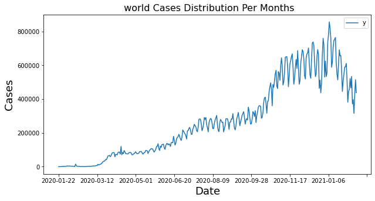
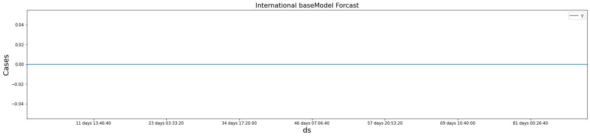
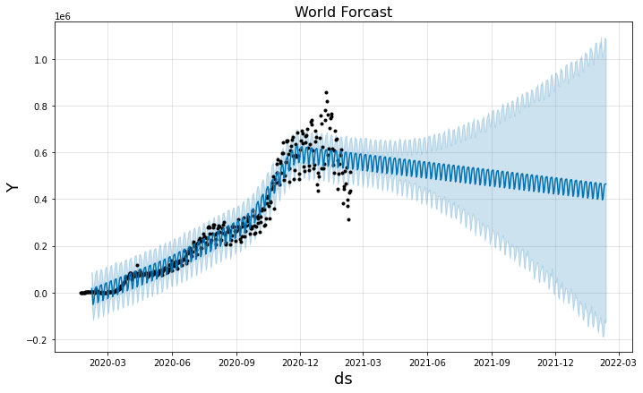
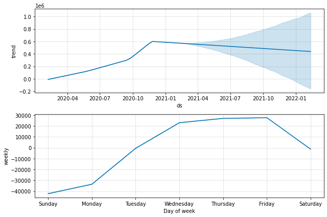
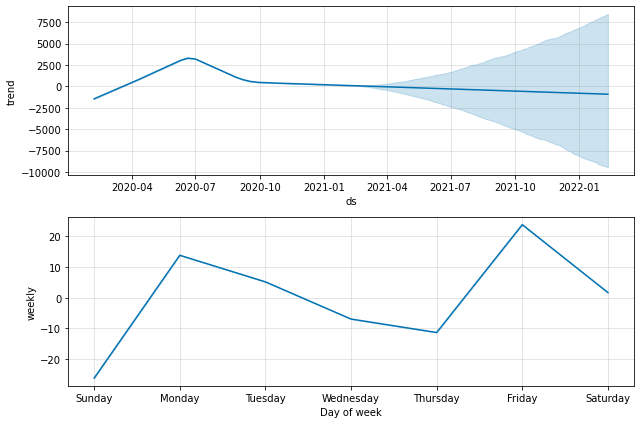
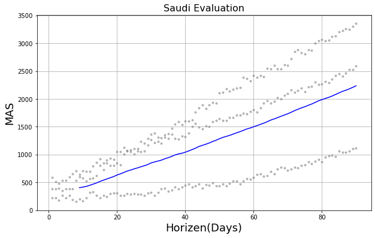

## Forecasting Covid-19 Cases

### Import the Dataset


```python
import pandas as pd
df = pd.read_csv("D:\Final_project\data\EDA.csv")
```


```python
df.tail()
```


<div>
<style scoped>
    .dataframe tbody tr th:only-of-type {
        vertical-align: middle;
    }

    .dataframe tbody tr th {
        vertical-align: top;
    }

    .dataframe thead th {
        text-align: right;
    }
</style>
<table border="1" class="dataframe">
  <thead>
    <tr style="text-align: right;">
      <th></th>
      <th>iso_code</th>
      <th>continent</th>
      <th>location</th>
      <th>date</th>
      <th>total_cases</th>
      <th>new_cases</th>
      <th>new_cases_smoothed</th>
      <th>total_deaths</th>
      <th>new_deaths</th>
      <th>new_deaths_smoothed</th>
      <th>...</th>
      <th>people_vaccinated</th>
      <th>people_fully_vaccinated</th>
      <th>new_vaccinations</th>
      <th>new_vaccinations_smoothed</th>
      <th>total_vaccinations_per_hundred</th>
      <th>people_vaccinated_per_hundred</th>
      <th>people_fully_vaccinated_per_hundred</th>
      <th>new_vaccinations_smoothed_per_million</th>
      <th>population</th>
      <th>population_density</th>
    </tr>
  </thead>
  <tbody>
    <tr>
      <th>65799</th>
      <td>ZWE</td>
      <td>Africa</td>
      <td>Zimbabwe</td>
      <td>2021-02-07</td>
      <td>34552.0</td>
      <td>65.0</td>
      <td>166.286</td>
      <td>1326.0</td>
      <td>10.0</td>
      <td>15.571</td>
      <td>...</td>
      <td>202042.626514</td>
      <td>173260.613062</td>
      <td>-12018.854475</td>
      <td>20179.002912</td>
      <td>2189.385</td>
      <td>13593.731</td>
      <td>11657.234</td>
      <td>1357.674</td>
      <td>14862927.0</td>
      <td>42.729</td>
    </tr>
    <tr>
      <th>65800</th>
      <td>ZWE</td>
      <td>Africa</td>
      <td>Zimbabwe</td>
      <td>2021-02-08</td>
      <td>34658.0</td>
      <td>106.0</td>
      <td>158.571</td>
      <td>1339.0</td>
      <td>13.0</td>
      <td>15.000</td>
      <td>...</td>
      <td>200489.896645</td>
      <td>173548.194279</td>
      <td>-11394.374095</td>
      <td>20075.984392</td>
      <td>2155.236</td>
      <td>13489.261</td>
      <td>11676.583</td>
      <td>1350.742</td>
      <td>14862927.0</td>
      <td>42.729</td>
    </tr>
    <tr>
      <th>65801</th>
      <td>ZWE</td>
      <td>Africa</td>
      <td>Zimbabwe</td>
      <td>2021-02-09</td>
      <td>34781.0</td>
      <td>123.0</td>
      <td>138.143</td>
      <td>1353.0</td>
      <td>14.0</td>
      <td>14.143</td>
      <td>...</td>
      <td>199250.060411</td>
      <td>174435.659533</td>
      <td>-11105.734623</td>
      <td>19997.080279</td>
      <td>2215.303</td>
      <td>13405.843</td>
      <td>11736.293</td>
      <td>1345.434</td>
      <td>14862927.0</td>
      <td>42.729</td>
    </tr>
    <tr>
      <th>65802</th>
      <td>ZWE</td>
      <td>Africa</td>
      <td>Zimbabwe</td>
      <td>2021-02-10</td>
      <td>34864.0</td>
      <td>83.0</td>
      <td>128.571</td>
      <td>1364.0</td>
      <td>11.0</td>
      <td>13.571</td>
      <td>...</td>
      <td>197971.146576</td>
      <td>175151.001255</td>
      <td>-11703.673670</td>
      <td>19929.314019</td>
      <td>2182.777</td>
      <td>13319.795</td>
      <td>11784.422</td>
      <td>1340.874</td>
      <td>14862927.0</td>
      <td>42.729</td>
    </tr>
    <tr>
      <th>65803</th>
      <td>ZWE</td>
      <td>Africa</td>
      <td>Zimbabwe</td>
      <td>2021-02-11</td>
      <td>34864.0</td>
      <td>0.0</td>
      <td>99.000</td>
      <td>1364.0</td>
      <td>0.0</td>
      <td>10.857</td>
      <td>...</td>
      <td>188557.868114</td>
      <td>177056.676529</td>
      <td>-14126.035117</td>
      <td>19375.934871</td>
      <td>1558.995</td>
      <td>12686.456</td>
      <td>11912.639</td>
      <td>1303.642</td>
      <td>14862927.0</td>
      <td>42.729</td>
    </tr>
  </tbody>
</table>
<p>5 rows × 37 columns</p>
</div>


### Select Subset Datasets


```python
International= df[df['location']=="International"]
```


```python
world= df[df['location']=="World"]
```


```python
Saudi = df[df['location']=="Saudi Arabia"]
```

### Prepare the Datasets for Modeling


```python
International= International.filter(['date','new_cases'])
# remove all columns except "date" and "new cases"
International.columns = ['ds', 'y'] # rename the columns 
 # exporting the data
    
```


```python
world= world.filter(['date','new_cases'])
# remove all columns except "date" and "new cases"
world.columns = ['ds', 'y'] # rename the columns 
 # exporting the data

```


```python
Saudi= Saudi.filter(['date','new_cases'])
# remove all columns except "date" and "new cases"
Saudi.columns = ['ds', 'y'] # rename the columns 
 # exporting the data
```

### Ploting the Datasets


```python
# importing libraries 
from matplotlib import pyplot
import matplotlib.pyplot as plt
International.plot("ds","y",figsize=(9,5))#plot the dataset
plt.title(" International Cases Distribution Per Months", fontsize=16) #set title and it size
plt.ylabel('Cases', fontsize=18) # set y axis name and size
plt.xlabel('Date', fontsize=18); #set x axis size
```


    

    


```python
world.plot("ds","y",figsize=(10, 5)) #plot the dataset
plt.title(" world Cases Distribution Per Months", fontsize=16) #set title and it size
plt.ylabel('Cases', fontsize=18) # set y axis name and size
plt.xlabel('Date', fontsize=18); #set x axis size
```


    

    


```python
Saudi.plot("ds","y",figsize=(9, 5)) #plot the dataset
plt.title(" Saudi Cases Distribution Per Months", fontsize=16) #set title and it size
plt.ylabel('Cases', fontsize=18) # set y axis name and size
plt.xlabel('Date', fontsize=18); #set x axis size
```


    

    


### The Baseline Model


```python
import itertools # importing library
def base_line(df):
    srise_value = df.y.values # take the y column data
    value = pd.DataFrame(srise_value) # make dataframe
    #create new dataframe contain a value and y value shifted
    new_df = pd.concat([value,value.shift(1)],axis=1 ) 
    new_df.columns = ['present','futur']  # name the columns
    result = new_df.futur.tail(1).item() # set result to the last value in new_df 
    global baselin # set result baseline dataset to global
    baselin = list(itertools.repeat(result, 90)) # iterate result
    return baselin #return iterator result
```


```python
#International Baseline model
Int = base_line(International)
```


```python
#world Baseline model
w = base_line(world)
```


```python
#Saudi Baseline model
S = base_line(Saudi)
```

### Create Dataframe for the Baseline Model Results


```python
#International
import datetime #importing library
date_list = [datetime.timedelta(days=x) for x in range(1,len(Int)+1)]  
# creat dayes for values in base line model
p1 = pd.concat([pd.Series(Int), pd.Series(date_list)], axis=1) 
# merge columns to one dataframe
p1.columns = ['y','ds'] # name the columns
p1.tail()
```


<div>
<style scoped>
    .dataframe tbody tr th:only-of-type {
        vertical-align: middle;
    }

    .dataframe tbody tr th {
        vertical-align: top;
    }

    .dataframe thead th {
        text-align: right;
    }
</style>
<table border="1" class="dataframe">
  <thead>
    <tr style="text-align: right;">
      <th></th>
      <th>y</th>
      <th>ds</th>
    </tr>
  </thead>
  <tbody>
    <tr>
      <th>85</th>
      <td>0.0</td>
      <td>86 days</td>
    </tr>
    <tr>
      <th>86</th>
      <td>0.0</td>
      <td>87 days</td>
    </tr>
    <tr>
      <th>87</th>
      <td>0.0</td>
      <td>88 days</td>
    </tr>
    <tr>
      <th>88</th>
      <td>0.0</td>
      <td>89 days</td>
    </tr>
    <tr>
      <th>89</th>
      <td>0.0</td>
      <td>90 days</td>
    </tr>
  </tbody>
</table>
</div>


```python
#world
date_list = [datetime.timedelta(days=x) for x in range(1,len(w)+1)]  
# creat dayes for values in base line model
p2 = pd.concat([pd.Series(w), pd.Series(date_list)], axis=1) 
# merge columns to one dataframe
p2.columns = ['y','ds'] # name the columns
p2.tail()
```


<div>
<style scoped>
    .dataframe tbody tr th:only-of-type {
        vertical-align: middle;
    }

    .dataframe tbody tr th {
        vertical-align: top;
    }

    .dataframe thead th {
        text-align: right;
    }
</style>
<table border="1" class="dataframe">
  <thead>
    <tr style="text-align: right;">
      <th></th>
      <th>y</th>
      <th>ds</th>
    </tr>
  </thead>
  <tbody>
    <tr>
      <th>85</th>
      <td>514862.0</td>
      <td>86 days</td>
    </tr>
    <tr>
      <th>86</th>
      <td>514862.0</td>
      <td>87 days</td>
    </tr>
    <tr>
      <th>87</th>
      <td>514862.0</td>
      <td>88 days</td>
    </tr>
    <tr>
      <th>88</th>
      <td>514862.0</td>
      <td>89 days</td>
    </tr>
    <tr>
      <th>89</th>
      <td>514862.0</td>
      <td>90 days</td>
    </tr>
  </tbody>
</table>
</div>


```python
#Saudi
date_list = [datetime.timedelta(days=x) for x in range(1,len(S)+1)]  
# creat dayes for values in base line model
p3 = pd.concat([pd.Series(S), pd.Series(date_list)], axis=1) 
# merge columns to one dataframe
p3.columns = ['y','ds'] # name the columns
p3.tail()
```


<div>
<style scoped>
    .dataframe tbody tr th:only-of-type {
        vertical-align: middle;
    }

    .dataframe tbody tr th {
        vertical-align: top;
    }

    .dataframe thead th {
        text-align: right;
    }
</style>
<table border="1" class="dataframe">
  <thead>
    <tr style="text-align: right;">
      <th></th>
      <th>y</th>
      <th>ds</th>
    </tr>
  </thead>
  <tbody>
    <tr>
      <th>85</th>
      <td>369.0</td>
      <td>86 days</td>
    </tr>
    <tr>
      <th>86</th>
      <td>369.0</td>
      <td>87 days</td>
    </tr>
    <tr>
      <th>87</th>
      <td>369.0</td>
      <td>88 days</td>
    </tr>
    <tr>
      <th>88</th>
      <td>369.0</td>
      <td>89 days</td>
    </tr>
    <tr>
      <th>89</th>
      <td>369.0</td>
      <td>90 days</td>
    </tr>
  </tbody>
</table>
</div>


### Plot the Baseline Model Result  


```python
#International
p1.plot("ds","y",figsize=(25, 5)) # plot the data
plt.title("International baseModel Forcast", fontsize=16) # set title
plt.ylabel('Cases', fontsize=18) #set y axis name and size
plt.xlabel('ds', fontsize=18);#set x axis name and size
```


    

    


```python
#world
p2.plot("ds","y",figsize=(25, 5)) # plot the data
plt.title("world baseModel Forcast", fontsize=16) # set title
plt.ylabel('Cases', fontsize=18) #set y axis name and size
plt.xlabel('ds', fontsize=18);#set x axis name and size
```


    

    


```python
#Saudi
p3.plot("ds","y",figsize=(25, 5)) # plot the data
plt.title("Saudi baseModel Forcast", fontsize=16) # set title
plt.ylabel('Cases', fontsize=18) #set y axis name and size
plt.xlabel('ds', fontsize=18);#set x axis name and size
```


    

    


### Baseline Model Scores


```python
from sklearn.metrics import mean_absolute_error
```

##### International Baseline Model Score


```python
mean_absolute_error(International.y[:90], Int)
```


    8.011111111111111


##### World Baseline Model Score


```python
mean_absolute_error(world.y[:90], w)
```


    487182.5


##### Saudi Baseline Model Score


```python
mean_absolute_error(Saudi.y[:90], S)
```


    804.3555555555556


### Prophet Models


```python
from fbprophet import Prophet # import propht
```

#### International Prophet Model


```python
m = Prophet() # set up model
m.fit(International) # fit model
```

    INFO:fbprophet:Disabling yearly seasonality. Run prophet with yearly_seasonality=True to override this.
    INFO:fbprophet:Disabling daily seasonality. Run prophet with daily_seasonality=True to override this.
    


    <fbprophet.forecaster.Prophet at 0x273819b6340>


```python
future_Int = m.make_future_dataframe(periods=365)
#make a dataframe to hold your future value predictions
```


```python
future_Int.tail() # see the data
```


<div>
<style scoped>
    .dataframe tbody tr th:only-of-type {
        vertical-align: middle;
    }

    .dataframe tbody tr th {
        vertical-align: top;
    }

    .dataframe thead th {
        text-align: right;
    }
</style>
<table border="1" class="dataframe">
  <thead>
    <tr style="text-align: right;">
      <th></th>
      <th>ds</th>
    </tr>
  </thead>
  <tbody>
    <tr>
      <th>731</th>
      <td>2022-02-07</td>
    </tr>
    <tr>
      <th>732</th>
      <td>2022-02-08</td>
    </tr>
    <tr>
      <th>733</th>
      <td>2022-02-09</td>
    </tr>
    <tr>
      <th>734</th>
      <td>2022-02-10</td>
    </tr>
    <tr>
      <th>735</th>
      <td>2022-02-11</td>
    </tr>
  </tbody>
</table>
</div>


```python
m.predict(future_Int) #  make a forecast 
```


<div>
<style scoped>
    .dataframe tbody tr th:only-of-type {
        vertical-align: middle;
    }

    .dataframe tbody tr th {
        vertical-align: top;
    }

    .dataframe thead th {
        text-align: right;
    }
</style>
<table border="1" class="dataframe">
  <thead>
    <tr style="text-align: right;">
      <th></th>
      <th>ds</th>
      <th>trend</th>
      <th>yhat_lower</th>
      <th>yhat_upper</th>
      <th>trend_lower</th>
      <th>trend_upper</th>
      <th>additive_terms</th>
      <th>additive_terms_lower</th>
      <th>additive_terms_upper</th>
      <th>weekly</th>
      <th>weekly_lower</th>
      <th>weekly_upper</th>
      <th>multiplicative_terms</th>
      <th>multiplicative_terms_lower</th>
      <th>multiplicative_terms_upper</th>
      <th>yhat</th>
    </tr>
  </thead>
  <tbody>
    <tr>
      <th>0</th>
      <td>2020-02-07</td>
      <td>20.702194</td>
      <td>8.120557</td>
      <td>32.558632</td>
      <td>20.702194</td>
      <td>20.702194</td>
      <td>-0.151995</td>
      <td>-0.151995</td>
      <td>-0.151995</td>
      <td>-0.151995</td>
      <td>-0.151995</td>
      <td>-0.151995</td>
      <td>0.0</td>
      <td>0.0</td>
      <td>0.0</td>
      <td>20.550199</td>
    </tr>
    <tr>
      <th>1</th>
      <td>2020-02-08</td>
      <td>20.401033</td>
      <td>7.364038</td>
      <td>32.426553</td>
      <td>20.401033</td>
      <td>20.401033</td>
      <td>-0.753577</td>
      <td>-0.753577</td>
      <td>-0.753577</td>
      <td>-0.753577</td>
      <td>-0.753577</td>
      <td>-0.753577</td>
      <td>0.0</td>
      <td>0.0</td>
      <td>0.0</td>
      <td>19.647456</td>
    </tr>
    <tr>
      <th>2</th>
      <td>2020-02-09</td>
      <td>20.099873</td>
      <td>9.025253</td>
      <td>33.214233</td>
      <td>20.099873</td>
      <td>20.099873</td>
      <td>0.454282</td>
      <td>0.454282</td>
      <td>0.454282</td>
      <td>0.454282</td>
      <td>0.454282</td>
      <td>0.454282</td>
      <td>0.0</td>
      <td>0.0</td>
      <td>0.0</td>
      <td>20.554155</td>
    </tr>
    <tr>
      <th>3</th>
      <td>2020-02-10</td>
      <td>19.798712</td>
      <td>8.772705</td>
      <td>34.142569</td>
      <td>19.798712</td>
      <td>19.798712</td>
      <td>1.265996</td>
      <td>1.265996</td>
      <td>1.265996</td>
      <td>1.265996</td>
      <td>1.265996</td>
      <td>1.265996</td>
      <td>0.0</td>
      <td>0.0</td>
      <td>0.0</td>
      <td>21.064708</td>
    </tr>
    <tr>
      <th>4</th>
      <td>2020-02-11</td>
      <td>19.497552</td>
      <td>6.887016</td>
      <td>31.966118</td>
      <td>19.497552</td>
      <td>19.497552</td>
      <td>-0.206922</td>
      <td>-0.206922</td>
      <td>-0.206922</td>
      <td>-0.206922</td>
      <td>-0.206922</td>
      <td>-0.206922</td>
      <td>0.0</td>
      <td>0.0</td>
      <td>0.0</td>
      <td>19.290630</td>
    </tr>
    <tr>
      <th>...</th>
      <td>...</td>
      <td>...</td>
      <td>...</td>
      <td>...</td>
      <td>...</td>
      <td>...</td>
      <td>...</td>
      <td>...</td>
      <td>...</td>
      <td>...</td>
      <td>...</td>
      <td>...</td>
      <td>...</td>
      <td>...</td>
      <td>...</td>
      <td>...</td>
    </tr>
    <tr>
      <th>731</th>
      <td>2022-02-07</td>
      <td>-0.346873</td>
      <td>-23.343742</td>
      <td>24.593315</td>
      <td>-20.529668</td>
      <td>22.302586</td>
      <td>1.265996</td>
      <td>1.265996</td>
      <td>1.265996</td>
      <td>1.265996</td>
      <td>1.265996</td>
      <td>1.265996</td>
      <td>0.0</td>
      <td>0.0</td>
      <td>0.0</td>
      <td>0.919123</td>
    </tr>
    <tr>
      <th>732</th>
      <td>2022-02-08</td>
      <td>-0.347309</td>
      <td>-24.741450</td>
      <td>25.654575</td>
      <td>-20.633886</td>
      <td>22.380811</td>
      <td>-0.206922</td>
      <td>-0.206922</td>
      <td>-0.206922</td>
      <td>-0.206922</td>
      <td>-0.206922</td>
      <td>-0.206922</td>
      <td>0.0</td>
      <td>0.0</td>
      <td>0.0</td>
      <td>-0.554231</td>
    </tr>
    <tr>
      <th>733</th>
      <td>2022-02-09</td>
      <td>-0.347745</td>
      <td>-24.010251</td>
      <td>27.577601</td>
      <td>-20.738104</td>
      <td>22.459110</td>
      <td>0.923393</td>
      <td>0.923393</td>
      <td>0.923393</td>
      <td>0.923393</td>
      <td>0.923393</td>
      <td>0.923393</td>
      <td>0.0</td>
      <td>0.0</td>
      <td>0.0</td>
      <td>0.575649</td>
    </tr>
    <tr>
      <th>734</th>
      <td>2022-02-10</td>
      <td>-0.348180</td>
      <td>-26.633299</td>
      <td>24.892264</td>
      <td>-20.842323</td>
      <td>22.537409</td>
      <td>-1.531178</td>
      <td>-1.531178</td>
      <td>-1.531178</td>
      <td>-1.531178</td>
      <td>-1.531178</td>
      <td>-1.531178</td>
      <td>0.0</td>
      <td>0.0</td>
      <td>0.0</td>
      <td>-1.879358</td>
    </tr>
    <tr>
      <th>735</th>
      <td>2022-02-11</td>
      <td>-0.348616</td>
      <td>-24.825848</td>
      <td>26.005673</td>
      <td>-20.943356</td>
      <td>22.629328</td>
      <td>-0.151995</td>
      <td>-0.151995</td>
      <td>-0.151995</td>
      <td>-0.151995</td>
      <td>-0.151995</td>
      <td>-0.151995</td>
      <td>0.0</td>
      <td>0.0</td>
      <td>0.0</td>
      <td>-0.500610</td>
    </tr>
  </tbody>
</table>
<p>736 rows × 16 columns</p>
</div>


```python
forecast_Int = m.predict(future_Int) #  make a forecast 
forecast_Int[['ds', 'yhat', 'yhat_lower', 'yhat_upper']].tail() # chosen columns
```


<div>
<style scoped>
    .dataframe tbody tr th:only-of-type {
        vertical-align: middle;
    }

    .dataframe tbody tr th {
        vertical-align: top;
    }

    .dataframe thead th {
        text-align: right;
    }
</style>
<table border="1" class="dataframe">
  <thead>
    <tr style="text-align: right;">
      <th></th>
      <th>ds</th>
      <th>yhat</th>
      <th>yhat_lower</th>
      <th>yhat_upper</th>
    </tr>
  </thead>
  <tbody>
    <tr>
      <th>731</th>
      <td>2022-02-07</td>
      <td>0.919123</td>
      <td>-26.381158</td>
      <td>26.620019</td>
    </tr>
    <tr>
      <th>732</th>
      <td>2022-02-08</td>
      <td>-0.554231</td>
      <td>-25.386885</td>
      <td>24.887145</td>
    </tr>
    <tr>
      <th>733</th>
      <td>2022-02-09</td>
      <td>0.575649</td>
      <td>-24.832774</td>
      <td>25.257137</td>
    </tr>
    <tr>
      <th>734</th>
      <td>2022-02-10</td>
      <td>-1.879358</td>
      <td>-27.533868</td>
      <td>24.341889</td>
    </tr>
    <tr>
      <th>735</th>
      <td>2022-02-11</td>
      <td>-0.500610</td>
      <td>-26.114134</td>
      <td>25.361182</td>
    </tr>
  </tbody>
</table>
</div>


#### Plot the Forecast for International Data


```python
m.plot(forecast_Int); # plot 
plt.title("International Forcast", fontsize=16) # set title
plt.ylabel('Y', fontsize=18) #set y axis name and size
plt.xlabel('ds', fontsize=18);#set x axis name and size
```


    

    


 - Black dots: actual values
 - Blue lines: upper, actual (dark blue), lower windows for yhat
 - Blue blob: prediction window (yhat window)

### Plot Components of International Forcast (Trend,Weekly)


```python
m.plot_components(forecast_Int);#plot
```


    

    


#### World Prophet Model


```python
m1 = Prophet() # set up model 
m1.fit(world) # fit model
```

    INFO:fbprophet:Disabling yearly seasonality. Run prophet with yearly_seasonality=True to override this.
    INFO:fbprophet:Disabling daily seasonality. Run prophet with daily_seasonality=True to override this.
    


    <fbprophet.forecaster.Prophet at 0x27383e80610>


```python
future_W = m.make_future_dataframe(periods=365)
#make a dataframe to hold your future value predictions
```


```python
future_W.tail() # see the data
```


<div>
<style scoped>
    .dataframe tbody tr th:only-of-type {
        vertical-align: middle;
    }

    .dataframe tbody tr th {
        vertical-align: top;
    }

    .dataframe thead th {
        text-align: right;
    }
</style>
<table border="1" class="dataframe">
  <thead>
    <tr style="text-align: right;">
      <th></th>
      <th>ds</th>
    </tr>
  </thead>
  <tbody>
    <tr>
      <th>731</th>
      <td>2022-02-07</td>
    </tr>
    <tr>
      <th>732</th>
      <td>2022-02-08</td>
    </tr>
    <tr>
      <th>733</th>
      <td>2022-02-09</td>
    </tr>
    <tr>
      <th>734</th>
      <td>2022-02-10</td>
    </tr>
    <tr>
      <th>735</th>
      <td>2022-02-11</td>
    </tr>
  </tbody>
</table>
</div>


```python
m1.predict(future_W) #  make a forecast 
```


<div>
<style scoped>
    .dataframe tbody tr th:only-of-type {
        vertical-align: middle;
    }

    .dataframe tbody tr th {
        vertical-align: top;
    }

    .dataframe thead th {
        text-align: right;
    }
</style>
<table border="1" class="dataframe">
  <thead>
    <tr style="text-align: right;">
      <th></th>
      <th>ds</th>
      <th>trend</th>
      <th>yhat_lower</th>
      <th>yhat_upper</th>
      <th>trend_lower</th>
      <th>trend_upper</th>
      <th>additive_terms</th>
      <th>additive_terms_lower</th>
      <th>additive_terms_upper</th>
      <th>weekly</th>
      <th>weekly_lower</th>
      <th>weekly_upper</th>
      <th>multiplicative_terms</th>
      <th>multiplicative_terms_lower</th>
      <th>multiplicative_terms_upper</th>
      <th>yhat</th>
    </tr>
  </thead>
  <tbody>
    <tr>
      <th>0</th>
      <td>2020-02-07</td>
      <td>-10608.346258</td>
      <td>-51150.415541</td>
      <td>7.947952e+04</td>
      <td>-10608.346258</td>
      <td>-1.060835e+04</td>
      <td>27655.449735</td>
      <td>27655.449735</td>
      <td>27655.449735</td>
      <td>27655.449735</td>
      <td>27655.449735</td>
      <td>27655.449735</td>
      <td>0.0</td>
      <td>0.0</td>
      <td>0.0</td>
      <td>17047.103477</td>
    </tr>
    <tr>
      <th>1</th>
      <td>2020-02-08</td>
      <td>-9411.974851</td>
      <td>-76767.884999</td>
      <td>5.301029e+04</td>
      <td>-9411.974851</td>
      <td>-9.411975e+03</td>
      <td>-1318.119703</td>
      <td>-1318.119703</td>
      <td>-1318.119703</td>
      <td>-1318.119703</td>
      <td>-1318.119703</td>
      <td>-1318.119703</td>
      <td>0.0</td>
      <td>0.0</td>
      <td>0.0</td>
      <td>-10730.094554</td>
    </tr>
    <tr>
      <th>2</th>
      <td>2020-02-09</td>
      <td>-8215.603445</td>
      <td>-119498.749608</td>
      <td>1.278768e+04</td>
      <td>-8215.603445</td>
      <td>-8.215603e+03</td>
      <td>-42280.738107</td>
      <td>-42280.738107</td>
      <td>-42280.738107</td>
      <td>-42280.738107</td>
      <td>-42280.738107</td>
      <td>-42280.738107</td>
      <td>0.0</td>
      <td>0.0</td>
      <td>0.0</td>
      <td>-50496.341552</td>
    </tr>
    <tr>
      <th>3</th>
      <td>2020-02-10</td>
      <td>-7019.232038</td>
      <td>-109170.298457</td>
      <td>2.896189e+04</td>
      <td>-7019.232038</td>
      <td>-7.019232e+03</td>
      <td>-33592.304953</td>
      <td>-33592.304953</td>
      <td>-33592.304953</td>
      <td>-33592.304953</td>
      <td>-33592.304953</td>
      <td>-33592.304953</td>
      <td>0.0</td>
      <td>0.0</td>
      <td>0.0</td>
      <td>-40611.536992</td>
    </tr>
    <tr>
      <th>4</th>
      <td>2020-02-11</td>
      <td>-5822.860632</td>
      <td>-73076.781266</td>
      <td>6.484047e+04</td>
      <td>-5822.860632</td>
      <td>-5.822861e+03</td>
      <td>-532.618487</td>
      <td>-532.618487</td>
      <td>-532.618487</td>
      <td>-532.618487</td>
      <td>-532.618487</td>
      <td>-532.618487</td>
      <td>0.0</td>
      <td>0.0</td>
      <td>0.0</td>
      <td>-6355.479119</td>
    </tr>
    <tr>
      <th>...</th>
      <td>...</td>
      <td>...</td>
      <td>...</td>
      <td>...</td>
      <td>...</td>
      <td>...</td>
      <td>...</td>
      <td>...</td>
      <td>...</td>
      <td>...</td>
      <td>...</td>
      <td>...</td>
      <td>...</td>
      <td>...</td>
      <td>...</td>
      <td>...</td>
    </tr>
    <tr>
      <th>731</th>
      <td>2022-02-07</td>
      <td>438946.725143</td>
      <td>-191695.396550</td>
      <td>9.543062e+05</td>
      <td>-159760.503713</td>
      <td>9.980510e+05</td>
      <td>-33592.304953</td>
      <td>-33592.304953</td>
      <td>-33592.304953</td>
      <td>-33592.304953</td>
      <td>-33592.304953</td>
      <td>-33592.304953</td>
      <td>0.0</td>
      <td>0.0</td>
      <td>0.0</td>
      <td>405354.420189</td>
    </tr>
    <tr>
      <th>732</th>
      <td>2022-02-08</td>
      <td>438579.915066</td>
      <td>-172707.147442</td>
      <td>9.993132e+05</td>
      <td>-162956.785625</td>
      <td>1.001086e+06</td>
      <td>-532.618487</td>
      <td>-532.618487</td>
      <td>-532.618487</td>
      <td>-532.618487</td>
      <td>-532.618487</td>
      <td>-532.618487</td>
      <td>0.0</td>
      <td>0.0</td>
      <td>0.0</td>
      <td>438047.296580</td>
    </tr>
    <tr>
      <th>733</th>
      <td>2022-02-09</td>
      <td>438213.104990</td>
      <td>-141821.444050</td>
      <td>1.026487e+06</td>
      <td>-164665.421620</td>
      <td>1.004027e+06</td>
      <td>23034.541194</td>
      <td>23034.541194</td>
      <td>23034.541194</td>
      <td>23034.541194</td>
      <td>23034.541194</td>
      <td>23034.541194</td>
      <td>0.0</td>
      <td>0.0</td>
      <td>0.0</td>
      <td>461247.646184</td>
    </tr>
    <tr>
      <th>734</th>
      <td>2022-02-10</td>
      <td>437846.294914</td>
      <td>-138074.246443</td>
      <td>1.027648e+06</td>
      <td>-166166.187160</td>
      <td>1.006143e+06</td>
      <td>27033.790321</td>
      <td>27033.790321</td>
      <td>27033.790321</td>
      <td>27033.790321</td>
      <td>27033.790321</td>
      <td>27033.790321</td>
      <td>0.0</td>
      <td>0.0</td>
      <td>0.0</td>
      <td>464880.085235</td>
    </tr>
    <tr>
      <th>735</th>
      <td>2022-02-11</td>
      <td>437479.484837</td>
      <td>-124448.701260</td>
      <td>1.031285e+06</td>
      <td>-167666.952700</td>
      <td>1.007956e+06</td>
      <td>27655.449735</td>
      <td>27655.449735</td>
      <td>27655.449735</td>
      <td>27655.449735</td>
      <td>27655.449735</td>
      <td>27655.449735</td>
      <td>0.0</td>
      <td>0.0</td>
      <td>0.0</td>
      <td>465134.934572</td>
    </tr>
  </tbody>
</table>
<p>736 rows × 16 columns</p>
</div>


```python
forecast_W = m1.predict(future_Int) #  make a forecast 
forecast_W[['ds', 'yhat', 'yhat_lower', 'yhat_upper']].tail() # chosen columns
```


<div>
<style scoped>
    .dataframe tbody tr th:only-of-type {
        vertical-align: middle;
    }

    .dataframe tbody tr th {
        vertical-align: top;
    }

    .dataframe thead th {
        text-align: right;
    }
</style>
<table border="1" class="dataframe">
  <thead>
    <tr style="text-align: right;">
      <th></th>
      <th>ds</th>
      <th>yhat</th>
      <th>yhat_lower</th>
      <th>yhat_upper</th>
    </tr>
  </thead>
  <tbody>
    <tr>
      <th>731</th>
      <td>2022-02-07</td>
      <td>405354.420189</td>
      <td>-234430.230883</td>
      <td>1.028121e+06</td>
    </tr>
    <tr>
      <th>732</th>
      <td>2022-02-08</td>
      <td>438047.296580</td>
      <td>-197549.900638</td>
      <td>1.047720e+06</td>
    </tr>
    <tr>
      <th>733</th>
      <td>2022-02-09</td>
      <td>461247.646184</td>
      <td>-182616.411754</td>
      <td>1.076066e+06</td>
    </tr>
    <tr>
      <th>734</th>
      <td>2022-02-10</td>
      <td>464880.085235</td>
      <td>-164416.323675</td>
      <td>1.093731e+06</td>
    </tr>
    <tr>
      <th>735</th>
      <td>2022-02-11</td>
      <td>465134.934572</td>
      <td>-182777.605304</td>
      <td>1.095845e+06</td>
    </tr>
  </tbody>
</table>
</div>


#### Plot the Forecast for World Data


```python
m1.plot(forecast_W); #plot
plt.title("World Forcast", fontsize=16) # set title
plt.ylabel('Y', fontsize=18) #set y axis name and size
plt.xlabel('ds', fontsize=18);#set x axis name and size
```


    

    


 - Black dots: actual values
 - Blue lines: upper, actual (dark blue), lower windows for yhat
 - Blue blob: prediction window (yhat window)

### Plot Components of IWorld Forcast (Trend,Weekly)


```python
m1.plot_components(forecast_W); #plot
```


    

    


#### Saudi Prophet Model


```python
m2 = Prophet() #set up model
m2.fit(Saudi) # fit model
```

    INFO:fbprophet:Disabling yearly seasonality. Run prophet with yearly_seasonality=True to override this.
    INFO:fbprophet:Disabling daily seasonality. Run prophet with daily_seasonality=True to override this.
    


    <fbprophet.forecaster.Prophet at 0x27383e39b80>


```python
future_S = m2.make_future_dataframe(periods=365)
#make a dataframe to hold your future value predictions
```


```python
future_S.tail() # see the data
```


<div>
<style scoped>
    .dataframe tbody tr th:only-of-type {
        vertical-align: middle;
    }

    .dataframe tbody tr th {
        vertical-align: top;
    }

    .dataframe thead th {
        text-align: right;
    }
</style>
<table border="1" class="dataframe">
  <thead>
    <tr style="text-align: right;">
      <th></th>
      <th>ds</th>
    </tr>
  </thead>
  <tbody>
    <tr>
      <th>707</th>
      <td>2022-02-07</td>
    </tr>
    <tr>
      <th>708</th>
      <td>2022-02-08</td>
    </tr>
    <tr>
      <th>709</th>
      <td>2022-02-09</td>
    </tr>
    <tr>
      <th>710</th>
      <td>2022-02-10</td>
    </tr>
    <tr>
      <th>711</th>
      <td>2022-02-11</td>
    </tr>
  </tbody>
</table>
</div>


```python
m2.predict(future_S )#  make a forecast 
```


<div>
<style scoped>
    .dataframe tbody tr th:only-of-type {
        vertical-align: middle;
    }

    .dataframe tbody tr th {
        vertical-align: top;
    }

    .dataframe thead th {
        text-align: right;
    }
</style>
<table border="1" class="dataframe">
  <thead>
    <tr style="text-align: right;">
      <th></th>
      <th>ds</th>
      <th>trend</th>
      <th>yhat_lower</th>
      <th>yhat_upper</th>
      <th>trend_lower</th>
      <th>trend_upper</th>
      <th>additive_terms</th>
      <th>additive_terms_lower</th>
      <th>additive_terms_upper</th>
      <th>weekly</th>
      <th>weekly_lower</th>
      <th>weekly_upper</th>
      <th>multiplicative_terms</th>
      <th>multiplicative_terms_lower</th>
      <th>multiplicative_terms_upper</th>
      <th>yhat</th>
    </tr>
  </thead>
  <tbody>
    <tr>
      <th>0</th>
      <td>2020-03-02</td>
      <td>-601.387581</td>
      <td>-1036.288828</td>
      <td>-148.763481</td>
      <td>-601.387581</td>
      <td>-601.387581</td>
      <td>13.842536</td>
      <td>13.842536</td>
      <td>13.842536</td>
      <td>13.842536</td>
      <td>13.842536</td>
      <td>13.842536</td>
      <td>0.0</td>
      <td>0.0</td>
      <td>0.0</td>
      <td>-587.545045</td>
    </tr>
    <tr>
      <th>1</th>
      <td>2020-03-03</td>
      <td>-566.190579</td>
      <td>-992.647105</td>
      <td>-138.672308</td>
      <td>-566.190579</td>
      <td>-566.190579</td>
      <td>5.174496</td>
      <td>5.174496</td>
      <td>5.174496</td>
      <td>5.174496</td>
      <td>5.174496</td>
      <td>5.174496</td>
      <td>0.0</td>
      <td>0.0</td>
      <td>0.0</td>
      <td>-561.016083</td>
    </tr>
    <tr>
      <th>2</th>
      <td>2020-03-04</td>
      <td>-530.993577</td>
      <td>-955.737001</td>
      <td>-119.805282</td>
      <td>-530.993577</td>
      <td>-530.993577</td>
      <td>-6.954218</td>
      <td>-6.954218</td>
      <td>-6.954218</td>
      <td>-6.954218</td>
      <td>-6.954218</td>
      <td>-6.954218</td>
      <td>0.0</td>
      <td>0.0</td>
      <td>0.0</td>
      <td>-537.947795</td>
    </tr>
    <tr>
      <th>3</th>
      <td>2020-03-05</td>
      <td>-495.796575</td>
      <td>-931.403485</td>
      <td>-49.576389</td>
      <td>-495.796575</td>
      <td>-495.796575</td>
      <td>-11.347144</td>
      <td>-11.347144</td>
      <td>-11.347144</td>
      <td>-11.347144</td>
      <td>-11.347144</td>
      <td>-11.347144</td>
      <td>0.0</td>
      <td>0.0</td>
      <td>0.0</td>
      <td>-507.143719</td>
    </tr>
    <tr>
      <th>4</th>
      <td>2020-03-06</td>
      <td>-460.599574</td>
      <td>-863.051506</td>
      <td>-22.685205</td>
      <td>-460.599574</td>
      <td>-460.599574</td>
      <td>23.823963</td>
      <td>23.823963</td>
      <td>23.823963</td>
      <td>23.823963</td>
      <td>23.823963</td>
      <td>23.823963</td>
      <td>0.0</td>
      <td>0.0</td>
      <td>0.0</td>
      <td>-436.775611</td>
    </tr>
    <tr>
      <th>...</th>
      <td>...</td>
      <td>...</td>
      <td>...</td>
      <td>...</td>
      <td>...</td>
      <td>...</td>
      <td>...</td>
      <td>...</td>
      <td>...</td>
      <td>...</td>
      <td>...</td>
      <td>...</td>
      <td>...</td>
      <td>...</td>
      <td>...</td>
      <td>...</td>
    </tr>
    <tr>
      <th>707</th>
      <td>2022-02-07</td>
      <td>-895.591197</td>
      <td>-9915.666435</td>
      <td>7681.119612</td>
      <td>-9785.100361</td>
      <td>7776.081832</td>
      <td>13.842536</td>
      <td>13.842536</td>
      <td>13.842536</td>
      <td>13.842536</td>
      <td>13.842536</td>
      <td>13.842536</td>
      <td>0.0</td>
      <td>0.0</td>
      <td>0.0</td>
      <td>-881.748661</td>
    </tr>
    <tr>
      <th>708</th>
      <td>2022-02-08</td>
      <td>-898.329124</td>
      <td>-9747.957361</td>
      <td>7674.028140</td>
      <td>-9820.378424</td>
      <td>7814.510501</td>
      <td>5.174496</td>
      <td>5.174496</td>
      <td>5.174496</td>
      <td>5.174496</td>
      <td>5.174496</td>
      <td>5.174496</td>
      <td>0.0</td>
      <td>0.0</td>
      <td>0.0</td>
      <td>-893.154628</td>
    </tr>
    <tr>
      <th>709</th>
      <td>2022-02-09</td>
      <td>-901.067050</td>
      <td>-9785.408564</td>
      <td>7645.312545</td>
      <td>-9853.262245</td>
      <td>7845.606093</td>
      <td>-6.954218</td>
      <td>-6.954218</td>
      <td>-6.954218</td>
      <td>-6.954218</td>
      <td>-6.954218</td>
      <td>-6.954218</td>
      <td>0.0</td>
      <td>0.0</td>
      <td>0.0</td>
      <td>-908.021269</td>
    </tr>
    <tr>
      <th>710</th>
      <td>2022-02-10</td>
      <td>-903.804977</td>
      <td>-10005.878252</td>
      <td>7855.457016</td>
      <td>-9884.868903</td>
      <td>7874.427593</td>
      <td>-11.347144</td>
      <td>-11.347144</td>
      <td>-11.347144</td>
      <td>-11.347144</td>
      <td>-11.347144</td>
      <td>-11.347144</td>
      <td>0.0</td>
      <td>0.0</td>
      <td>0.0</td>
      <td>-915.152121</td>
    </tr>
    <tr>
      <th>711</th>
      <td>2022-02-11</td>
      <td>-906.542903</td>
      <td>-9780.486165</td>
      <td>7889.476990</td>
      <td>-9916.475562</td>
      <td>7903.249094</td>
      <td>23.823963</td>
      <td>23.823963</td>
      <td>23.823963</td>
      <td>23.823963</td>
      <td>23.823963</td>
      <td>23.823963</td>
      <td>0.0</td>
      <td>0.0</td>
      <td>0.0</td>
      <td>-882.718941</td>
    </tr>
  </tbody>
</table>
<p>712 rows × 16 columns</p>
</div>


```python
forecast_S = m2.predict(future_Int) #  make a forecast 
forecast_S[['ds', 'yhat', 'yhat_lower', 'yhat_upper']].tail() # chosen columns
```


<div>
<style scoped>
    .dataframe tbody tr th:only-of-type {
        vertical-align: middle;
    }

    .dataframe tbody tr th {
        vertical-align: top;
    }

    .dataframe thead th {
        text-align: right;
    }
</style>
<table border="1" class="dataframe">
  <thead>
    <tr style="text-align: right;">
      <th></th>
      <th>ds</th>
      <th>yhat</th>
      <th>yhat_lower</th>
      <th>yhat_upper</th>
    </tr>
  </thead>
  <tbody>
    <tr>
      <th>731</th>
      <td>2022-02-07</td>
      <td>-881.748661</td>
      <td>-9441.236646</td>
      <td>7397.126421</td>
    </tr>
    <tr>
      <th>732</th>
      <td>2022-02-08</td>
      <td>-893.154628</td>
      <td>-9511.876988</td>
      <td>7531.003775</td>
    </tr>
    <tr>
      <th>733</th>
      <td>2022-02-09</td>
      <td>-908.021269</td>
      <td>-9547.481511</td>
      <td>7433.414975</td>
    </tr>
    <tr>
      <th>734</th>
      <td>2022-02-10</td>
      <td>-915.152121</td>
      <td>-9887.308277</td>
      <td>7555.336034</td>
    </tr>
    <tr>
      <th>735</th>
      <td>2022-02-11</td>
      <td>-882.718941</td>
      <td>-9754.584148</td>
      <td>7608.762775</td>
    </tr>
  </tbody>
</table>
</div>


#### Plot the Forecast for Saudi Data


```python
m2.plot(forecast_S); # plot m2 
plt.title("Saudi Forcast", fontsize=16) # set title
plt.ylabel('Y', fontsize=18) #set y axis name and size
plt.xlabel('ds', fontsize=18);#set x axis name and size
```


    

    


 - Black dots: actual values
 - Blue lines: upper, actual (dark blue), lower windows for yhat
 - Blue blob: prediction window (yhat window)

#### Plot Components of Saudi Forcast (Trend,Weekly)


```python
m2.plot_components(forecast_S); #plot
```


    

    


### Models Valiadtion


```python
from fbprophet.diagnostics import cross_validation # import cross_validation
```

#### International Model Valiadtion


```python
Int_cv = cross_validation(m, initial='180 days', period='30 days', horizon='90 days')
Int_cv.tail()
```

    INFO:fbprophet:Making 4 forecasts with cutoffs between 2020-08-15 00:00:00 and 2020-11-13 00:00:00
    


      0%|          | 0/4 [00:00<?, ?it/s]


<div>
<style scoped>
    .dataframe tbody tr th:only-of-type {
        vertical-align: middle;
    }

    .dataframe tbody tr th {
        vertical-align: top;
    }

    .dataframe thead th {
        text-align: right;
    }
</style>
<table border="1" class="dataframe">
  <thead>
    <tr style="text-align: right;">
      <th></th>
      <th>ds</th>
      <th>yhat</th>
      <th>yhat_lower</th>
      <th>yhat_upper</th>
      <th>y</th>
      <th>cutoff</th>
    </tr>
  </thead>
  <tbody>
    <tr>
      <th>355</th>
      <td>2021-02-07</td>
      <td>-0.289656</td>
      <td>-15.203394</td>
      <td>13.464654</td>
      <td>0.0</td>
      <td>2020-11-13</td>
    </tr>
    <tr>
      <th>356</th>
      <td>2021-02-08</td>
      <td>0.780397</td>
      <td>-14.238935</td>
      <td>14.255059</td>
      <td>0.0</td>
      <td>2020-11-13</td>
    </tr>
    <tr>
      <th>357</th>
      <td>2021-02-09</td>
      <td>-1.175760</td>
      <td>-14.347619</td>
      <td>13.818463</td>
      <td>0.0</td>
      <td>2020-11-13</td>
    </tr>
    <tr>
      <th>358</th>
      <td>2021-02-10</td>
      <td>0.317515</td>
      <td>-13.863805</td>
      <td>14.571108</td>
      <td>0.0</td>
      <td>2020-11-13</td>
    </tr>
    <tr>
      <th>359</th>
      <td>2021-02-11</td>
      <td>-2.940298</td>
      <td>-17.080033</td>
      <td>11.310512</td>
      <td>0.0</td>
      <td>2020-11-13</td>
    </tr>
  </tbody>
</table>
</div>


- initial: how much data to consider before making any predictions
- period: how frequently to make predictions 
- horizon: how many periods to predict

#### World Model Valiadtion


```python
W_cv = cross_validation(m1, initial='180 days', period='30 days', horizon='90 days')
W_cv.tail()
```

    INFO:fbprophet:Making 4 forecasts with cutoffs between 2020-08-15 00:00:00 and 2020-11-13 00:00:00
    


      0%|          | 0/4 [00:00<?, ?it/s]


<div>
<style scoped>
    .dataframe tbody tr th:only-of-type {
        vertical-align: middle;
    }

    .dataframe tbody tr th {
        vertical-align: top;
    }

    .dataframe thead th {
        text-align: right;
    }
</style>
<table border="1" class="dataframe">
  <thead>
    <tr style="text-align: right;">
      <th></th>
      <th>ds</th>
      <th>yhat</th>
      <th>yhat_lower</th>
      <th>yhat_upper</th>
      <th>y</th>
      <th>cutoff</th>
    </tr>
  </thead>
  <tbody>
    <tr>
      <th>355</th>
      <td>2021-02-07</td>
      <td>9.423845e+05</td>
      <td>875094.428643</td>
      <td>1.013977e+06</td>
      <td>397050.0</td>
      <td>2020-11-13</td>
    </tr>
    <tr>
      <th>356</th>
      <td>2021-02-08</td>
      <td>9.536786e+05</td>
      <td>888577.358166</td>
      <td>1.026080e+06</td>
      <td>315176.0</td>
      <td>2020-11-13</td>
    </tr>
    <tr>
      <th>357</th>
      <td>2021-02-09</td>
      <td>9.713878e+05</td>
      <td>899744.430182</td>
      <td>1.044155e+06</td>
      <td>427277.0</td>
      <td>2020-11-13</td>
    </tr>
    <tr>
      <th>358</th>
      <td>2021-02-10</td>
      <td>9.899952e+05</td>
      <td>916498.404279</td>
      <td>1.067741e+06</td>
      <td>514862.0</td>
      <td>2020-11-13</td>
    </tr>
    <tr>
      <th>359</th>
      <td>2021-02-11</td>
      <td>1.002870e+06</td>
      <td>929050.512808</td>
      <td>1.080110e+06</td>
      <td>437761.0</td>
      <td>2020-11-13</td>
    </tr>
  </tbody>
</table>
</div>


- initial: how much data to consider before making any predictions
- period: how frequently to make predictions 
- horizon: how many periods to predict

#### Saudi Model Valiadtion


```python
S_cv = cross_validation(m2, initial='180 days', period='30 days', horizon='90 days')
S_cv.tail()
```

    INFO:fbprophet:Making 3 forecasts with cutoffs between 2020-09-14 00:00:00 and 2020-11-13 00:00:00
    


      0%|          | 0/3 [00:00<?, ?it/s]


<div>
<style scoped>
    .dataframe tbody tr th:only-of-type {
        vertical-align: middle;
    }

    .dataframe tbody tr th {
        vertical-align: top;
    }

    .dataframe thead th {
        text-align: right;
    }
</style>
<table border="1" class="dataframe">
  <thead>
    <tr style="text-align: right;">
      <th></th>
      <th>ds</th>
      <th>yhat</th>
      <th>yhat_lower</th>
      <th>yhat_upper</th>
      <th>y</th>
      <th>cutoff</th>
    </tr>
  </thead>
  <tbody>
    <tr>
      <th>265</th>
      <td>2021-02-07</td>
      <td>-723.092579</td>
      <td>-1958.725776</td>
      <td>510.562916</td>
      <td>317.0</td>
      <td>2020-11-13</td>
    </tr>
    <tr>
      <th>266</th>
      <td>2021-02-08</td>
      <td>-683.277603</td>
      <td>-1886.011602</td>
      <td>546.697732</td>
      <td>356.0</td>
      <td>2020-11-13</td>
    </tr>
    <tr>
      <th>267</th>
      <td>2021-02-09</td>
      <td>-712.868756</td>
      <td>-2018.886278</td>
      <td>501.397506</td>
      <td>353.0</td>
      <td>2020-11-13</td>
    </tr>
    <tr>
      <th>268</th>
      <td>2021-02-10</td>
      <td>-739.247702</td>
      <td>-2033.744995</td>
      <td>580.370264</td>
      <td>369.0</td>
      <td>2020-11-13</td>
    </tr>
    <tr>
      <th>269</th>
      <td>2021-02-11</td>
      <td>-755.189568</td>
      <td>-2050.161505</td>
      <td>513.422259</td>
      <td>364.0</td>
      <td>2020-11-13</td>
    </tr>
  </tbody>
</table>
</div>


- initial: how much data to consider before making any predictions
- period: how frequently to make predictions 
- horizon: how many periods to predict

### Plot the Valiadtions 


```python
from fbprophet.plot import plot_cross_validation_metric
```

####  Plot International Valiadtion


```python
fig = plot_cross_validation_metric(Int_cv, metric='mse')
plt.title("International Evaluation", fontsize=16) # set title
plt.ylabel('MSA', fontsize=18) #set y axis name and size
plt.xlabel('Horizen(Days)', fontsize=18);#set x axis name and size
```


    

    


####  Plot World Valiadtion


```python
fig = plot_cross_validation_metric(W_cv, metric='mse')
plt.title("World Evaluation", fontsize=16) # set title
plt.ylabel('MSA', fontsize=18) #set y axis name and size
plt.xlabel('Horizen(Days)', fontsize=18);#set x axis name and size
```


    

    


####  Plot Saudi Valiadtion


```python
fig = plot_cross_validation_metric(S_cv, metric='mse')
plt.title("Saudi Evaluation", fontsize=16) # set title
plt.ylabel('MAS', fontsize=18) #set y axis name and size
plt.xlabel('Horizen(Days)', fontsize=18);#set x axis name and size
```


    

    


### Models Scors


```python
from fbprophet.diagnostics import performance_metrics
```

#### International Model Score


```python
df_p = performance_metrics(Int_cv) # performance matrics
df_p.tail(3) 
```

    INFO:fbprophet:Skipping MAPE because y close to 0
    


<div>
<style scoped>
    .dataframe tbody tr th:only-of-type {
        vertical-align: middle;
    }

    .dataframe tbody tr th {
        vertical-align: top;
    }

    .dataframe thead th {
        text-align: right;
    }
</style>
<table border="1" class="dataframe">
  <thead>
    <tr style="text-align: right;">
      <th></th>
      <th>horizon</th>
      <th>mse</th>
      <th>rmse</th>
      <th>mae</th>
      <th>mdape</th>
      <th>coverage</th>
    </tr>
  </thead>
  <tbody>
    <tr>
      <th>79</th>
      <td>88 days</td>
      <td>8.502603</td>
      <td>2.915922</td>
      <td>2.310295</td>
      <td>inf</td>
      <td>1.0</td>
    </tr>
    <tr>
      <th>80</th>
      <td>89 days</td>
      <td>9.057125</td>
      <td>3.009506</td>
      <td>2.312601</td>
      <td>inf</td>
      <td>1.0</td>
    </tr>
    <tr>
      <th>81</th>
      <td>90 days</td>
      <td>9.668629</td>
      <td>3.109442</td>
      <td>2.430505</td>
      <td>inf</td>
      <td>1.0</td>
    </tr>
  </tbody>
</table>
</div>


```python
df_p.mae.tail(1) # mean_absolute_error 8.011111111111111
```


    81    2.430505
    Name: mae, dtype: float64


#### World Model Score


```python
df_p = performance_metrics(W_cv) # performance matrics
df_p.tail(3)
```


<div>
<style scoped>
    .dataframe tbody tr th:only-of-type {
        vertical-align: middle;
    }

    .dataframe tbody tr th {
        vertical-align: top;
    }

    .dataframe thead th {
        text-align: right;
    }
</style>
<table border="1" class="dataframe">
  <thead>
    <tr style="text-align: right;">
      <th></th>
      <th>horizon</th>
      <th>mse</th>
      <th>rmse</th>
      <th>mae</th>
      <th>mape</th>
      <th>mdape</th>
      <th>coverage</th>
    </tr>
  </thead>
  <tbody>
    <tr>
      <th>79</th>
      <td>88 days</td>
      <td>1.122580e+11</td>
      <td>335049.195418</td>
      <td>290789.931702</td>
      <td>0.550883</td>
      <td>0.439984</td>
      <td>0.027778</td>
    </tr>
    <tr>
      <th>80</th>
      <td>89 days</td>
      <td>1.116127e+11</td>
      <td>334084.896829</td>
      <td>290690.870443</td>
      <td>0.547552</td>
      <td>0.437523</td>
      <td>0.027778</td>
    </tr>
    <tr>
      <th>81</th>
      <td>90 days</td>
      <td>1.147476e+11</td>
      <td>338744.212386</td>
      <td>297002.705972</td>
      <td>0.559757</td>
      <td>0.434698</td>
      <td>0.027778</td>
    </tr>
  </tbody>
</table>
</div>


```python
df_p.mae.tail(1) # mean_absolute_error 487182.5
```


    81    297002.705972
    Name: mae, dtype: float64


#### Saudi Model Score


```python
df_p = performance_metrics(S_cv)# performance matrics
df_p.tail(3)
```


<div>
<style scoped>
    .dataframe tbody tr th:only-of-type {
        vertical-align: middle;
    }

    .dataframe tbody tr th {
        vertical-align: top;
    }

    .dataframe thead th {
        text-align: right;
    }
</style>
<table border="1" class="dataframe">
  <thead>
    <tr style="text-align: right;">
      <th></th>
      <th>horizon</th>
      <th>mse</th>
      <th>rmse</th>
      <th>mae</th>
      <th>mape</th>
      <th>mdape</th>
      <th>coverage</th>
    </tr>
  </thead>
  <tbody>
    <tr>
      <th>79</th>
      <td>88 days</td>
      <td>5.556503e+06</td>
      <td>2357.223658</td>
      <td>2180.290392</td>
      <td>14.493562</td>
      <td>16.645156</td>
      <td>0.333333</td>
    </tr>
    <tr>
      <th>80</th>
      <td>89 days</td>
      <td>5.675953e+06</td>
      <td>2382.425911</td>
      <td>2207.442021</td>
      <td>14.558351</td>
      <td>16.715839</td>
      <td>0.333333</td>
    </tr>
    <tr>
      <th>81</th>
      <td>90 days</td>
      <td>5.813050e+06</td>
      <td>2411.026811</td>
      <td>2235.389194</td>
      <td>14.578988</td>
      <td>17.610862</td>
      <td>0.333333</td>
    </tr>
  </tbody>
</table>
</div>


```python
df_p.mae.tail(1) # mean_absolute_error 804.3555555555556
```


    81    2235.389194
    Name: mae, dtype: float64


